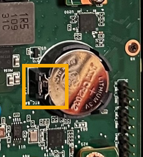

= Vuelva a instalar la batería CMOS
:allow-uri-read: 

.Acerca de esta tarea
Para evitar interrupciones del servicio, confirme que todos los demás nodos de almacenamiento están conectados a la red antes de iniciar la sustitución de la batería CMOS o reemplace la batería durante una ventana de mantenimiento programada cuando los períodos de interrupción del servicio sean aceptables. Consulte la información acerca de https://docs.netapp.com/us-en/storagegrid-118/monitor/monitoring-system-health.html#monitor-node-connection-states["supervisar los estados de conexión de los nodos"^].

CAUTION: Si alguna vez utilizó una regla de ILM que crea solo una copia de un objeto, debe sustituir la batería durante una ventana de mantenimiento programada. De lo contrario, es posible que pierda temporalmente el acceso a esos objetos durante este procedimiento. Consulte la información acerca de https://docs.netapp.com/us-en/storagegrid-118/ilm/why-you-should-not-use-single-copy-replication.html["por qué no debe utilizar replicación de copia única"^].

.Pasos
. Envuelva el extremo de la correa de la muñequera ESD alrededor de su muñeca y fije el extremo de la pinza a una masa metálica para evitar descargas estáticas.
. Localice el conjunto de elevador de dos ranuras en la parte posterior del aparato.
+
image::../media/SGF6112-two-slot-riser-position.png[Ubicación del elevador de dos ranuras]

. Sujete el conjunto del elevador a través de los orificios marcados en azul y levántelo con cuidado hacia arriba. Mueva el conjunto de elevador hacia la parte delantera del chasis mientras lo levanta para permitir que los conectores externos de sus NIC instaladas despejen el chasis.
. Coloque el elevador sobre una superficie antiestática plana con el marco metálico hacia abajo.
. Localice la batería CMOS en la placa del sistema en la posición debajo del conjunto de elevador retirado.
+
image::../media/SGF6112-cmos-position.png[Ubicación de la batería CMOS]

. Utilice el dedo o una herramienta de palanca de plástico para empujar el clip de retención (resaltado) lejos de la batería para soltarlo de la toma.
+

. Retire la batería y deséchela correctamente.

== Vuelva a instalar la batería CMOS

Instale la batería CMOS de repuesto en la toma de la placa del sistema.

.Antes de empezar
* Tiene la batería CMOS de reemplazo correcta (CR2032).
* Ha extraído la batería CMOS fallida.

.Pasos
. Envuelva el extremo de la correa de la muñequera ESD alrededor de su muñeca y fije el extremo de la pinza a una masa metálica para evitar descargas estáticas.
. Retire la batería CMOS de su embalaje.
. Presione la batería de repuesto en la toma vacía de la placa del sistema con el lado positivo (+) hacia arriba hasta que la batería encaje en su sitio.
. Localice el orificio de alineación en el conjunto del elevador de dos ranuras (con un círculo) que se alinea con el pasador guía de la placa del sistema para garantizar la colocación correcta del conjunto del elevador.
+
image::../media/sgf6112_two-slot-riser_alignment_hole.png[Orificio de alineación del conjunto de elevador grande]

. Localice el pasador guía en la placa del sistema.
+
image::../media/sgf6112_two-slot-riser_guide-pin.png[Pasador guía en la placa del sistema para el conjunto de elevador de dos ranuras]

. Coloque el conjunto de elevador en el chasis, asegurándose de que esté alineado con el conector de la placa del sistema y el pasador guía.
. Presione con cuidado el conjunto del elevador de dos ranuras en su sitio a lo largo de su línea central, junto a los orificios marcados en azul, hasta que quede completamente asentado.
. Si no tiene que realizar ningún otro procedimiento de mantenimiento en el aparato, vuelva a instalar la cubierta del aparato, vuelva a colocar el aparato en el bastidor, conecte los cables y conecte la alimentación.
. Si el dispositivo que sustituyó tenía activado el cifrado de unidades para las unidades SED, debe hacerlo link:../installconfig/optional-enabling-node-encryption.html#access-an-encrypted-drive["introduzca la clave de acceso de cifrado de la unidad"] para acceder a las unidades cifradas cuando se inicia el dispositivo de sustitución por primera vez.
. Si el dispositivo que sustituyó utilizó un servidor de gestión de claves (KMS) para gestionar claves de cifrado para el cifrado de nodos, es posible que se necesite una configuración adicional para que el nodo pueda unirse al grid. Si el nodo no se une automáticamente a la cuadrícula, asegúrese de que estas opciones de configuración se hayan transferido al nuevo dispositivo y configure manualmente cualquier configuración que no tenga la configuración esperada:
+
** link:../installconfig/accessing-storagegrid-appliance-installer.html["Configure las conexiones StorageGRID"]
** https://docs.netapp.com/us-en/storagegrid-118/admin/kms-overview-of-kms-and-appliance-configuration.html#set-up-the-appliance["Configure el cifrado de nodo para el dispositivo"^]

. Inicie sesión en el dispositivo:
+
.. Introduzca el siguiente comando: `ssh admin@_grid_node_IP_`
.. Introduzca la contraseña que aparece en `Passwords.txt` archivo.
.. Introduzca el siguiente comando para cambiar a la raíz: `su -`
.. Introduzca la contraseña que aparece en `Passwords.txt` archivo.

. Restaure la conectividad de red de BMC para el dispositivo a través de una de estas opciones:
+
** Utilice IP estáticas, máscara de red y puerta de enlace
** Utilice DHCP para obtener una IP, una máscara de red y una puerta de enlace
+
... Para restaurar la configuración de BMC para utilizar una IP estática, una máscara de red y una puerta de enlace, escriba los siguientes comandos:
+
`*run-host-command ipmitool lan set 1 ipsrc static*`

+
`*run-host-command ipmitool lan set 1 ipaddr _Appliance_IP_*`

+
`*run-host-command ipmitool lan set 1 netmask _Netmask_IP_*`

+
`*run-host-command ipmitool lan set 1 defgw ipaddr _Default_gateway_*`

... Para restaurar la configuración de BMC a fin de utilizar DHCP a fin de obtener una IP, una máscara de red y una puerta de enlace, introduzca el siguiente comando:
+
`*run-host-command ipmitool lan set 1 ipsrc dhcp*`

. Después de restaurar la conectividad de red de BMC, conéctese a la interfaz de BMC para auditar y restaurar cualquier configuración de BMC personalizada adicional que pueda haber aplicado. Por ejemplo, se debe confirmar la configuración de los destinos de capturas SNMP y las notificaciones por correo electrónico. Consulte link:../installconfig/configuring-bmc-interface.html["Configurar la interfaz de BMC"].
. Confirme que el nodo del dispositivo aparece en Grid Manager y que no aparece ninguna alerta.

