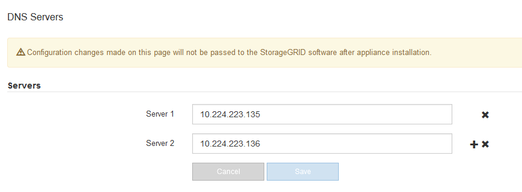

= Comprobar la configuración del servidor DNS
:allow-uri-read: 
:icons: font
:imagesdir: ../media/

[role="lead"]
Puede comprobar y cambiar temporalmente los servidores DNS que está utilizando actualmente este nodo del dispositivo.

.Antes de empezar
El aparato se ha estado link:../commonhardware/placing-appliance-into-maintenance-mode.html["se colocó en modo de mantenimiento"].

.Acerca de esta tarea
Es posible que deba cambiar la configuración del servidor DNS si un dispositivo cifrado no puede conectarse al servidor de gestión de claves (KMS) o al clúster KMS porque el nombre de host del KMS se especificó como un nombre de dominio en lugar de una dirección IP. Cualquier cambio realizado en la configuración de DNS del dispositivo es temporal y se pierde al salir del modo de mantenimiento. Para que estos cambios sean permanentes, especifique los servidores DNS en Grid Manager (*MAINTENANCE* > *Network* > *servidores DNS*).

* Los cambios temporales en la configuración DNS sólo son necesarios para los dispositivos cifrados por nodo en los que el servidor KMS se define mediante un nombre de dominio completo, en lugar de una dirección IP, para el nombre de host.
* Cuando un dispositivo cifrado por nodo se conecta a un KMS mediante un nombre de dominio, debe conectarse a uno de los servidores DNS definidos para la cuadrícula. A continuación, uno de estos servidores DNS convierte el nombre de dominio en una dirección IP.
* Si el nodo no puede acceder a un servidor DNS para la cuadrícula, o si cambió la configuración de DNS para toda la cuadrícula cuando un nodo de dispositivo cifrado por nodo estaba desconectado, el nodo no puede conectarse al KMS. Los datos cifrados en el dispositivo no se pueden descifrar hasta que se resuelva el problema de DNS.

Para resolver un problema de DNS que impide la conexión de KMS, especifique la dirección IP de uno o más servidores DNS en el instalador de dispositivos de StorageGRID. Estas configuraciones temporales de DNS permiten que el dispositivo se conecte al KMS y descifre los datos en el nodo.

Por ejemplo, si el servidor DNS de la cuadrícula cambia mientras un nodo cifrado estaba fuera de línea, el nodo no podrá acceder al KMS cuando vuelva a estar en línea, porque todavía está utilizando los valores DNS anteriores. La introducción de la nueva dirección IP del servidor DNS en el instalador de dispositivos de StorageGRID permite que una conexión KMS temporal descifre los datos del nodo.

.Pasos
. En el instalador de dispositivos StorageGRID, seleccione *Configurar redes* > *Configuración de DNS*.
. Compruebe que los servidores DNS especificados sean correctos.
+

. Si es necesario, cambie los servidores DNS.
+

NOTE: Los cambios realizados en la configuración de DNS son temporales y se pierden al salir del modo de mantenimiento.

. Cuando esté satisfecho con la configuración temporal de DNS, seleccione *Guardar*.
+
El nodo utiliza la configuración del servidor DNS especificada en esta página para volver a conectarse al KMS, lo que permite descifrar los datos del nodo.

. Tras descifrar los datos del nodo, reinicie el nodo. En el instalador del dispositivo StorageGRID, seleccione *Avanzado* > *Reiniciar controlador* y, a continuación, seleccione una de estas opciones:
+
** Seleccione *Reiniciar en StorageGRID* para reiniciar el controlador con el nodo que vuelve a unir la cuadrícula. Seleccione esta opción si hizo trabajo en modo de mantenimiento y está listo para devolver el nodo a su funcionamiento normal.
** Seleccione *Reiniciar en el modo de mantenimiento* para reiniciar el controlador con el nodo restante en modo de mantenimiento. (Esta opción solo está disponible si la controladora se encuentra en modo de mantenimiento). Seleccione esta opción si hay otras operaciones de mantenimiento que debe realizar en el nodo antes de volver a unir la cuadrícula.
+
image::../media/reboot_controller_from_maintenance_mode.png[Reinicie la controladora en modo de mantenimiento]

+

NOTE: Cuando el nodo se reinicia y se vuelve a unir a la cuadrícula, utiliza los servidores DNS de todo el sistema enumerados en Grid Manager. Después de volver a unirse a la cuadrícula, el dispositivo ya no utilizará los servidores DNS temporales especificados en el instalador de dispositivos StorageGRID mientras el dispositivo estaba en modo de mantenimiento.

+
El dispositivo puede tardar hasta 20 minutos en reiniciarse y volver a unirse a la cuadrícula. Para confirmar que el reinicio ha finalizado y que el nodo ha vuelto a unirse a la cuadrícula, vuelva a Grid Manager. La página *NODES* debe mostrar un estado normal (icono de marca de verificación verde image:../media/icon_alert_green_checkmark.png["marca de verificación verde"] a la izquierda del nombre del nodo) del nodo del dispositivo, lo que indica que no hay ninguna alerta activa y que el nodo está conectado a la cuadrícula.

+
image::../media/nodes_menu.png[El nodo del dispositivo se ha vuelto a unir a la cuadrícula]

