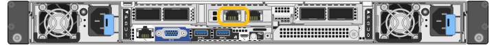
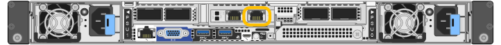

= Acceda al instalador de dispositivos de StorageGRID
:allow-uri-read: 
:icons: font
:imagesdir: ../media/

[role="lead"]
Debe acceder al instalador de dispositivos de StorageGRID para verificar la versión del instalador y configurar las conexiones entre el dispositivo y las tres redes StorageGRID: La red de grid, la red de administración (opcional) y la red de cliente (opcional).

.Antes de empezar
* Está utilizando cualquier cliente de gestión que pueda conectarse a la red de administración de StorageGRID o que tenga un portátil de servicio.
* El cliente o servicio portátil tiene un https://docs.netapp.com/us-en/storagegrid/admin/web-browser-requirements.html["navegador web compatible"^].
* El dispositivo de servicios o el controlador del dispositivo de almacenamiento está conectado a todas las redes StorageGRID que planea utilizar.
* Conoce la dirección IP, la puerta de enlace y la subred del dispositivo de servicios o la controladora del dispositivo de almacenamiento de estas redes.
* Configuró los switches de red que planea utilizar.

.Acerca de esta tarea
Para acceder inicialmente al instalador de dispositivos StorageGRID, puede utilizar la dirección IP asignada por DHCP para el puerto de la red de administración del dispositivo de servicios o del controlador del dispositivo de almacenamiento (suponiendo que esté conectado a la red de administración), también puede conectar un portátil de servicio directamente al dispositivo de servicios o al controlador del dispositivo de almacenamiento.

.Pasos
. Si es posible, utilice la dirección DHCP para el puerto de red de administración en el controlador del dispositivo de servicios o del dispositivo de almacenamiento. El puerto de la red de administración se resalta en la siguiente figura. (Utilice la dirección IP en la red de grid si la red de administración no está conectada).
+
[role="tabbed-block"]
====
.SG100
--
image::../media/sg100_admin_network_port.png[Puerto de red de administración en el SG100]

--
.SG110
--
image::../media/sg6100_admin_network_port.png[Puerto de red de administración en SG110]

--
.SG1000
--
image::../media/sg1000_admin_network_port.png[Puerto de red de administración en SG1000]

--
.SG1100
--

--
.E5700SG
--
Para el E5700SG, puede realizar una de las siguientes acciones:

** Observe la pantalla de siete segmentos en la controladora E5700SG. Si los puertos 1 y 10/25-GbE 2 y 4 de la controladora E5700SG están conectados a redes con servidores DHCP, la controladora intenta obtener direcciones IP asignadas de forma dinámica cuando se enciende en el compartimento. Una vez que el controlador ha completado el proceso de encendido, su pantalla de siete segmentos muestra *HO*, seguido de una secuencia repetida de dos números.
+
[listing]
----
HO -- IP address for Admin Network -- IP address for Grid Network HO
----
+
En la secuencia:

+
*** El primer conjunto de números es la dirección DHCP para el nodo de almacenamiento del dispositivo en la red de administración, si está conectado. Esta dirección IP se asigna al puerto de gestión 1 en la controladora E5700SG.
*** El segundo conjunto de números es la dirección DHCP del nodo de almacenamiento del dispositivo en la red de grid. Esta dirección IP se asigna a los puertos 10/25-GbE 2 y 4 cuando se enciende por primera vez el aparato.
+

NOTE: Si no se pudo asignar una dirección IP con DHCP, se muestra 0.0.0.0.

--
.SG5800
--
image::../media/sg5800_admin_network_port.png[Puerto de red de administración en la controladora SG5800]

--
.SG6000-CN
--
image::../media/sg6000_cn_admin_network_port.png[Puerto de red de administración en el controlador SG6000-CN]

--
.SG6100-CN
--
image::../media/sg6100_cn_admin_network_port.png[Puerto de red de administración en el controlador SG6000-CN]

--
.SGF6112
--
image::../media/sg6100_admin_network_port.png[Puerto de red de administración en SGF6112]

--
====
+
.. Obtenga la dirección DHCP del dispositivo en la red de administración de su administrador de red.
.. Desde el cliente, introduzca esta URL para el instalador de dispositivos StorageGRID: +
`*https://_Appliance_IP_:8443*`
+
Para `_Appliance_IP_`, Utilice la dirección DHCP (utilice la dirección IP para la red de administración si la tiene).

.. Si se le solicita una alerta de seguridad, vea e instale el certificado con el asistente de instalación del explorador.
+
La alerta no aparecerá la próxima vez que acceda a esta URL.

+
Aparece la página de inicio del instalador de dispositivos de StorageGRID. La información y los mensajes que se muestran cuando accede por primera vez a esta página dependen de cómo el dispositivo está conectado actualmente a redes StorageGRID. Pueden aparecer mensajes de error que se resolverán en pasos posteriores.

+
image::../media/appliance_installer_home_5700_5600.png[Captura de pantalla de la parte superior de la página de inicio del instalador de dispositivos StorageGRID]

. Si no puede obtener una dirección IP mediante DHCP, puede utilizar una conexión de enlace local.
+
[role="tabbed-block"]
====
.SG100
--
Conecte un ordenador portátil de servicio directamente al puerto RJ-45 más derecho del dispositivo de servicios mediante un cable Ethernet.

image::../media/sg100_link_local_port.png[Conexión local de enlace SG100]

--
.SG110
--
Conecte un ordenador portátil de servicio directamente al puerto RJ-45 situado más a la derecha del aparato mediante un cable Ethernet.

image::../media/sg6100_link_local_port.png[SG110 Conexión Link-Local]

--
.SG1000
--
Conecte un ordenador portátil de servicio directamente al puerto RJ-45 más derecho del dispositivo de servicios mediante un cable Ethernet.

image::../media/sg1000_link_local_port.png[Conexión de enlace local SG1000]

--
.SG1100
--
Conecte un ordenador portátil de servicio directamente al puerto RJ-45 situado más a la derecha del aparato mediante un cable Ethernet.

--
.E5700SG
--
Conecte el portátil de servicio al puerto de gestión 2 de la controladora E5700SG mediante un cable Ethernet.

image::../media/e5700sg_mgmt_port_2.gif[Ubicación del puerto de gestión 2 en la controladora E5700SG]

--
.SG5800
--
Conecte el portátil de servicio al puerto de administración 1 del controlador SG5800 mediante un cable Ethernet.

image::../media/sg5800_mgmt_port.png[Ubicación del puerto de gestión 1 en la controladora SG5800]

--
.SG6000-CN
--
Conecte un portátil de servicio directamente al puerto RJ-45 más derecho del controlador SG6000-CN mediante un cable Ethernet.

image::../media/sg6000_cn_link_local_port.png[Ubicación del puerto de gestión para SG6000-CN]

--
.SG6100-CN
--
Conecte un portátil de servicio directamente al puerto RJ-45 más derecho del controlador SG6100-CN, mediante un cable Ethernet.

image::../media/sg6100_cn_link_local_port.png[Ubicación del puerto de gestión para SG6100-CN]

--
.SGF6112
--
Conecte un ordenador portátil de servicio directamente al puerto RJ-45 situado más a la derecha del aparato mediante un cable Ethernet.

image::../media/sg6100_link_local_port.png[SGF6112 Conexión Link-Local]

--
====
+
.. Abra un explorador Web en el portátil de servicios.
.. Introduzca esta URL para el instalador del dispositivo StorageGRID: +
`*\https://169.254.0.1:8443*`
+
Aparece la página de inicio del instalador de dispositivos de StorageGRID. La información y los mensajes que se muestran cuando accede por primera vez a esta página dependen de cómo el dispositivo está conectado actualmente a redes StorageGRID. Pueden aparecer mensajes de error que se resolverán en pasos posteriores.

+

NOTE: Si no puede acceder a la página de inicio a través de una conexión local de enlace, configure la dirección IP del portátil de servicio como `169.254.0.2`y vuelva a intentarlo.

.Después de terminar
Tras acceder al instalador de dispositivos de StorageGRID:

* Compruebe que la versión de instalador de dispositivos StorageGRID del dispositivo coincide con la versión de software instalada en el sistema StorageGRID. Si es necesario, actualice el instalador de dispositivos StorageGRID.
+
link:verifying-and-upgrading-storagegrid-appliance-installer-version.html["Comprobar y actualizar la versión de StorageGRID Appliance Installer"]

* Revise los mensajes que se muestran en la página principal del instalador de dispositivos de StorageGRID y configure la configuración del enlace y la configuración IP, según sea necesario.
+
image::../media/appliance_installer_home_services_appliance.png[Inicio del instalador del aparato]

