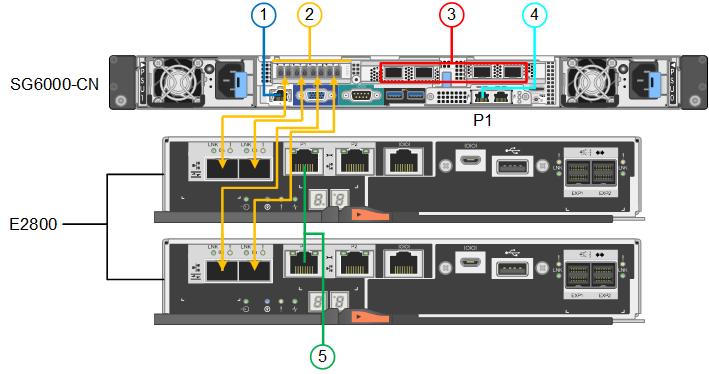

= Aparato por cable
:allow-uri-read: 
:icons: font
:imagesdir: ../media/

[role="lead"]
Conecte los puertos de red del dispositivo o la controladora a la red de grid y la red de cliente opcional para StorageGRID. Para algunos dispositivos, también debe conectar el puerto de gestión del dispositivo al portátil de servicio o realizar conexiones entre los puertos de gestión de la controladora.

[role="tabbed-block"]
====
.SG100 y SG1000
--
Debe conectar el puerto de administración del dispositivo al ordenador portátil de servicio y conectar los puertos de red del dispositivo a la red de grid y a la red de cliente opcional para StorageGRID.

.Antes de empezar
* Tiene un cable Ethernet RJ-45 para conectar el puerto de administración.
* Tiene una de las siguientes opciones para los puertos de red. Estos elementos no se suministran con el aparato.
+
** De uno a cuatro cables Twinax para conectar los cuatro puertos de red.
** Para SG100, de uno a cuatro transceptores SFP+ o SFP28 si planea utilizar cables ópticos para los puertos.
** Para SG1000, de uno a cuatro transceptores QSFP+ o QSFP28 si va a utilizar cables ópticos para los puertos.

CAUTION: *Riesgo de exposición a la radiación láser* -- No desmonte ni retire ninguna parte de un transceptor SFP o QSFP. Puede que esté expuesto a la radiación láser.

.Acerca de esta tarea
Las siguientes figuras muestran los puertos de la parte posterior del aparato.

Conexiones de puerto SG100:

image::../media/sg100_connections.png[Conectores traseros SG100]

Conexiones de puerto SG1000:

image::../media/sg1000_connections.png[Conexiones de puerto SG1000]

[cols="1a,2a,2a,3a"]
|===
| Llamada | Puerto | Tipo de puerto | Uso 

 a| 
1
 a| 
Puerto de gestión BMC en el dispositivo
 a| 
1 GbE (RJ-45).
 a| 
Se conecta a la red en la que se accede a la interfaz del BMC.

 a| 
2
 a| 
Cuatro puertos de red en el dispositivo
 a| 
* Para el SG100: 10/25-GbE
* Para el SG1000: 10/25/40/100-GbE

 a| 
Conéctese a la red de red y a la red de cliente para StorageGRID.  Consulte link:../installconfig/gathering-installation-information-sg100-and-sg1000.html#port-bond-modes["Modos de enlace de puerto (modos de enlace de puerto (SG100 y SG1000)"].

 a| 
3
 a| 
Puerto de red de administración en el dispositivo (con la etiqueta P1 en las figuras)
 a| 
1 GbE (RJ-45).

*Importante:* este puerto funciona sólo a 1000 BaseT/full y no admite velocidades de 10 o 100 megabits.
 a| 
Conecta el dispositivo a la red de administración para StorageGRID.

 a| 
 a| 
El puerto RJ-45 más a la derecha del aparato
 a| 
1 GbE (RJ-45).

*Importante:* este puerto funciona sólo a 1000 BaseT/full y no admite velocidades de 10 o 100 megabits.
 a| 
* Se puede unir al puerto de administración 1 si desea una conexión redundante a la red de administración.
* Se puede dejar desconectado y disponible para acceso local temporal (IP 169.254.0.1).
* Durante la instalación, se puede usar para conectar el dispositivo a un portátil de servicio si las direcciones IP asignadas por DHCP no están disponibles.

|===
.Pasos
. Conecte el puerto de gestión BMC del dispositivo a la red de gestión mediante un cable Ethernet.
+
Aunque esta conexión es opcional, se recomienda facilitar el soporte.

. Conecte los puertos de red del dispositivo a los switches de red adecuados utilizando cables Twinax o cables ópticos y transceptores.
+
Consulte la siguiente tabla para conocer el equipo necesario para su hardware y velocidad de enlace.

+
[cols="2a,2a"]
|===
| Velocidad de enlace SG100 (GbE) | Equipo necesario 

 a| 
10
 a| 
Transceptor SFP+

 a| 
25
 a| 
Transceptor SFP28

| Velocidad de enlace de SG1000 GbE (GbE) | Equipo necesario 

 a| 
10
 a| 
Transceptor QSA y SFP+

 a| 
25
 a| 
Transceptor QSA y SFP28

 a| 
40
 a| 
Transceptor QSFP+

 a| 
100
 a| 
Transceptor QFSP28

|===
+
** En los modelos que admiten autonegociación como opción de velocidad de puerto, si se selecciona el modo de enlace de puerto fijo, puede ejecutar los puertos dedicados a la red de red de StorageGRID a una velocidad diferente a la de los puertos dedicados a la red cliente.
** En los modelos que no admiten autonegociación como opción de velocidad de puerto, los cuatro puertos de red deben usar la misma velocidad de enlace.
** Si piensa utilizar el modo de enlace de puerto fijo (predeterminado), conecte los puertos a la red de StorageGRID y a las redes de cliente, como se muestra en la tabla.
+
[cols="1a,2a"]
|===
| Puerto | Conecta a... 

 a| 
Puerto 1
 a| 
Red de cliente (opcional)

 a| 
Puerto 2
 a| 
Red Grid

 a| 
Puerto 3
 a| 
Red de cliente (opcional)

 a| 
Puerto 4
 a| 
Red Grid

|===
** Si planea utilizar el modo de enlace de puerto agregado, conecte uno o varios puertos de red a uno o varios switches. Debe conectar al menos dos de los cuatro puertos para evitar tener un único punto de error. Si utiliza más de un switch para un único vínculo LACP, los switches deben ser compatibles con MLAG o equivalente.

. Si tiene previsto utilizar la Red de administración para StorageGRID, conecte el puerto Red de administración del dispositivo a la Red de administración mediante un cable Ethernet.

--
.SG110 y SG1100
--
El puerto de gestión del dispositivo se conecta al portátil de servicio y los puertos de red del dispositivo a la red de grid y a la red de cliente opcional para StorageGRID.

.Antes de empezar
* Tiene un cable Ethernet RJ-45 para conectar el puerto de administración.
* Tiene una de las siguientes opciones para los puertos de red. Estos elementos no se suministran con el aparato.
+
** De uno a cuatro cables Twinax para conectar los cuatro puertos de red.
** Para el SG110, de uno a cuatro transceptores SFP+ o SFP28 si planea utilizar cables ópticos para los puertos.
** Para el SG1100, uno a cuatro transceptores QSFP+ o QSFP28 si planea utilizar cables ópticos para los puertos.

CAUTION: *Riesgo de exposición a la radiación láser* -- No desmonte ni retire ninguna parte de un transceptor SFP o QSFP. Puede que esté expuesto a la radiación láser.

.Acerca de esta tarea
Las siguientes figuras muestran los puertos de la parte posterior del aparato.

Conexiones de puerto SG110:

image::../media/sgf6112_connections.png[SG110 conectores traseros]

Conexiones de puerto SG1100:

image::../media/sg1100_connections.png[Conexiones de puerto SG1000]

[cols="1a,2a,2a,3a"]
|===
| Llamada | Puerto | Tipo de puerto | Uso 

 a| 
1
 a| 
Puerto de gestión BMC en el dispositivo
 a| 
1 GbE (RJ-45).
 a| 
Se conecta a la red en la que se accede a la interfaz del BMC.

 a| 
2
 a| 
Cuatro puertos de red en el dispositivo
 a| 
* Para SG110: 10/25-GbE
* Para SG1100: 10/25/40/100-GbE

 a| 
Conéctese a la red de red y a la red de cliente para StorageGRID. Consulte link:gathering-installation-information-sg110-and-sg1100.html#port-bond-modes["Modos de enlace de puertos (SG110 y SG1100)"]

 a| 
3
 a| 
Puerto de red de administración en el dispositivo
 a| 
1 GbE (RJ-45).

*Importante:* Este puerto funciona solo a 1/10-GbE (RJ-45) y no admite velocidades de 100 megabits.
 a| 
Conecta el dispositivo a la red de administración para StorageGRID.

 a| 
 a| 
El puerto RJ-45 más a la derecha del aparato
 a| 
1 GbE (RJ-45).

*Importante:* Este puerto funciona solo a 1/10-GbE (RJ-45) y no admite velocidades de 100 megabits.
 a| 
* Se puede unir al puerto de administración 1 si desea una conexión redundante a la red de administración.
* Se puede dejar desconectado y disponible para acceso local temporal (IP 169.254.0.1).
* Durante la instalación, se puede usar para conectar el dispositivo a un portátil de servicio si las direcciones IP asignadas por DHCP no están disponibles.

|===
.Pasos
. Conecte el puerto de gestión BMC del dispositivo a la red de gestión mediante un cable Ethernet.
+
Aunque esta conexión es opcional, se recomienda facilitar el soporte.

. Conecte los puertos de red del dispositivo a los switches de red adecuados utilizando cables Twinax o cables ópticos y transceptores.
+
Consulte la siguiente tabla para conocer el equipo necesario para su hardware y velocidad de enlace.

+
[cols="2a,2a"]
|===
| Velocidad de enlace de SG110 GbE (GbE) | Equipo necesario 

 a| 
10
 a| 
Transceptor SFP+

 a| 
25
 a| 
Transceptor SFP28

| Velocidad de enlace de SG1100 GbE (GbE) | Equipo necesario 

 a| 
10
 a| 
Transceptor QSA y SFP+

 a| 
25
 a| 
Transceptor QSA y SFP28

 a| 
40
 a| 
Transceptor QSFP+

 a| 
100
 a| 
Transceptor QFSP28

|===
+
** En los modelos que admiten autonegociación como opción de velocidad de puerto, si se selecciona el modo de enlace de puerto fijo, puede ejecutar los puertos dedicados a la red de red de StorageGRID a una velocidad diferente a la de los puertos dedicados a la red cliente.
** En los modelos que no admiten autonegociación como opción de velocidad de puerto, los cuatro puertos de red deben usar la misma velocidad de enlace.
** Si piensa utilizar el modo de enlace de puerto fijo (predeterminado), conecte los puertos a la red de StorageGRID y a las redes de cliente, como se muestra en la tabla.
+
[cols="1a,2a"]
|===
| Puerto | Conecta a... 

 a| 
Puerto 1
 a| 
Red de cliente (opcional)

 a| 
Puerto 2
 a| 
Red Grid

 a| 
Puerto 3
 a| 
Red de cliente (opcional)

 a| 
Puerto 4
 a| 
Red Grid

|===
** Si planea utilizar el modo de enlace de puerto agregado, conecte uno o varios puertos de red a uno o varios switches. Debe conectar al menos dos de los cuatro puertos para evitar tener un único punto de error. Si utiliza más de un switch para un único vínculo LACP, los switches deben ser compatibles con MLAG o equivalente.

. Si tiene previsto utilizar la Red de administración para StorageGRID, conecte el puerto Red de administración del dispositivo a la Red de administración mediante un cable Ethernet.

--
.SG5700
--
Debe conectar las dos controladoras entre sí, conectar los puertos de gestión de cada controladora y conectar los puertos de 10/25 GbE de la controladora E5700SG a la red de grid y red de cliente opcional para StorageGRID.

.Antes de empezar
* Ha desembalado los siguientes elementos, que se incluyen con el aparato:
+
** Dos cables de alimentación.
** Dos cables ópticos para los puertos de interconexión de FC en las controladoras.
** Ocho transceptores SFP+, que admiten FC de 10-GbE o 16 Gbps. Los transceptores pueden utilizarse con los dos puertos de interconexión de ambas controladoras y con los cuatro puertos de red 10/25-GbE de la controladora E5700SG, suponiendo que desee que los puertos de red utilicen una velocidad de enlace de 10-GbE.

* Ha obtenido los siguientes elementos, que no están incluidos en el aparato:
+
** De uno a cuatro cables ópticos para los puertos 10/25-GbE que planea utilizar.
** De uno a cuatro transceptores SFP28, si tiene previsto utilizar velocidad de enlace 25-GbE.
** Cables Ethernet para conectar los puertos de gestión.

CAUTION: *Riesgo de exposición a la radiación láser* -- No desmonte ni retire ninguna parte de un transceptor SFP. Puede que esté expuesto a la radiación láser.

.Acerca de esta tarea
Las figuras muestran las dos controladoras en SG5760 y SG5760X, con la controladora de almacenamiento de la serie E2800 en la parte superior y la controladora E5700SG en la parte inferior. En SG5712 y SG5712X, la controladora de almacenamiento de la serie E2800 se encuentra a la izquierda de la controladora E5700SG cuando se ve desde la parte posterior.

Conexiones SG5760:

image::../media/sg5760_connections.gif[Conexiones en el dispositivo SG5760]

Conexiones SG5760X:

image::../media/sg5760X_connections.png[Conexiones en el dispositivo SG5760X]

[cols="1a,2a,2a,2a"]
|===
| Llamada | Puerto | Tipo de puerto | Uso 

 a| 
1
 a| 
Dos puertos de interconexión en cada controladora
 a| 
SFP+ óptico FC de 16 GB/s
 a| 
Conecte las dos controladoras entre sí.

 a| 
2
 a| 
Puerto de gestión 1 en la controladora serie E2800
 a| 
1 GbE (RJ-45).
 a| 
Se conecta a la red en la que se accede a System Manager de SANtricity. Es posible usar la red administrativa para StorageGRID o una red de gestión independiente.

 a| 
2
 a| 
Puerto de gestión 2 de la controladora serie E2800
 a| 
1 GbE (RJ-45).
 a| 
Reservado para soporte técnico.

 a| 
3
 a| 
Puerto de gestión 1 de la controladora E5700SG
 a| 
1 GbE (RJ-45).
 a| 
Conecta la controladora E5700SG a la red de administración para StorageGRID.

 a| 
3
 a| 
Puerto de gestión 2 de la controladora E5700SG
 a| 
1 GbE (RJ-45).
 a| 
* Se puede unir al puerto de administración 1 si desea una conexión redundante a la red de administración.
* Puede dejarse sin cables y disponible para acceso local temporal (IP 169.254.0.1).
* Durante la instalación, se puede utilizar para conectar el controlador E5700SG a un portátil de servicio si las direcciones IP asignadas por DHCP no están disponibles.

 a| 
4
 a| 
10 puertos 1-4 de 25 GbE en la controladora E5700SG
 a| 
10-GbE o 25-GbE

*Nota:* los transceptores SFP+ incluidos con el dispositivo admiten velocidades de enlace de 10 GbE. Si desea utilizar velocidades de enlace de 25-GbE para los cuatro puertos de red, debe proporcionar transceptores SFP28.
 a| 
Conéctese a la red de red y a la red de cliente para StorageGRID. Consulte link:gathering-installation-information-sg5700.html#port-bond-modes["Modos de enlace de puertos (controladora E5700SG)"].

|===
.Pasos
. Conecte la controladora E2800 a la controladora E5700SG, utilizando dos cables ópticos y cuatro de los ocho transceptores SFP+.
+
[cols="1a,1a"]
|===
| Conectar este puerto... | A este puerto... 

 a| 
Puerto 1 de interconexión en la controladora E2800
 a| 
Puerto de interconexión 1 en el controlador E5700SG

 a| 
Interconecte el puerto 2 en la controladora E2800
 a| 
Interconecte el puerto 2 en la controladora E5700SG

|===
. Si piensa utilizar System Manager de SANtricity, conecte el puerto de gestión 1 (P1) de la controladora E2800 (el puerto RJ-45 en la izquierda) a la red de gestión de SANtricity System Manager mediante un cable Ethernet.
+
No utilice el puerto de gestión 2 (P2) en la controladora E2800 (el puerto RJ-45 a la derecha). Este puerto está reservado para el soporte técnico.

. Si tiene previsto utilizar la Red de administración para StorageGRID, conecte el puerto de administración 1 del controlador E5700SG (el puerto RJ-45 de la izquierda) a la Red de administración mediante un cable Ethernet.
+
Si tiene pensado utilizar el modo de enlace de red de copia de seguridad activa para la red de administración, conecte el puerto de administración 2 en la controladora E5700SG (el puerto RJ-45 a la derecha) a la red de administración, utilizando un cable Ethernet.

. Conecte los puertos 10/25-GbE de la controladora E5700SG a los switches de red correspondientes, mediante cables ópticos y transceptores SFP+ o SFP28.
+

NOTE: Instale transceptores SFP+ si tiene pensado utilizar velocidades de enlace 10-GbE. Instale transceptores SFP28 si tiene pensado utilizar velocidades de enlace 25-GbE.

+
** En los modelos que admiten autonegociación como opción de velocidad de puerto, si se selecciona el modo de enlace de puerto fijo, puede ejecutar los puertos dedicados a la red de red de StorageGRID a una velocidad diferente a la de los puertos dedicados a la red cliente.
** En los modelos que no admiten autonegociación como opción de velocidad de puerto, los cuatro puertos de red deben usar la misma velocidad de enlace.
** Si piensa utilizar el modo de enlace de puerto fijo (predeterminado), conecte los puertos a la red de StorageGRID y a las redes de cliente, como se muestra en la tabla.
+
[cols="1a,1a"]
|===
| Puerto | Conecta a... 

 a| 
Puerto 1
 a| 
Red de cliente (opcional)

 a| 
Puerto 2
 a| 
Red Grid

 a| 
Puerto 3
 a| 
Red de cliente (opcional)

 a| 
Puerto 4
 a| 
Red Grid

|===
** Si planea utilizar el modo de enlace de puerto agregado, conecte uno o varios puertos de red a uno o varios switches. Debe conectar al menos dos de los cuatro puertos para evitar tener un único punto de error. Si utiliza más de un switch para un único vínculo LACP, los switches deben ser compatibles con MLAG o equivalente.

--
.SG6000
--
Las controladoras de almacenamiento se conectan a la controladora SG6000-CN, se conectan los puertos de gestión de las tres controladoras y se conectan los puertos de red de la controladora SG6000-CN a la red de grid y a la red cliente opcional para StorageGRID.

.Antes de empezar
* Dispone de los cuatro cables ópticos suministrados con el aparato para conectar los dos controladores de almacenamiento al controlador SG6000-CN.
* Tiene cables Ethernet RJ-45 (cuatro mínimos) para conectar los puertos de administración.
* Tiene una de las siguientes opciones para los puertos de red. Estos elementos no se suministran con el aparato.
+
** De uno a cuatro cables Twinax para conectar los cuatro puertos de red.
** De uno a cuatro transceptores SFP+ o SFP28 si planea utilizar cables ópticos para los puertos.
+

CAUTION: *Riesgo de exposición a la radiación láser* -- No desmonte ni retire ninguna parte de un transceptor SFP. Puede que esté expuesto a la radiación láser.

.Acerca de esta tarea
En las siguientes figuras, se muestran las tres controladoras incluidas en los dispositivos SG6060 y SG6060X, con la controladora de computación SG6000-CN en la parte superior y las dos controladoras de almacenamiento E2800 en la parte inferior. SG6060 usa E2800A controladoras y SG6060X utiliza una o dos versiones de controladora E2800B.

NOTE: Ambas versiones de la controladora E2800 tienen especificaciones y funciones idénticas a excepción de la ubicación de los puertos de interconexión.

CAUTION: No utilice un controlador E2800A y E2800B en el mismo dispositivo.

Conexiones SG6060:

Conexiones SG6060X:

* Versión 1
+
image::../media/sg6000x_e2800B_connections.png[SG6060 a E2800B conexiones]

* Versión 2
+

NOTE: Si los transceptores FC de la controladora E2800B están instalados en los puertos de conexión FC superiores (6), muévalos a los puertos de conexión FC inferiores derechos (7).

+
image::../media/sg6000x_e2800B2_connections.png[SG6060 a E2800B conexiones]

La siguiente figura muestra las tres controladoras del dispositivo SGF6024, con el controlador de computación SG6000-CN en la parte superior y las dos controladoras de almacenamiento EF570 en paralelo debajo del controlador de computación.

Conexiones SGF6024:

image::../media/sg6000_ef570_connections.png[SG6000 a SGF570 conexiones]

[cols="1a,2a,2a,3a"]
|===
| Llamada | Puerto | Tipo de puerto | Uso 

 a| 
1
 a| 
Puerto de gestión de BMC en el controlador SG6000-CN
 a| 
1 GbE (RJ-45).
 a| 
Se conecta a la red en la que se accede a la interfaz del BMC.

 a| 
2
 a| 
Puertos de conexión FC:

* 4 en el controlador SG6000-CN
* 2 en cada controladora de almacenamiento

 a| 
SFP+ óptico FC de 16 GB/s
 a| 
Conecte cada controlador de almacenamiento al controlador SG6000-CN.

 a| 
3
 a| 
Cuatro puertos de red en el controlador SG6000-CN
 a| 
10/25 GbE
 a| 
Conéctese a la red de red y a la red de cliente para StorageGRID. Consulte link:../installconfig/gathering-installation-information-sg6000.html#port-bond-modes["Modos de enlace de puertos (controladora SG6000-CN)"].

 a| 
4
 a| 
Puerto de red de administración en la controladora SG6000-CN (etiquetado como P1 en la figura)
 a| 
1 GbE (RJ-45).

*Importante:* este puerto funciona sólo a 1000 BaseT/full y no admite velocidades de 10 o 100 megabits.
 a| 
Conecta el controlador SG6000-CN a la red de administración para StorageGRID.

 a| 
 a| 
Puerto RJ-45 derecho en el controlador SG6000-CN
 a| 
1 GbE (RJ-45).

*Importante:* este puerto funciona sólo a 1000 BaseT/full y no admite velocidades de 10 o 100 megabits.
 a| 
* Se puede unir al puerto de administración 1 si desea una conexión redundante a la red de administración.
* Puede dejarse sin cables y disponible para acceso local temporal (IP 169.254.0.1).
* Durante la instalación, se puede utilizar para conectar el controlador SG6000-CN a un portátil de servicio si las direcciones IP asignadas por DHCP no están disponibles.

 a| 
5
 a| 
Puerto de gestión 1 en cada controladora de almacenamiento
 a| 
1 GbE (RJ-45).
 a| 
Se conecta a la red en la que se accede a System Manager de SANtricity.

 a| 
 a| 
Puerto de gestión 2 en cada controladora de almacenamiento
 a| 
1 GbE (RJ-45).
 a| 
Reservado para soporte técnico.

|===
.Pasos
. Conecte el puerto de administración de BMC del controlador SG6000-CN a la red de administración mediante un cable Ethernet.
+
Aunque esta conexión es opcional, se recomienda facilitar el soporte.

. Conecte los dos puertos FC de cada controlador de almacenamiento a los puertos FC de la controladora SG6000-CN, utilizando cuatro cables ópticos y cuatro transceptores SFP+ para las controladoras de almacenamiento.
. Conecte los puertos de red del controlador SG6000-CN a los switches de red adecuados utilizando cables Twinax o cables ópticos y transceptores SFP+ o SFP28.
+

NOTE: Instale transceptores SFP+ si tiene pensado utilizar velocidades de enlace 10-GbE. Instale transceptores SFP28 si tiene pensado utilizar velocidades de enlace 25-GbE.

+
** En los modelos que admiten autonegociación como opción de velocidad de puerto, si se selecciona el modo de enlace de puerto fijo, puede ejecutar los puertos dedicados a la red de red de StorageGRID a una velocidad diferente a la de los puertos dedicados a la red cliente.
** En los modelos que no admiten autonegociación como opción de velocidad de puerto, los cuatro puertos de red deben usar la misma velocidad de enlace.
** Si piensa utilizar el modo de enlace de puerto fijo (predeterminado), conecte los puertos a la red de StorageGRID y a las redes de cliente, como se muestra en la tabla.
+
[cols="1a,2a"]
|===
| Puerto | Conecta a... 

 a| 
Puerto 1
 a| 
Red de cliente (opcional)

 a| 
Puerto 2
 a| 
Red Grid

 a| 
Puerto 3
 a| 
Red de cliente (opcional)

 a| 
Puerto 4
 a| 
Red Grid

|===
+
*** Si planea utilizar el modo de enlace de puerto agregado, conecte uno o varios puertos de red a uno o varios switches. Debe conectar al menos dos de los cuatro puertos para evitar tener un único punto de error. Si utiliza más de un switch para un único vínculo LACP, los switches deben ser compatibles con MLAG o equivalente.

. Si tiene previsto utilizar la Red de administración para StorageGRID, conecte el puerto Red de administración del controlador SG6000-CN a la Red de administración, mediante un cable Ethernet.
. Si planea utilizar la red de gestión para SANtricity System Manager, conecte el puerto de gestión 1 (P1) de cada controladora de almacenamiento (el puerto RJ-45 en la izquierda) a la red de gestión de SANtricity System Manager, mediante un cable Ethernet.
+
No utilice el puerto de gestión 2 (P2) en las controladoras de almacenamiento (el puerto RJ-45 a la derecha). Este puerto está reservado para el soporte técnico.

--
.SG6100
--
El puerto de gestión del dispositivo se conecta al portátil de servicio y los puertos de red del dispositivo a la red de grid y a la red de cliente opcional para StorageGRID.

.Antes de empezar
* Tiene un cable Ethernet RJ-45 para conectar el puerto de administración.
* Tiene una de las siguientes opciones para los puertos de red. Estos elementos no se suministran con el aparato.
+
** De uno a cuatro cables Twinax para conectar los cuatro puertos de red.
** De uno a cuatro transceptores SFP+ o SFP28 si planea utilizar cables ópticos para los puertos.

CAUTION: *Riesgo de exposición a la radiación láser* -- No desmonte ni retire ninguna parte de un transceptor SFP. Puede que esté expuesto a la radiación láser.

.Acerca de esta tarea
Las siguientes figuras muestran los puertos en la parte posterior del SGF6112.

image::../media/sgf6112_connections.png[SGF6112 conectores traseros]

[cols="1a,2a,2a,3a"]
|===
| Llamada | Puerto | Tipo de puerto | Uso 

 a| 
1
 a| 
Puerto de gestión BMC en el dispositivo
 a| 
1 GbE (RJ-45).
 a| 
Se conecta a la red en la que se accede a la interfaz del BMC.

 a| 
2
 a| 
Cuatro puertos de red 10 GbE/25 GbE en el dispositivo
 a| 
 a| 
Conéctese a la red de red y a la red de cliente para StorageGRID. Consulte link:gathering-installation-information-sg6100.html#port-bond-modes["Modos de enlace de puertos (SGF6112)"]

 a| 
3
 a| 
Puerto de red de administración en el dispositivo (con la etiqueta P1 en la figura)
 a| 
1 GbE (RJ-45).

*Importante:* Este puerto funciona solo a 1/10-GbE (RJ-45) y no admite velocidades de 100 megabits.
 a| 
Conecta el dispositivo a la red de administración para StorageGRID.

 a| 
 a| 
El puerto RJ-45 más a la derecha del aparato
 a| 
1 GbE (RJ-45).

*Importante:* Este puerto funciona solo a 1/10-GbE (RJ-45) y no admite velocidades de 100 megabits.
 a| 
* Se puede unir al puerto de administración 1 si desea una conexión redundante a la red de administración.
* Se puede dejar desconectado y disponible para acceso local temporal (IP 169.254.0.1).
* Durante la instalación, se puede usar para conectar el dispositivo a un portátil de servicio si las direcciones IP asignadas por DHCP no están disponibles.

|===
.Pasos
. Conecte el puerto de gestión BMC del dispositivo a la red de gestión mediante un cable Ethernet.
+
Aunque esta conexión es opcional, se recomienda facilitar el soporte.

. Conecte los puertos de red del dispositivo a los switches de red adecuados utilizando cables Twinax o cables ópticos y transceptores.
+
[cols="2a,2a"]
|===
| Velocidad de enlace de SGF6112 GbE (GbE) | Equipo necesario 

 a| 
10
 a| 
Transceptor SFP+

 a| 
25
 a| 
Transceptor SFP28

|===
+
** En los modelos que admiten autonegociación como opción de velocidad de puerto, si se selecciona el modo de enlace de puerto fijo, puede ejecutar los puertos dedicados a la red de red de StorageGRID a una velocidad diferente a la de los puertos dedicados a la red cliente.
** En los modelos que no admiten autonegociación como opción de velocidad de puerto, los cuatro puertos de red deben usar la misma velocidad de enlace.
** Si piensa utilizar el modo de enlace de puerto fijo (predeterminado), conecte los puertos a la red de StorageGRID y a las redes de cliente, como se muestra en la tabla.
+
[cols="1a,2a"]
|===
| Puerto | Conecta a... 

 a| 
Puerto 1
 a| 
Red de cliente (opcional)

 a| 
Puerto 2
 a| 
Red Grid

 a| 
Puerto 3
 a| 
Red de cliente (opcional)

 a| 
Puerto 4
 a| 
Red Grid

|===
** Si planea utilizar el modo de enlace de puerto agregado, conecte uno o varios puertos de red a uno o varios switches. Debe conectar al menos dos de los cuatro puertos para evitar tener un único punto de error. Si utiliza más de un switch para un único vínculo LACP, los switches deben ser compatibles con MLAG o equivalente.

. Si tiene previsto utilizar la Red de administración para StorageGRID, conecte el puerto Red de administración del dispositivo a la Red de administración mediante un cable Ethernet.

--
====