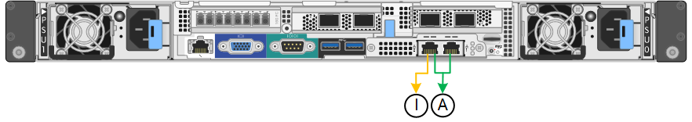
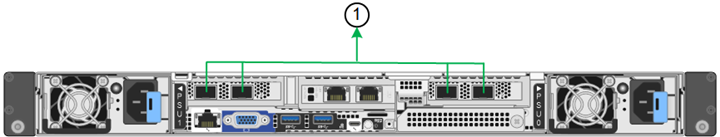

= Configure los enlaces de red
:allow-uri-read: 
:icons: font
:imagesdir: ../media/

[role="lead"]
Puede configurar los enlaces de red para los puertos utilizados para conectar el dispositivo a la red de grid, la red de cliente y la red de administración. Puede establecer la velocidad de enlace, así como los modos de enlace de red y puerto.

TIP: Si utiliza ConfigBuilder para generar un archivo JSON, puede configurar los enlaces de red automáticamente. Consulte link:automating-appliance-installation-and-configuration.html["Automatice la instalación y configuración de los dispositivos"].

.Antes de empezar
* Ya tienes link:obtaining-additional-equipment-and-tools.html["obtuvo el equipo adicional"] necesario para su tipo de cable y velocidad de enlace.
* Ha instalado los transceptores correctos en los puertos en función de la velocidad de enlace que planea utilizar.
* Ha conectado los puertos de red a los switches que admiten la velocidad elegida.

Si planea utilizar el modo de enlace de puerto de agregado, el modo de enlace de red LACP o el etiquetado de VLAN:

* Conectó los puertos de red del dispositivo a los switches que admiten VLAN y LACP.
* Si varios switches participan en el enlace LACP, los switches admiten grupos de agregación de enlaces de varios chasis (MLAG) o equivalente.
* Comprende cómo configurar los switches para que utilicen VLAN, LACP y MLAG o equivalente.
* Conoce la etiqueta de VLAN única que se utilizará para cada red. Esta etiqueta VLAN se añadirá a cada paquete de red para garantizar que el tráfico de red se dirija a la red correcta.

.Acerca de esta tarea
Sólo tiene que configurar los ajustes en la página Configuración de vínculos si desea utilizar un valor no predeterminado.

NOTE: La política hash de transmisión de LACP es layer2+3.

En las figuras y las tablas se resumen las opciones del modo de enlace de puerto y el modo de enlace de red para cada dispositivo. En la siguiente sección, se ofrece más información:

* link:gathering-installation-information-sg100-and-sg1000.html#port-bond-modes["Modos de enlace de puertos (SG1000 y SG100)"]
* link:gathering-installation-information-sg5700.html#port-bond-modes["Modos de enlace de puertos (E5700SG)"]
* link:gathering-installation-information-sg6000.html#port-bond-modes["Modos de enlace de puertos (SG6000-CN)"]
* link:gathering-installation-information-sg6100.html#port-bond-modes["Modos de enlace de puertos (SGF6112)"]

[role="tabbed-block"]
====
.SG100 y SG1000
--
Modo de enlace de puerto fijo (predeterminado)::
+
--
Las cifras muestran cómo los cuatro puertos de red en SG1000 o SG100 están unidos en modo de enlace de puerto fijo (configuración predeterminada).

SG1000 GBE:

image::../media/sg1000_fixed_port.png[SG1000 Modo de enlace de puerto fijo]

SG100:

image::../media/sg100_fixed_port_draft.png[Modo de enlace de puerto fijo SG100]

[cols="1a,3a"]
|===
| Llamada | Qué puertos están Unidos 

 a| 
C
 a| 
Los puertos 1 y 3 se unen para la red cliente, si se utiliza esta red.

 a| 
G
 a| 
Los puertos 2 y 4 están Unidos para la red de cuadrícula.

|===
La tabla resume las opciones para configurar los cuatro puertos de red. Sólo tiene que configurar los ajustes en la página Configuración de vínculos si desea utilizar un valor no predeterminado.

[cols="1a,2a,2a"]
|===
| Modo de enlace de red | Red de cliente desactivada (predeterminada) | Red de cliente habilitada 

 a| 
Active-Backup (predeterminado)
 a| 
* Los puertos 2 y 4 utilizan un vínculo de copia de seguridad activa para la red Grid.
* Los puertos 1 y 3 no se utilizan.
* Una etiqueta de VLAN es opcional.

 a| 
* Los puertos 2 y 4 utilizan un vínculo de copia de seguridad activa para la red Grid.
* Los puertos 1 y 3 utilizan un vínculo de backup activo para la red cliente.
* Las etiquetas de VLAN se pueden especificar para ambas redes, por conveniencia del administrador de red.

 a| 
LACP (802,3ad)
 a| 
* Los puertos 2 y 4 utilizan un enlace LACP para la red de grid.
* Los puertos 1 y 3 no se utilizan.
* Una etiqueta de VLAN es opcional.

 a| 
* Los puertos 2 y 4 utilizan un enlace LACP para la red de grid.
* Los puertos 1 y 3 utilizan un enlace LACP para la red de cliente.
* Las etiquetas de VLAN se pueden especificar para ambas redes, por conveniencia del administrador de red.

|===
--
Modo de enlace de puerto agregado::
+
--
Estas cifras muestran cómo se unen los cuatro puertos de red en el modo de enlace de puertos agregados.

SG1000 GBE:

image::../media/sg1000_aggregate_ports.png[Modo de enlace de puerto agregado SG1000]

SG100:

image::../media/sg100_aggregate_ports.png[Modo de enlace de puerto agregado SG100]

[cols="1a,3a"]
|===
| Llamada | Qué puertos están Unidos 

 a| 
1
 a| 
Los cuatro puertos se agrupan en un enlace LACP único, lo que permite que se usen todos los puertos para el tráfico de red de grid y de red de cliente.

|===
La tabla resume las opciones para configurar los cuatro puertos de red. Sólo tiene que configurar los ajustes en la página Configuración de vínculos si desea utilizar un valor no predeterminado.

[cols="1a,2a,2a"]
|===
| Modo de enlace de red | Red de cliente desactivada (predeterminada) | Red de cliente habilitada 

 a| 
Solo LACP (802.3ad)
 a| 
* Los puertos 1-4 utilizan un enlace LACP único para la red de grid.
* Una única etiqueta VLAN identifica los paquetes de red Grid.

 a| 
* Los puertos 1-4 utilizan un enlace LACP único para la red de grid y la red de cliente.
* Dos etiquetas VLAN permiten que los paquetes de red de cuadrícula se separen de los paquetes de red de cliente.

|===
--
Active-Backup: Modo de vinculación de red para los puertos de gestión::
+
--
Estas cifras muestran cómo los dos puertos de gestión de 1 GbE de los dispositivos se unen en el modo de enlace de red Active-Backup para la red de administración.

SG1000 GBE:

image::../media/sg1000_bonded_management_ports.png[Puertos de red de administración unidos SG1000]

SG100:

image::../media/sg100_bonded_management_ports.png[Puertos de red de administración con conexión SG100]

--

--
.SG5700
--
Modo de enlace de puerto fijo (predeterminado)::
+
--
Esta figura muestra cómo los cuatro puertos 10/25-GbE se bonifican en modo de enlace de puerto fijo (configuración predeterminada).

image::../media/e5700sg_fixed_port.gif[Imagen que muestra cómo los puertos 10/25-GbE de la controladora E5700SG se vinculan en modo fijo]

[cols="1a,3a"]
|===
| Llamada | Qué puertos están Unidos 

 a| 
C
 a| 
Los puertos 1 y 3 se unen para la red cliente, si se utiliza esta red.

 a| 
G
 a| 
Los puertos 2 y 4 están Unidos para la red de cuadrícula.

|===
La tabla resume las opciones para configurar los cuatro puertos 10/25-GbE. Sólo tiene que configurar los ajustes en la página Configuración de vínculos si desea utilizar un valor no predeterminado.

[cols="1a,2a,2a"]
|===
| Modo de enlace de red | Red de cliente desactivada (predeterminada) | Red de cliente habilitada 

 a| 
Active-Backup (predeterminado)
 a| 
* Los puertos 2 y 4 utilizan un vínculo de copia de seguridad activa para la red Grid.
* Los puertos 1 y 3 no se utilizan.
* Una etiqueta de VLAN es opcional.

 a| 
* Los puertos 2 y 4 utilizan un vínculo de copia de seguridad activa para la red Grid.
* Los puertos 1 y 3 utilizan un vínculo de backup activo para la red cliente.
* Las etiquetas de VLAN se pueden especificar para ambas redes, por conveniencia del administrador de red.

 a| 
LACP (802,3ad)
 a| 
* Los puertos 2 y 4 utilizan un enlace LACP para la red de grid.
* Los puertos 1 y 3 no se utilizan.
* Una etiqueta de VLAN es opcional.

 a| 
* Los puertos 2 y 4 utilizan un enlace LACP para la red de grid.
* Los puertos 1 y 3 utilizan un enlace LACP para la red de cliente.
* Las etiquetas de VLAN se pueden especificar para ambas redes, por conveniencia del administrador de red.

|===
--
Modo de enlace de puerto agregado::
+
--
Esta figura muestra cómo los cuatro puertos 10/25-GbE están Unidos en modo de enlace de puerto agregado.

image::../media/e5700sg_aggregate_port.gif[Imagen que muestra cómo los puertos 10/25-GbE de la controladora E5700SG se vinculan en modo de agregado]

[cols="1a,3a"]
|===
| Llamada | Qué puertos están Unidos 

 a| 
1
 a| 
Los cuatro puertos se agrupan en un enlace LACP único, lo que permite que se usen todos los puertos para el tráfico de red de grid y de red de cliente.

|===
La tabla resume las opciones para configurar los cuatro puertos 10/25-GbE. Sólo tiene que configurar los ajustes en la página Configuración de vínculos si desea utilizar un valor no predeterminado.

[cols="1a,2a,2a"]
|===
| Modo de enlace de red | Red de cliente desactivada (predeterminada) | Red de cliente habilitada 

 a| 
Solo LACP (802.3ad)
 a| 
* Los puertos 1-4 utilizan un enlace LACP único para la red de grid.
* Una única etiqueta VLAN identifica los paquetes de red Grid.

 a| 
* Los puertos 1-4 utilizan un enlace LACP único para la red de grid y la red de cliente.
* Dos etiquetas VLAN permiten que los paquetes de red de cuadrícula se separen de los paquetes de red de cliente.

|===
--
Active-Backup: Modo de vinculación de red para los puertos de gestión::
+
--
En esta figura, se muestra cómo los dos puertos de gestión de 1-GbE de la controladora E5700SG están Unidos en el modo de enlace de red Active-Backup para la red Admin.

image::../media/e5700sg_bonded_management_ports.gif[E5700SG puertos de gestión vinculados]

--

--
.SG6000
--
Modo de enlace de puerto fijo (predeterminado)::
+
--
En esta figura, se muestra cómo los cuatro puertos de red están unidos en modo de enlace de puerto fijo (configuración predeterminada).

image::../media/sg6000_cn_fixed_port.gif[Imagen que muestra cómo los puertos de red del controlador SG6000-CN están Unidos en modo fijo]

[cols="1a,3a"]
|===
| Llamada | Qué puertos están Unidos 

 a| 
C
 a| 
Los puertos 1 y 3 se unen para la red cliente, si se utiliza esta red.

 a| 
G
 a| 
Los puertos 2 y 4 están Unidos para la red de cuadrícula.

|===
La tabla resume las opciones para configurar los puertos de red. Sólo tiene que configurar los ajustes en la página Configuración de vínculos si desea utilizar un valor no predeterminado.

[cols="1a,3a,3a"]
|===
| Modo de enlace de red | Red de cliente desactivada (predeterminada) | Red de cliente habilitada 

 a| 
Active-Backup (predeterminado)
 a| 
* Los puertos 2 y 4 utilizan un vínculo de copia de seguridad activa para la red Grid.
* Los puertos 1 y 3 no se utilizan.
* Una etiqueta de VLAN es opcional.

 a| 
* Los puertos 2 y 4 utilizan un vínculo de copia de seguridad activa para la red Grid.
* Los puertos 1 y 3 utilizan un vínculo de backup activo para la red cliente.
* Las etiquetas de VLAN se pueden especificar para ambas redes, por conveniencia del administrador de red.

 a| 
LACP (802,3ad)
 a| 
* Los puertos 2 y 4 utilizan un enlace LACP para la red de grid.
* Los puertos 1 y 3 no se utilizan.
* Una etiqueta de VLAN es opcional.

 a| 
* Los puertos 2 y 4 utilizan un enlace LACP para la red de grid.
* Los puertos 1 y 3 utilizan un enlace LACP para la red de cliente.
* Las etiquetas de VLAN se pueden especificar para ambas redes, por conveniencia del administrador de red.

|===
--
Modo de enlace de puerto agregado::
+
--
En esta figura, se muestra cómo los cuatro puertos de red están Unidos en el modo de enlace de puerto agregado.

image::../media/sg6000_cn_aggregate_port.gif[Imagen que muestra cómo los puertos de red del controlador SG6000-CN están Unidos en modo agregado]

[cols="1a,3a"]
|===
| Llamada | Qué puertos están Unidos 

 a| 
1
 a| 
Los cuatro puertos se agrupan en un enlace LACP único, lo que permite que se usen todos los puertos para el tráfico de red de grid y de red de cliente.

|===
La tabla resume las opciones para configurar los puertos de red. Sólo tiene que configurar los ajustes en la página Configuración de vínculos si desea utilizar un valor no predeterminado.

[cols="1a,3a,3a"]
|===
| Modo de enlace de red | Red de cliente desactivada (predeterminada) | Red de cliente habilitada 

 a| 
Solo LACP (802.3ad)
 a| 
* Los puertos 1-4 utilizan un enlace LACP único para la red de grid.
* Una única etiqueta VLAN identifica los paquetes de red Grid.

 a| 
* Los puertos 1-4 utilizan un enlace LACP único para la red de grid y la red de cliente.
* Dos etiquetas VLAN permiten que los paquetes de red de cuadrícula se separen de los paquetes de red de cliente.

|===
--
Active-Backup: Modo de vinculación de red para los puertos de gestión::
+
--
Esta figura muestra cómo los dos puertos de gestión de 1 GbE del controlador SG6000-CN están Unidos en el modo de enlace de red Active-Backup para la red Admin.

--

--
.SGF6112
--
Modo de enlace de puerto fijo (predeterminado)::
+
--
La figura muestra cómo están unidos los cuatro puertos de red en modo de enlace de puerto fijo (configuración predeterminada).

image::../media/sgf6112_fixed_port.png[SGF6112 Modo de enlace de puerto fijo]

[cols="1a,3a"]
|===
| Llamada | Qué puertos están Unidos 

 a| 
C
 a| 
Los puertos 1 y 3 se unen para la red cliente, si se utiliza esta red.

 a| 
G
 a| 
Los puertos 2 y 4 están Unidos para la red de cuadrícula.

|===
La tabla resume las opciones para configurar los puertos de red. Sólo tiene que configurar los ajustes en la página Configuración de vínculos si desea utilizar un valor no predeterminado.

[cols="1a,2a,2a"]
|===
| Modo de enlace de red | Red de cliente desactivada (predeterminada) | Red de cliente habilitada 

 a| 
Active-Backup (predeterminado)
 a| 
* Los puertos 2 y 4 utilizan un vínculo de copia de seguridad activa para la red Grid.
* Los puertos 1 y 3 no se utilizan.
* Una etiqueta de VLAN es opcional.

 a| 
* Los puertos 2 y 4 utilizan un vínculo de copia de seguridad activa para la red Grid.
* Los puertos 1 y 3 utilizan un vínculo de backup activo para la red cliente.
* Las etiquetas de VLAN se pueden especificar para ambas redes, por conveniencia del administrador de red.

 a| 
LACP (802,3ad)
 a| 
* Los puertos 2 y 4 utilizan un enlace LACP para la red de grid.
* Los puertos 1 y 3 no se utilizan.
* Una etiqueta de VLAN es opcional.

 a| 
* Los puertos 2 y 4 utilizan un enlace LACP para la red de grid.
* Los puertos 1 y 3 utilizan un enlace LACP para la red de cliente.
* Las etiquetas de VLAN se pueden especificar para ambas redes, por conveniencia del administrador de red.

|===
--
Modo de enlace de puerto agregado::
+
--
En la figura, se muestra cómo están unidos los cuatro puertos de red en el modo de enlace de puertos agregados.

[cols="1a,3a"]
|===
| Llamada | Qué puertos están Unidos 

 a| 
1
 a| 
Los cuatro puertos se agrupan en un enlace LACP único, lo que permite que se usen todos los puertos para el tráfico de red de grid y de red de cliente.

|===
La tabla resume las opciones para configurar los puertos de red. Sólo tiene que configurar los ajustes en la página Configuración de vínculos si desea utilizar un valor no predeterminado.

[cols="1a,2a,2a"]
|===
| Modo de enlace de red | Red de cliente desactivada (predeterminada) | Red de cliente habilitada 

 a| 
Solo LACP (802.3ad)
 a| 
* Los puertos 1-4 utilizan un enlace LACP único para la red de grid.
* Una única etiqueta VLAN identifica los paquetes de red Grid.

 a| 
* Los puertos 1-4 utilizan un enlace LACP único para la red de grid y la red de cliente.
* Dos etiquetas VLAN permiten que los paquetes de red de cuadrícula se separen de los paquetes de red de cliente.

|===
--
Active-Backup: Modo de vinculación de red para los puertos de gestión::
+
--
Esta figura muestra cómo los dos puertos de gestión de 1 GbE en SGF6112 están vinculados en el modo de enlace de red Active-Backup para la red de administración.

image::../media/sgf6112_bonded_management_ports.png[Puertos de red de administración unidos SGF6112]

--

--
====
.Pasos
. En la barra de menús del instalador del dispositivo StorageGRID, haga clic en *Configurar redes* > *Configuración de vínculo*.
+
La página Network Link Configuration muestra un diagrama del dispositivo con los puertos de red y administración numerados.

+
La tabla Estado del enlace muestra el estado del enlace, la velocidad del enlace y otras estadísticas de los puertos numerados.

+
La primera vez que acceda a esta página:

+
** *Velocidad de enlace* se ajusta en *Auto*.
** *El modo de enlace de puerto* está establecido en *fijo*.
** *El modo de enlace de red* se establece en *Active-Backup* para la red de cuadrícula.
** La *Red de administración* está activada y el modo de enlace de red se establece en *independiente*.
** La *Red cliente* está desactivada.

. Seleccione la velocidad de enlace para los puertos de red en la lista desplegable *velocidad de enlace*.
+
Los switches de red que utiliza para la red de cuadrícula y la red de cliente también deben ser compatibles y configurados para esta velocidad. Debe utilizar los adaptadores o transceptores adecuados para la velocidad de enlace configurada. Utilice la velocidad de enlace automático cuando sea posible porque esta opción negocia tanto la velocidad de enlace como el modo de corrección de error de avance (FEC) con el interlocutor de enlace.

+
Si tiene pensado utilizar la velocidad de enlace de 25 GbE para los puertos de red de SG6000 o SG5700:

+
** Utilice transceptores SFP28 y cables Twinax SFP28 o cables ópticos.
** Para el SG5700, seleccione *25GbE* en la lista desplegable *Velocidad de enlace*.
** Para el SG6000, selecciona *Auto* en la lista desplegable *Velocidad de enlace*.

. Habilite o deshabilite las redes StorageGRID que tiene previsto utilizar.
+
Se requiere la red de red. No puede desactivar esta red.

+
.. Si el dispositivo no está conectado a la red de administración, desactive la casilla de verificación *Habilitar red* para la red de administración.
.. Si el aparato está conectado a la red cliente, seleccione la casilla de verificación *Habilitar red* para la red cliente.
+
Ahora se muestra la configuración de la red de cliente para los puertos NIC de datos.

. Consulte la tabla y configure el modo de enlace de puerto y el modo de enlace de red.
+
Este ejemplo muestra:

+
** *Agregado* y *LACP* seleccionados para la red Grid y las redes cliente. Debe especificar una etiqueta de VLAN exclusiva para cada red. Puede seleccionar valores entre 0 y 4095.
** *Active-Backup* seleccionado para la red de administración.
+
image::../media/sg1000_network_link_configuration_aggregate.png[Agregado de configuración de Network Link]

. Cuando esté satisfecho con sus selecciones, haga clic en *Guardar*.
+

NOTE: Puede perder la conexión si ha realizado cambios en la red o el enlace que está conectado a través de. Si no se vuelve a conectar en 1 minuto, vuelva a introducir la URL del instalador de dispositivos de StorageGRID mediante una de las otras direcciones IP asignadas al dispositivo: +
`*https://_appliance_IP_:8443*`

