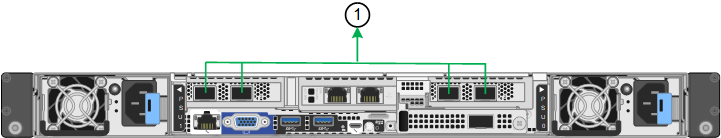

= Recopilar información de red (SG6100)
:allow-uri-read: 
:icons: font
:imagesdir: ../media/

[role="lead"]
En las siguientes tablas, registre la información necesaria para cada red que conecte al dispositivo. Estos valores son necesarios para instalar y configurar el hardware.

TIP: En lugar de utilizar las tablas, utilice el libro de trabajo proporcionado con ConfigBuilder. El uso del libro de trabajo de ConfigBuilder permite cargar información del sistema y generar un archivo JSON para completar automáticamente algunos pasos de configuración en el instalador de dispositivos de StorageGRID. Consulte link:automating-appliance-installation-and-configuration.html["Automatice la instalación y configuración de los dispositivos"].

== Compruebe la versión de StorageGRID

Antes de instalar un dispositivo SGF6112 o SG6160, confirme que el sistema StorageGRID está usando una versión necesaria del software StorageGRID.

[cols="1a,2a"]
|===
| Dispositivo | Versión de StorageGRID requerida 

 a| 
SGF6112
 a| 
11,7 o posterior (se recomienda la última revisión)

 a| 
SG6160
 a| 
11,8 o posterior (se recomienda la última revisión)

|===

== Conéctese a SANtricity System Manager

Usted conecta las dos controladoras de almacenamiento del dispositivo SG6160 a la red de gestión que utilizará para System Manager de SANtricity. La controladora A está en la parte superior y la controladora B en la inferior.

[cols="2a,1a,1a"]
|===
| Información necesaria | Su valor para la controladora A | Su valor para la controladora B. 

 a| 
Puerto del switch Ethernet que se conectará al puerto de gestión 1 (con la etiqueta P1 en la controladora)
 a| 
 a| 

 a| 
Dirección MAC del puerto de gestión 1 (impreso en una etiqueta cerca del puerto P1)
 a| 
 a| 

 a| 
Dirección IP asignada por DHCP para el puerto de gestión 1, si está disponible después de encenderse

*Nota:* Si la red que va a conectar al controlador de almacenamiento incluye un servidor DHCP, el administrador de red puede utilizar la dirección MAC para determinar la dirección IP asignada por el servidor DHCP.
 a| 
 a| 

 a| 
Dirección IP estática que planea usar para el dispositivo en la red de gestión
 a| 
Para IPv4:

* Dirección IPv4:
* Máscara de subred:
* Puerta de enlace:

Para IPv6:

* Dirección IPv6:
* Dirección IP enrutable:
* Dirección IP del enrutador de la controladora de almacenamiento:

 a| 
Para IPv4:

* Dirección IPv4:
* Máscara de subred:
* Puerta de enlace:

Para IPv6:

* Dirección IPv6:
* Dirección IP enrutable:
* Dirección IP del enrutador de la controladora de almacenamiento:

 a| 
Formato de dirección IP
 a| 
Elija una opción:

* IPv4
* IPv6

 a| 
Elija una opción:

* IPv4
* IPv6

 a| 
Velocidad y modo doble

*Nota:* debe asegurarse de que el conmutador Ethernet de la red de administración de SANtricity System Manager está establecido en Negotiate automático.
 a| 
Debe ser:

* Autonegociar (predeterminado)

 a| 
Debe ser:

* Autonegociar (predeterminado)

|===

== Puertos de administración y mantenimiento

La red de administración de StorageGRID es una red opcional que se utiliza para la administración y el mantenimiento del sistema. El dispositivo se conecta a la red de administración a través de los siguientes puertos 1/10 GbE del dispositivo.

Puertos RJ-45 en el dispositivo SGF6112:

image::../media/sg6100_rj_45_ports_circled.png[SGF6112 puertos RJ-45]

Puertos RJ-45 en la controladora SG6100-CN:

[cols="2a,1a"]
|===
| Información necesaria | Su valor 

 a| 
Red de administrador habilitada
 a| 
Elija una opción:

* No
* Sí (predeterminado)

 a| 
Modo de enlace de red
 a| 
Elija una opción:

* Independiente (predeterminado)
* Copia de seguridad activa

 a| 
Puerto de conmutador para el puerto izquierdo con un círculo en el diagrama (puerto activo predeterminado para el modo de enlace de red independiente)
 a| 

 a| 
Puerto de conmutador para el puerto derecho con un círculo en el diagrama (sólo modo de enlace de red Active-Backup)
 a| 

 a| 
Dirección IP asignada por DHCP para el puerto de red de administración, si está disponible después del encendido

*Nota:* Póngase en contacto con el administrador de la red para obtener la dirección IP asignada por DHCP del puerto de la red de administración.
 a| 
* Dirección IPv4 (CIDR):
* Puerta de enlace:

 a| 
Dirección IP estática que piensa usar para el nodo del dispositivo en la red de administración

*Nota:* Si su red no tiene una puerta de enlace, especifique la misma dirección IPv4 estática para la puerta de enlace.
 a| 
* Dirección IPv4 (CIDR):
* Puerta de enlace:

 a| 
Subredes de red de administración (CIDR)
 a| 

|===

== Puertos de red

Los cuatro puertos de red del dispositivo se conectan a la red Grid de StorageGRID y a la red de cliente opcional.

[cols="2a,1a"]
|===
| Información necesaria | Su valor 

 a| 
Velocidad de enlace
 a| 
Elija una opción:

* Automático (predeterminado)
* 10 GbE
* 25 GbE
* 100 GbE (solo SG6160)

 a| 
Modo de enlace de puerto
 a| 
Elija una opción:

* Fijo (predeterminado)
* Agregado

 a| 
Puerto de conmutador para el puerto 1 (red cliente para modo fijo)
 a| 

 a| 
Puerto de conmutador para el puerto 2 (red de cuadrícula para modo fijo)
 a| 

 a| 
Puerto de switch para el puerto 3 (red cliente para modo fijo)
 a| 

 a| 
Puerto de switch para el puerto 4 (Red de red para el modo fijo)
 a| 

|===

== Puertos de red de grid

Grid Network para StorageGRID es una red necesaria que se utiliza para todo el tráfico interno de StorageGRID. El dispositivo se conecta a la red de cuadrícula mediante los cuatro puertos de red.

[cols="2a,1a"]
|===
| Información necesaria | Su valor 

 a| 
Modo de enlace de red
 a| 
Elija una opción:

* Active-Backup (predeterminado)
* LACP (802,3ad)

 a| 
Etiquetado VLAN habilitado
 a| 
Elija una opción:

* No (predeterminado)
* Sí

 a| 
Etiqueta de VLAN (si el etiquetado de VLAN está habilitado)
 a| 
Introduzca un valor entre 0 y 4095:

 a| 
Dirección IP asignada por DHCP para la red de cuadrícula, si está disponible después del encendido
 a| 
* Dirección IPv4 (CIDR):
* Puerta de enlace:

 a| 
Dirección IP estática que se va a utilizar para el nodo del dispositivo en la red de cuadrícula

*Nota:* Si su red no tiene una puerta de enlace, especifique la misma dirección IPv4 estática para la puerta de enlace.
 a| 
* Dirección IPv4 (CIDR):
* Puerta de enlace:

 a| 
Subredes de red de cuadrícula (CIDR)
 a| 

 a| 
Ajuste de la unidad de transmisión máxima (MTU) (opcional). Puede utilizar el valor predeterminado de 1500 o establecer la MTU en un valor adecuado para tramas gigantes, como 9000.
 a| 

|===

== Puertos de red del cliente

La red de cliente para StorageGRID es una red opcional que se suele utilizar para proporcionar acceso al protocolo de cliente al grid. El dispositivo se conecta a la red cliente mediante los cuatro puertos de red.

[cols="2a,1a"]
|===
| Información necesaria | Su valor 

 a| 
Red de cliente habilitada
 a| 
Elija una opción:

* No (predeterminado)
* Sí

 a| 
Modo de enlace de red
 a| 
Elija una opción:

* Active-Backup (predeterminado)
* LACP (802,3ad)

 a| 
Etiquetado VLAN habilitado
 a| 
Elija una opción:

* No (predeterminado)
* Sí

 a| 
Etiqueta de VLAN (si el etiquetado de VLAN está habilitado)
 a| 
Introduzca un valor entre 0 y 4095:

 a| 
Dirección IP asignada por DHCP para la red cliente, si está disponible después del encendido
 a| 
* Dirección IPv4 (CIDR):
* Puerta de enlace:

 a| 
Dirección IP estática que se va a usar para el nodo del dispositivo en la red cliente

*Nota:* Si la red de cliente está activada, la ruta predeterminada del dispositivo utilizará la puerta de enlace especificada aquí.
 a| 
* Dirección IPv4 (CIDR):
* Puerta de enlace:

|===

== Puertos de red de gestión de BMC

Puede acceder a la interfaz de BMC en el dispositivo con el puerto de gestión 1-GbE rodeado en un círculo en el diagrama. Este puerto admite la gestión remota del hardware de la controladora a través de Ethernet mediante el estándar de interfaz de gestión de plataforma inteligente (IPMI).

NOTE: Es posible habilitar o deshabilitar el acceso IPMI remoto para todos los dispositivos que contengan un BMC. La interfaz de IPMI remota permite que cualquier persona que tenga una cuenta y una contraseña de BMC acceda al hardware de bajo nivel a sus dispositivos StorageGRID. Si no necesita acceso remoto de IPMI a BMC, deshabilite esta opción mediante uno de los siguientes métodos: +
En Grid Manager, vaya a *CONFIGURACIÓN* > *SEGURIDAD* > *CONFIGURACIÓN DE SEGURIDAD* > *Electrodomésticos* y desactive la casilla de verificación *Habilitar acceso remoto a IPMI*. +
En la API de administración de grid, utilice el extremo privado: `PUT /private/bmc`.

Las siguientes figuras muestran el puerto de gestión BMC en SGF6112 y SG6100-CN.

_SGF6112_

image::../media/sgf6112_cn_bmc_management_port.png[Puerto de gestión de SGF6112 GbE]

_SG6100-CN_

image::../media/sg6100_cn_bmc_management_port.png[Puerto de gestión SG6100-CN]

[cols="2a,1a"]
|===
| Información necesaria | Su valor 

 a| 
Puerto del switch Ethernet se conectará al puerto de administración del BMC (con un círculo en el diagrama)
 a| 

 a| 
Dirección IP asignada por DHCP para la red de gestión de BMC, si está disponible después del encendido
 a| 
* Dirección IPv4 (CIDR):
* Puerta de enlace:

 a| 
La dirección IP estática que planea usar para el puerto de gestión de BMC
 a| 
* Dirección IPv4 (CIDR):
* Puerta de enlace:

|===

== Modos de enlace de puerto

Cuando link:configuring-network-links.html["configurar enlaces de red"] Para el dispositivo SGF6112, puede utilizar la vinculación de puertos para los puertos que se conectan a la red Grid y la red cliente opcional, y los puertos de gestión 1/10-GbE que se conectan a la red de administración opcional. El enlace de puertos ayuda a proteger los datos proporcionando rutas redundantes entre las redes StorageGRID y el dispositivo.

=== Modos de enlace de red

Los puertos de red del dispositivo admiten el modo de enlace de puerto fijo o el modo de enlace de puerto agregado para las conexiones Red de grid y Red de cliente.

==== Modo de enlace de puerto fijo

El modo de enlace de puerto fijo es la configuración predeterminada de los puertos de red.

_SGF6112:_

image::../media/sgf6112_fixed_port.png[SGF6112 Modo de enlace de puerto fijo]

_SG6100-CN:_

image::../media/sg6100_cn_fixed_port.png[SG6100-CN Modo de enlace de puerto fijo]

[cols="1a,3a"]
|===
| Llamada | Qué puertos están Unidos 

 a| 
C
 a| 
Los puertos 1 y 3 se unen para la red cliente, si se utiliza esta red.

 a| 
G
 a| 
Los puertos 2 y 4 están Unidos para la red de cuadrícula.

|===
Cuando se utiliza el modo de enlace de puerto fijo, los puertos se pueden enlazar mediante el modo de copia de seguridad activa o el modo de protocolo de control de agregación de enlaces (LACP 802.3ad).

* En el modo activo-backup (predeterminado), solo hay un puerto activo a la vez. Si se produce un error en el puerto activo, su puerto de backup proporciona automáticamente una conexión de conmutación por error. El puerto 4 proporciona una ruta de copia de seguridad para el puerto 2 (red de red de cuadrícula) y el puerto 3 proporciona una ruta de copia de seguridad para el puerto 1 (red de cliente).
* En el modo LACP, cada par de puertos forma un canal lógico entre el dispositivo y la red, lo que permite un mayor rendimiento. Si un puerto falla, el otro continúa proporcionando el canal. El rendimiento se reduce, pero la conectividad no se ve afectada.

NOTE: Si no necesita conexiones redundantes, puede utilizar solo un puerto para cada red. Sin embargo, tenga en cuenta que la alerta *Enlace de dispositivo de almacenamiento inactivo* podría activarse en el Administrador de grid después de instalar StorageGRID, lo que indica que un cable está desconectado. Puede desactivar esta regla de alerta con seguridad.

==== Modo de enlace de puerto agregado

El modo de enlace de puerto de agregado aumenta de manera significativa el rendimiento de cada red StorageGRID y proporciona rutas de conmutación al respaldo adicionales.

_SGF6112:_

image::../media/sgf6112_aggregate_ports.png[SGF6112 modos de unión de puertos agregados]

_SG6100-CN:_

[cols="1a,3a"]
|===
| Llamada | Qué puertos están Unidos 

 a| 
1
 a| 
Todos los puertos conectados se agrupan en un único enlace LACP, lo que permite que todos los puertos se usen para el tráfico de red de grid y de red de cliente.

|===
Si tiene pensado utilizar el modo de enlace de puerto agregado:

* Debe usar el modo de enlace de red LACP.
* Debe especificar una etiqueta de VLAN exclusiva para cada red. Esta etiqueta VLAN se añadirá a cada paquete de red para garantizar que el tráfico de red se dirija a la red correcta.
* Los puertos deben estar conectados a switches que sean compatibles con VLAN y LACP. Si varios switches participan en el enlace LACP, los switches deben ser compatibles con los grupos de agregación de enlaces de varios chasis (MLAG), o equivalentes.
* Comprenderá cómo configurar los switches para usar VLAN, LACP, y MLAG, o equivalente.

Si no desea utilizar los cuatro puertos, puede usar uno, dos o tres puertos. El uso de más de un puerto maximiza la posibilidad de que cierta conectividad de red permanezca disponible si se produce un error en uno de ellos.

NOTE: Si decide utilizar menos de cuatro puertos de red, tenga en cuenta que puede activarse una alerta * de enlace de dispositivo de servicios* en Grid Manager después de instalar el nodo del dispositivo, lo que indica que se ha desconectado un cable. Puede deshabilitar con seguridad esta regla de alerta para la alerta activada.

=== Modos de enlace de red para los puertos de gestión

En el caso de los dos puertos de gestión de 1/10 GbE, puede seleccionar el modo de vínculo de red independiente o el modo de vínculo de red Active-Backup para conectarse a la red de administración opcional.

_SGF6112:_

image::../media/sgf6112_bonded_management_ports.png[SGF6112 puertos de gestión de red]

_SG6100-CN:_

[cols="1a,3a"]
|===
| Llamada | Modo de enlace de red 

 a| 
A.
 a| 
Modo de copia de seguridad activa. Ambos puertos de gestión están Unidos en un puerto de gestión lógico conectado a la red administrativa.

 a| 
YO
 a| 
Modo independiente. El puerto de la izquierda está conectado a la red de administración. El puerto de la derecha está disponible para conexiones locales temporales (dirección IP 169.254.0.1).

|===
En modo independiente, solo el puerto de gestión de la izquierda está conectado a la red del administrador. Este modo no proporciona una ruta de acceso redundante. El puerto de gestión de la derecha está desconectado y disponible para las conexiones locales temporales (utiliza la dirección IP 169.254.0.1).

En el modo Active-Backup, ambos puertos de gestión están conectados a la red Admin. Solo hay un puerto activo a la vez. Si se produce un error en el puerto activo, su puerto de backup proporciona automáticamente una conexión de conmutación por error. La vinculación de estos dos puertos físicos en un puerto de gestión lógica proporciona una ruta redundante a la red de administración.

NOTE: Si necesita establecer una conexión local temporal con el dispositivo cuando los puertos de gestión 1/10 GbE están configurados para el modo de copia de seguridad activa, quite los cables de ambos puertos de administración, conecte el cable temporal en el puerto de administración de la derecha y acceda al dispositivo con la dirección IP 169.254.0.1.

.Información relacionada
* link:cabling-appliance.html["Aparato por cable"]
* link:setting-ip-configuration.html["Configure las direcciones IP de StorageGRID"]

