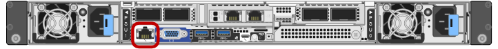

= Dispositivos SG100 y SG1000: Descripción general
:allow-uri-read: 
:icons: font
:imagesdir: ../media/

[role="lead"]
La aplicación de servicios SG100 de StorageGRID y la aplicación de servicios SG1000 pueden funcionar como nodo de puerta de enlace y como nodo de administración para ofrecer servicios de equilibrio de carga de alta disponibilidad en un sistema StorageGRID. Ambos dispositivos pueden funcionar como nodos de puerta de enlace y nodos de administración (primarios o no primarios) al mismo tiempo.

== Funciones de los dispositivos

Ambos modelos del dispositivo de servicios ofrecen las siguientes características:

* Funciones del nodo de puerta de enlace o del nodo de administración para un sistema StorageGRID.
* El instalador de dispositivos StorageGRID para simplificar la puesta en marcha y la configuración de nodos.
* Cuando se implementa, puede acceder al software StorageGRID desde un nodo de administración existente o desde el software descargado en una unidad local. Para simplificar aún más el proceso de implementación, se incluye una versión reciente del software en el dispositivo durante la fabricación.
* Un controlador de administración en placa base (BMC) para supervisar y diagnosticar parte del hardware del dispositivo.
* La capacidad de conectarse a las tres redes StorageGRID, incluidas la red de grid, la red de administración y la red de cliente:
+
** El SG100 admite hasta cuatro conexiones de 10 o 25 GbE a la red Grid y a la red de clientes.
** El SG1000 admite hasta cuatro conexiones de 10, 25, 40 o 100 GbE a la red Grid y a la red de clientes.

== Diagramas SG100 y SG1000

Esta figura muestra la parte frontal del SG100 y el SG1000 con el bisel retirado. Desde la parte frontal, los dos aparatos son idénticos a excepción del nombre del producto en el bisel.

Las dos unidades de estado sólido (SSD), indicadas con el esquema naranja, se utilizan para almacenar el sistema operativo StorageGRID y se duplican con RAID 1 para la redundancia. Cuando el dispositivo de servicios SG100 o SG1000 está configurado como nodo de administración, estas unidades se pueden utilizar para almacenar registros de auditoría, métricas y tablas de bases de datos.

Las ranuras de unidades restantes están vacías.

Esta figura muestra la ubicación del suministro de alimentación e identifica los LED en la parte posterior del SG100 y del SG1000. En los puertos del dispositivo hay indicadores LED adicionales de estado y actividad. Estos LED pueden variar según el modelo de dispositivo.

image::../media/q2023_rear_leds.png[LED traseros SG100 y SG1000]

[cols="1a,2a,3a"]
|===
| Llamada | LED | Estado 

 a| 
1
 a| 
LED de fuente de alimentación
 a| 
* Verde, sólido: Alimentación aplicada al aparato, el botón de encendido está encendido.
* Verde, parpadeante: Se ha aplicado la alimentación al aparato, el botón de encendido está apagado.
* Apagado: No se ha aplicado alimentación al aparato.
* Ámbar: Fallo en la fuente de alimentación.

 a| 
2
 a| 
Identifique el LED
 a| 
* Azul, parpadeando: Identifica el dispositivo en el armario o rack.
* Azul, sólido: Identifica el dispositivo en el armario o rack.
* Desactivado: El aparato no se puede identificar visualmente en el armario o bastidor.

|===

== SG100 conectores

Esta figura muestra los conectores en la parte posterior del SG100.

image::../media/sg100_rear_connectors.png[Conectores traseros SG100]

[cols="1a,2a,2a,2a"]
|===
| Llamada | Puerto | Tipo | Uso 

 a| 
1
 a| 
Puertos de red 1-4
 a| 
10/25-GbE, según el tipo de transceptor cable o SFP (se admiten los módulos SFP28 y SFP+), la velocidad del switch y la velocidad de enlace configurada
 a| 
Conéctese a la red de red y a la red de cliente para StorageGRID.

 a| 
2
 a| 
Puerto de gestión de BMC
 a| 
1 GbE (RJ-45).
 a| 
Conéctese al controlador de administración de la placa base del dispositivo.

 a| 
3
 a| 
Puertos de diagnóstico y soporte
 a| 
* VGA
* Serie, 115200 8-N-1
* USB

 a| 
Reservado para uso del soporte técnico.

 a| 
4
 a| 
Puerto de red de administrador 1
 a| 
1 GbE (RJ-45).
 a| 
Conecte el dispositivo a la red de administración para StorageGRID.

 a| 
5
 a| 
Puerto de red de administración 2
 a| 
1 GbE (RJ-45).
 a| 
Opciones:

* Bond con el puerto de gestión 1 para una conexión redundante con la red de administrador para StorageGRID.
* Deje desconectado y disponible para acceso local temporal (IP 169.254.0.1).
* Durante la instalación, use el puerto 2 para la configuración IP si las direcciones IP asignadas para DHCP no están disponibles.

|===

== SG1000 conectores

Esta figura muestra los conectores en la parte posterior del SG1000.

image::../media/sg1000_rear_connectors.png[Conectores posteriores SG1000]

[cols="1a,2a,2a,2a"]
|===
| Llamada | Puerto | Tipo | Uso 

 a| 
1
 a| 
Puertos de red 1-4
 a| 
10/25/40/100-GbE, basado en el tipo de cable o transceptor, la velocidad del switch y la velocidad de enlace configurada. Se admiten QSFP28 y QSFP+ (40 GbE) de forma nativa y se pueden utilizar transceptores SFP28/SFP+ con una QSA (se vende por separado) para utilizar velocidades de 10 GbE.
 a| 
Conéctese a la red de red y a la red de cliente para StorageGRID.

 a| 
2
 a| 
Puerto de gestión de BMC
 a| 
1 GbE (RJ-45).
 a| 
Conéctese al controlador de administración de la placa base del dispositivo.

 a| 
3
 a| 
Puertos de diagnóstico y soporte
 a| 
* VGA
* Serie, 115200 8-N-1
* USB

 a| 
Reservado para uso del soporte técnico.

 a| 
4
 a| 
Puerto de red de administrador 1
 a| 
1 GbE (RJ-45).
 a| 
Conecte el dispositivo a la red de administración para StorageGRID.

 a| 
5
 a| 
Puerto de red de administración 2
 a| 
1 GbE (RJ-45).
 a| 
Opciones:

* Bond con el puerto de gestión 1 para una conexión redundante con la red de administrador para StorageGRID.
* Deje desconectado y disponible para acceso local temporal (IP 169.254.0.1).
* Durante la instalación, use el puerto 2 para la configuración IP si las direcciones IP asignadas para DHCP no están disponibles.

|===

== Aplicaciones SG100 y SG1000

Puede configurar los dispositivos de servicios StorageGRID de diversas formas para proporcionar servicios de puerta de enlace, así como redundancia de algunos servicios de administración de grid.

Los dispositivos se pueden implementar de las siguientes formas:

* Agregue a una cuadrícula nueva o existente como nodo de puerta de enlace
* Añada a un grid nuevo como nodo de administrador principal o no primario, o a un grid existente como nodo de administrador no primario
* Opere como un nodo de puerta de enlace y un nodo de administración (principal o no primario) al mismo tiempo

El dispositivo facilita el uso de grupos de alta disponibilidad (ha) y el equilibrio de carga inteligente para las conexiones de la ruta de datos S3 o Swift.

Los siguientes ejemplos describen cómo puede maximizar las funcionalidades del dispositivo:

* Utilice dos dispositivos SG100 o dos SG1000 para proporcionar servicios de puerta de enlace configurándolos como nodos de puerta de enlace.
+

NOTE: Mezclar dispositivos de servicios con diferentes niveles de rendimiento en el mismo sitio, como SG100 o SG110 con SG1000 o SG1100, puede provocar resultados impredecibles e incoherentes cuando se usan varios nodos de un grupo de alta disponibilidad o al equilibrar la carga del cliente en varios dispositivos de servicios.

* Utilice dos dispositivos SG100 o dos SG1000 para ofrecer redundancia en algunos servicios de administración de grid. Para ello, configure cada dispositivo como nodos de administración.
* Utilice dos dispositivos SG100 o dos SG1000 para ofrecer servicios de equilibrio de carga y configuración de tráfico de alta disponibilidad a los que se accede a través de una o más direcciones IP virtuales. Para ello, configure los dispositivos como cualquier combinación de nodos de administrador o nodos de puerta de enlace y añada ambos nodos al mismo grupo de alta disponibilidad.
+

NOTE: Si utiliza nodos de administración y nodos de pasarela en el mismo grupo de alta disponibilidad, el puerto de solo nodo de administración no conmutará al nodo de respaldo. Consulte las instrucciones para https://docs.netapp.com/us-en/storagegrid/admin/configure-high-availability-group.html["Configurar grupos de alta disponibilidad"^].

Cuando se utiliza con dispositivos de almacenamiento StorageGRID, tanto el SG100 como los dispositivos de servicios SG1000 permiten la implementación de grids de dispositivo únicamente sin dependencias en hipervisores externos o hardware informático.
