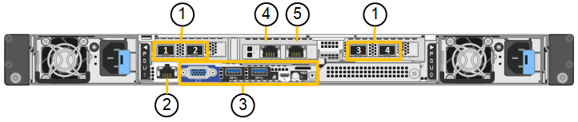
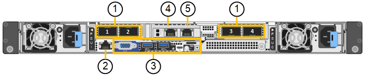

= Dispositivos SG110 y SG1100: Información general
:allow-uri-read: 
:icons: font
:imagesdir: ../media/

[role="lead"]
El dispositivo de servicios StorageGRID SG110 y el dispositivo de servicios SG1100 pueden funcionar como un nodo de pasarela y como nodo de administración para proporcionar servicios de balanceo de carga de alta disponibilidad en un sistema StorageGRID. Ambos dispositivos pueden funcionar como nodos de puerta de enlace y nodos de administración (primarios o no primarios) al mismo tiempo.

== Funciones de los dispositivos

Ambos modelos del dispositivo de servicios ofrecen las siguientes características:

* Funciones del nodo de puerta de enlace o del nodo de administración para un sistema StorageGRID.
* El instalador de dispositivos StorageGRID para simplificar la puesta en marcha y la configuración de nodos.
* Cuando se implementa, puede acceder al software StorageGRID desde un nodo de administración existente o desde el software descargado en una unidad local. Para simplificar aún más el proceso de implementación, se incluye una versión reciente del software en el dispositivo durante la fabricación.
* Un controlador de administración en placa base (BMC) para supervisar y diagnosticar parte del hardware del dispositivo.
* La capacidad de conectarse a las tres redes StorageGRID, incluidas la red de grid, la red de administración y la red de cliente:
+
** El SG110 admite hasta cuatro conexiones de 10 o 25 GbE a la red Grid y a la red cliente.
** El SG1100 admite hasta cuatro conexiones de 10, 25, 40 o 100 GbE a la red Grid y a la red cliente.

== Diagramas SG110 y SG1100

En esta figura se muestra el frente de SG110 y SG1100 con el panel frontal quitado. Desde la parte frontal, los dos aparatos son idénticos a excepción del nombre del producto en el bisel.

image::../media/sg1100_front_with_ssds.png[Parte frontal con SSD SG110 y SG1100]

Las dos unidades de estado sólido (SSD), indicadas con el esquema naranja, se utilizan para almacenar el sistema operativo StorageGRID y se duplican con RAID 1 para la redundancia. Cuando el dispositivo de servicios SG110 o SG1100 está configurado como nodo de administración, estas unidades se pueden utilizar para almacenar registros de auditoría, métricas y tablas de bases de datos.

Las ranuras de unidades restantes están vacías.

== SG110 conectores

Esta figura muestra la parte posterior de SG110, incluidos los puertos, los ventiladores y los suministros de alimentación.

[cols="1a,2a,2a,2a"]
|===
| Llamada | Puerto | Tipo | Uso 

 a| 
1
 a| 
Puertos de red 1-4
 a| 
10/25-GbE, según el tipo de transceptor cable o SFP (se admiten los módulos SFP28 y SFP+), la velocidad del switch y la velocidad de enlace configurada
 a| 
Conéctese a la red de red y a la red de cliente para StorageGRID.

 a| 
2
 a| 
Puerto de gestión de BMC
 a| 
1 GbE (RJ-45).
 a| 
Conéctese al controlador de administración de la placa base del dispositivo.

 a| 
3
 a| 
Puertos de diagnóstico y soporte
 a| 
* VGA
* USB
* Puerto de consola Micro-USB
* Módulo de ranura Micro-SD

 a| 
Reservado para uso del soporte técnico.

 a| 
4
 a| 
Puerto de red de administrador 1
 a| 
1 U/10 GbE (RJ-45)
 a| 
Conecte el dispositivo a la red de administración para StorageGRID.

 a| 
5
 a| 
Puerto de red de administración 2
 a| 
1 U/10 GbE (RJ-45)
 a| 
Opciones:

* Bond con el puerto de gestión 1 para una conexión redundante con la red de administrador para StorageGRID.
* Deje desconectado y disponible para acceso local temporal (IP 169.254.0.1).
* Durante la instalación, use el puerto 2 para la configuración IP si las direcciones IP asignadas para DHCP no están disponibles.

|===

== SG1100 conectores

Esta figura muestra los conectores en la parte posterior del SG1100.

[cols="1a,2a,2a,2a"]
|===
| Llamada | Puerto | Tipo | Uso 

 a| 
1
 a| 
Puertos de red 1-4
 a| 
10/25/40/100-GbE, basado en el tipo de cable o transceptor, la velocidad del switch y la velocidad de enlace configurada. Compatible de forma nativa con QSFP56 (limitado a 100GbE GbE/puerto), QSFP28 (100GbE GbE) y QSFP+ (40GbE GbE). Los transceptores SFP+ (10GbE) o SFP28 (25GbE) opcionales se pueden utilizar con un QSA (se vende por separado).
 a| 
Conéctese a la red de red y a la red de cliente para StorageGRID.

 a| 
2
 a| 
Puerto de gestión de BMC
 a| 
1 GbE (RJ-45).
 a| 
Conéctese al controlador de administración de la placa base del dispositivo.

 a| 
3
 a| 
Puertos de diagnóstico y soporte
 a| 
* VGA
* USB
* Puerto de consola Micro-USB
* Módulo de ranura Micro-SD

 a| 
Reservado para uso del soporte técnico.

 a| 
4
 a| 
Puerto de red de administrador 1
 a| 
1 U/10 GbE (RJ-45)
 a| 
Conecte el dispositivo a la red de administración para StorageGRID.

 a| 
5
 a| 
Puerto de red de administración 2
 a| 
1 U/10 GbE (RJ-45)
 a| 
Opciones:

* Bond con el puerto de gestión 1 para una conexión redundante con la red de administrador para StorageGRID.
* Deje desconectado y disponible para acceso local temporal (IP 169.254.0.1).
* Durante la instalación, use el puerto 2 para la configuración IP si las direcciones IP asignadas para DHCP no están disponibles.

|===

== Aplicaciones SG110 y SG1100

Puede configurar los dispositivos de servicios StorageGRID de diversas formas para proporcionar servicios de puerta de enlace, así como redundancia de algunos servicios de administración de grid.

Los dispositivos se pueden implementar de las siguientes formas:

* Agregue a una cuadrícula nueva o existente como nodo de puerta de enlace
* Añada a un grid nuevo como nodo de administrador principal o no primario, o a un grid existente como nodo de administrador no primario
* Opere como un nodo de puerta de enlace y un nodo de administración (principal o no primario) al mismo tiempo

El dispositivo facilita el uso de grupos de alta disponibilidad (ha) y el equilibrio de carga inteligente para las conexiones de la ruta de datos S3 o Swift.

Los siguientes ejemplos describen cómo puede maximizar las funcionalidades del dispositivo:

* Utilice dos dispositivos SG110 o dos dispositivos SG1100 para proporcionar servicios de puerta de enlace configurándolos como nodos de puerta de enlace.
+

IMPORTANT: No ponga en marcha los dispositivos de servicio SG110 y SG1100 en el mismo sitio. El rendimiento puede ser impredecible.

* Utilice dos dispositivos SG110 o dos dispositivos SG1100 para proporcionar redundancia de algunos servicios de administración de grid. Para ello, configure cada dispositivo como nodos de administración.
* Utilice dos dispositivos SG110 o dos SG1100 para proporcionar servicios de equilibrio de carga y perfilado de tráfico de alta disponibilidad a los que se accede a través de una o más direcciones IP virtuales. Para ello, configure los dispositivos como cualquier combinación de nodos de administrador o nodos de puerta de enlace y añada ambos nodos al mismo grupo de alta disponibilidad.
+

IMPORTANT: Si utiliza nodos de administración y nodos de pasarela en el mismo grupo de alta disponibilidad, el puerto de solo nodo de administración no conmutará al nodo de respaldo. Consulte las instrucciones para https://docs.netapp.com/us-en/storagegrid-118/admin/configure-high-availability-group.html["Configurar grupos de alta disponibilidad"^].

Cuando se usan con dispositivos de almacenamiento de StorageGRID, tanto los dispositivos de servicios SG110 como SG1100 permiten la puesta en marcha de grids de solo dispositivos sin dependencias de hipervisores externos o hardware de computación.
