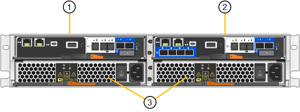

= Dispositivos SG5800: Información general
:allow-uri-read: 
:icons: font
:imagesdir: ../media/

[role="lead"]
El dispositivo SG5800 StorageGRID es una plataforma integrada de almacenamiento y computación que funciona como un nodo de almacenamiento en un grid de StorageGRID.

El dispositivo StorageGRID de la serie SG5800 ofrece las siguientes características:

* Integre los elementos de computación y almacenamiento para un nodo de almacenamiento de StorageGRID.
* Incluya el instalador de dispositivos StorageGRID para simplificar la puesta en marcha y la configuración del nodo de almacenamiento.
* Incluye System Manager de la serie E-Series SANtricity para la gestión y supervisión del hardware.
* Admite hasta cuatro conexiones de 10 GbE o 25 GbE a la red Grid y a la red cliente de StorageGRID.
* Compatible con unidades de cifrado de disco completo (FDE) o FIPS. Cuando estas unidades se usan con la función Drive Security en SANtricity System Manager, se evita el acceso no autorizado a los datos.

El dispositivo SG5800 está disponible en dos modelos: SG5812 y SG5860.

== SG5800 componentes

Los modelos SG5800 incluyen los siguientes componentes:

[role="tabbed-block"]
====
.SG5812
--
Controladora de computación:: Controlador SG5800
Controladora de almacenamiento:: Controlador E4000
Chasis:: E-Series DE212C, un compartimento de dos unidades rack (2U)
Unidades:: 12 unidades NL-SAS (3.5 pulgadas)
Sistemas de alimentación y ventiladores redundantes:: Dos contenedores de alimentación/ventilador

--
.SG5860
--
Controladora de computación:: Controlador SG5800
Controladora de almacenamiento:: Controlador E4000
Chasis:: Compartimento DE460C E-Series, un compartimento de cuatro unidades de rack (4U)
Unidades:: Unidades de NL-SAS de 60 TB (3,5 pulgadas)
Sistemas de alimentación y ventiladores redundantes:: Dos contenedores de alimentación y dos contenedores de ventilador

--
====
El almacenamiento bruto máximo disponible en el dispositivo StorageGRID es fijo, en función del número de unidades de cada compartimento. No es posible ampliar el almacenamiento disponible añadiendo una bandeja con unidades adicionales.

== SG5800 diagramas

=== Vistas frontal y trasera de SG5812

Las cifras muestran la parte frontal y posterior del SG5812, un compartimento 2U con capacidad para 12 unidades.

image::../media/sg5812_front_and_back_views.png[La parte frontal y posterior del dispositivo SG5812]

=== SG5812 componentes

SG5812 incluye dos controladoras y dos contenedores de alimentación/ventiladores.

[cols="1a,3a"]
|===
| Llamada | Descripción 

 a| 
1
 a| 
Controladora E4000 (controladora de almacenamiento)

 a| 
2
 a| 
Controladora SG5800 (controladora de computación)

 a| 
3
 a| 
Contenedores de alimentación/ventilador

|===

=== Vistas frontal y trasera de SG5860

Las cifras muestran la parte frontal y posterior del modelo SG5860, un compartimento 4U con capacidad para 60 unidades en 5 cajones de unidades.

image::../media/sg5860_front_and_back_views.png[Parte delantera y trasera del dispositivo SG5860]

=== SG5860 componentes

SG5860 incluye dos controladoras, dos contenedores de ventilador y dos contenedores de alimentación.

image::../media/sg5860_with_callouts.png[Controladoras,fan canisters,and power canisters in SG5860 appliance]

[cols="1a,2a"]
|===
| Llamada | Descripción 

 a| 
1
 a| 
Controladora E4000 (controladora de almacenamiento)

 a| 
2
 a| 
Controladora SG5800 (controladora de computación)

 a| 
3
 a| 
Contenedor de ventilador (1 de 2)

 a| 
4
 a| 
Contenedor de alimentación (1 de 2)

|===

== Controlador SG5800

Los modelos SG5812 de 12 unidades y SG5860 de 60 unidades del dispositivo StorageGRID incluyen una controladora de computación SG5800 y una controladora de almacenamiento E-Series E4000.

=== Controladora de computación de SG5800

* Funciona como servidor de computación del dispositivo.
* Incluye el instalador de dispositivos StorageGRID.
+

NOTE: El software StorageGRID no está preinstalado en el dispositivo. A este software se accede desde el nodo de administración cuando se implementa el dispositivo.

* Se puede conectar a las tres redes StorageGRID, incluidas la red de cuadrícula, la red de administración y la red de cliente.
* Se conecta a la controladora E4000 y funciona como iniciador.

==== SG5800 conectores

image::../media/sg5800_controller_with_callouts.png[Conectores en el controlador SG5800]

[cols="1a,2a,2a,2a"]
|===
| Llamada | Puerto | Tipo | Uso 

 a| 
1
 a| 
Puerto de gestión 1
 a| 
Ethernet de 1 GB (RJ-45)
 a| 
Conéctese a la red de administración para StorageGRID.

 a| 
2
 a| 
Puertos de diagnóstico y soporte
 a| 
* Puerto serie RJ-45
* Puerto serie USB-C.
* Puerto USB

 a| 
Reservado para soporte técnico.

 a| 
3
 a| 
Puertos de expansión de unidades
 a| 
SAS de 12 GB/s
 a| 
No se utiliza.

 a| 
4
 a| 
Puertos de interconexión 1 y 2
 a| 
25GbE iSCSI
 a| 
Conecte el controlador SG5800 al controlador E4000.

 a| 
5
 a| 
Puertos de red 1-4
 a| 
10-GbE o 25-GbE, según el tipo de transceptor SFP, la velocidad del switch y la velocidad de enlace configurada
 a| 
Conéctese a la red de red y a la red de cliente para StorageGRID.

|===

=== Controladora de almacenamiento E4000

La controladora de almacenamiento de la serie E4000 tiene las siguientes especificaciones:

* Funciona como controladora de almacenamiento del dispositivo.
* Gestiona el almacenamiento de datos en las unidades.
* Funciona como controladora E-Series estándar en modo simple.
* Incluye software de sistema operativo SANtricity (firmware de la controladora).
* Incluye System Manager de SANtricity para supervisar el hardware del dispositivo y gestionar alertas, la función AutoSupport y la función Drive Security.
* Se conecta a la controladora SG5800 y funciona como destino.

==== E4000 conectores

image::../media/e4000_controller_with_callouts.png[Conectores en el controlador E4000]

[cols="1a,2a,2a,2a"]
|===
| Llamada | Puerto | Tipo | Uso 

 a| 
1
 a| 
Puerto de gestión
 a| 
Ethernet de 1 GB (RJ-45)
 a| 
Opciones de puerto:
** Conectarse a una red de administración para permitir el acceso directo TCP/IP al Administrador del sistema de SANtricity
** Dejar sin cables para guardar un puerto de switch y una dirección IP.  Acceda al administrador del sistema de SANtricity mediante Grid Manager o el instalador de Storage Grid Appliance.

*Nota*: Algunas funciones opcionales de SANtricity, como la sincronización NTP para registros de hora precisos, no están disponibles cuando decide dejar el puerto de administración sin cables.

*Nota*: StorageGRID 11,8 o superior, y SANtricity 11,8 o superior, son necesarios cuando dejas la gestión sin cables.

 a| 
2
 a| 
Puertos de diagnóstico y soporte
 a| 
* Puerto serie RJ-45
* Puerto serie USB-C.
* Puerto USB

 a| 
Reservado para uso del soporte técnico.

 a| 
3
 a| 
Puertos de expansión de unidades.
 a| 
SAS de 12 GB/s
 a| 
No se utiliza.

 a| 
4
 a| 
Puertos de interconexión 1 y 2
 a| 
25GbE iSCSI
 a| 
Conecte el controlador E4000 al controlador SG5800.

|===
.Información relacionada
http://mysupport.netapp.com/info/web/ECMP1658252.html["Sitio de documentación para sistemas E-Series y EF-Series de NetApp"^]
