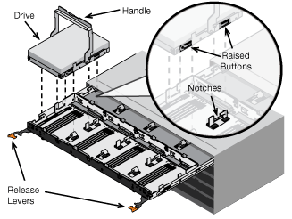

= Instale en el armario o rack (SG5700)
:allow-uri-read: 
:icons: font
:imagesdir: ../media/

[role="lead"]
Instale un conjunto de rieles en el armario o rack y, a continuación, deslice el dispositivo sobre los rieles. Si tiene un SG5760, instale las unidades después de instalar el dispositivo.

.Antes de empezar
* Ha revisado el documento de avisos de seguridad que se incluye en la caja y comprende las precauciones para mover e instalar el hardware.
* Tiene las instrucciones incluidas en el kit de raíl.

== Instale SG5712

Siga estos pasos para instalar un dispositivo SG5712 en un rack o armario.

CAUTION: El SG5712 pesa aproximadamente 29 kg (64 lb) cuando está totalmente cargado con unidades. Se requiere que dos personas o un ascensor mecanizado muevan de forma segura el SG5712.

CAUTION: Instale el hardware desde la parte inferior del rack, armario o rack hasta para evitar que el equipo vuelque.

.Pasos
. Siga las instrucciones del kit de rieles para instalar los rieles.
. Coloque la parte posterior del aparato (el extremo con los conectores) en los rieles.
. Deslice con cuidado el aparato completamente hacia atrás en el armario o rack.
. Fije el aparato al armario o al bastidor tal y como se indica en las instrucciones del kit de guías.
. Fije el panel frontal en la parte frontal.

== Instale SG5760

Siga estos pasos para instalar un dispositivo SG5760 y cualquier bandeja de expansión en un rack o armario.

CAUTION: Instale el hardware desde la parte inferior del rack, armario o rack hasta para evitar que el equipo vuelque.

CAUTION: El SG5760 pesa aproximadamente 60 kg (132 lb) sin unidades instaladas. Se requiere que cuatro personas o un ascensor mecanizado muevan de forma segura un SG5760 vacío.

CAUTION: Para evitar que se dañe el hardware, no mueva nunca un SG5760 si hay unidades instaladas. Debe quitar todas las unidades antes de mover la bandeja.

.Pasos
. Siga las instrucciones del kit de raíl para instalar los rieles en su armario o rack.
. Prepárese para mover el aparato:
+
.. Retire la caja de embalaje exterior.
.. Pliegue hacia abajo las solapas de la caja interior.
.. Si va a levantar el SG5760 manualmente, fije las cuatro asas a los lados del chasis.
+
Retire estas asas mientras desliza el aparato sobre los rieles.

. Si su gabinete tiene un orificio cuadrado, instale las tuercas de la jaula para que pueda asegurar la parte delantera y trasera del estante con tornillos.
. Coloque la parte posterior del aparato (el extremo con los conectores) en los rieles.
. Sostenga el dispositivo desde la parte inferior, deslícelo en el rack o armario.
+
Utilice los pestillos para quitar las asas mientras desliza el aparato hacia adentro.

. Fije el aparato a la parte delantera del bastidor insertando dos tornillos en el primer y tercer orificio (contando desde la parte superior) de cada lado.
. Fije el dispositivo a la parte posterior del rack o armario con los soportes.
. Instale 12 unidades en cada uno de los cinco cajones de unidades.
+
Debe instalar las 60 unidades para garantizar que su funcionamiento es correcto.

+
.. Coloque la muñequera ESD y retire los accionamientos de su embalaje.
.. Suelte las palancas del cajón de mando superior y deslice el cajón hacia fuera con las palancas.
.. Levante el asa de la unidad a la posición vertical y alinee los botones de la unidad con las muescas del cajón.
+

.. Al presionar suavemente en la parte superior de la unidad, gire la palanca de mando hacia abajo hasta que la unidad encaje en su lugar.
.. Después de instalar los primeros 12 mandos, deslice el cajón hacia atrás presionando el centro y cerrando ambas palancas con cuidado.
.. Repita estos pasos para los otros cuatro cajones.

. Conecte el panel frontal.

