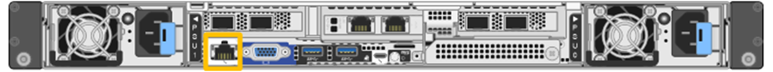
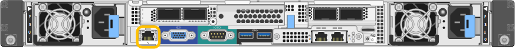
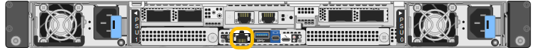
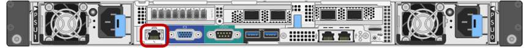

= Establece la dirección IP del puerto de gestión BMC en un dispositivo StorageGRID
:allow-uri-read: 
:icons: font
:imagesdir: ../media/

[role="lead"]
Para poder acceder a la interfaz BMC, configure la dirección IP para el puerto de gestión BMC en las controladoras SGF6112, SG6000-CN, SG6100-CN o de los dispositivos de servicios.

Si utiliza ConfigBuilder para generar un archivo JSON, puede configurar direcciones IP automáticamente. Consulte link:automating-appliance-installation-and-configuration.html["Automatice la instalación y configuración de los dispositivos"].

.Acerca de esta tarea
Para fines de soporte, el puerto de gestión del BMC permite un acceso bajo al hardware.

NOTE: Solo debe conectar este puerto a una red de gestión interna segura y de confianza. Si no hay ninguna red disponible, deje el puerto BMC desconectado o bloqueado, a menos que el soporte técnico solicite una conexión a BMC.

.Antes de empezar
* El cliente de gestión está utilizando https://docs.netapp.com/us-en/storagegrid/admin/web-browser-requirements.html["navegador web compatible"^].
* Está usando cualquier cliente de gestión que pueda conectarse a una red StorageGRID.
* El puerto de gestión del BMC está conectado a la red de gestión que tiene previsto utilizar.
+
[role="tabbed-block"]
====
.SG100
--
image::../media/sg100_bmc_management_port.png[SG100 Puerto de administración de BMC]

--
.SG110
--

--
.SG120
--
image::../media/sg120_bmc_management_port.png[Puerto de gestión de BMC SG120]

--
.SG1000
--

--
.SG1100
--
image::../media/sg1100_bmc_management_port.png[Puerto de gestión SG1100 de BMC]

--
.SG1200
--

--
.SG6000
--

--
.SG6100
--
_SGF6112_:

_SG6100-CN_:

image::../media/sg6100_cn_bmc_management_port.png[Puerto de gestión BMC SG610-CN]

--
.SG6200
--
_SGF6212_:

image::../media/sgf6212_bmc_management_port.png[Puerto de gestión BMC SGF6212]

_SG6200-CN_:

image::../media/sg6200_cn_bmc_management_port.png[Puerto de gestión BMC SG6200-CN]

--
====

.Pasos
. Desde el cliente, introduzca la URL del instalador de dispositivos de StorageGRID: +
`*https://_Appliance_IP_:8443*`
+
Para `Appliance_IP`, Utilice la dirección IP del dispositivo en cualquier red StorageGRID.

+
Aparece la página de inicio del instalador de dispositivos de StorageGRID.

. Seleccione *Configurar hardware* > *Configuración BMC*.
+
Aparece la página Configuración de la controladora de gestión de placa base.

. En la configuración de IP de LAN, tome nota de la dirección IPv4 que se muestra automáticamente.
+
DHCP es el método predeterminado para asignar una dirección IP a este puerto.

+

NOTE: Puede que los valores de DHCP deban tardar varios minutos en aparecer.

. De manera opcional, establezca una dirección IP estática para el puerto de gestión del BMC.
+

NOTE: Debe asignar una IP estática al puerto de gestión de BMC o una concesión permanente para la dirección en el servidor DHCP.

+
.. Seleccione *estático*.
.. Introduzca la dirección IPv4 mediante la notación CIDR.
.. Introduzca la pasarela predeterminada.
.. Haga clic en *Guardar*.
+
Puede que los cambios se apliquen en unos minutos.

