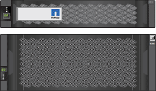
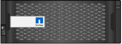

= Desempaquetar cajas
:allow-uri-read: 
:icons: font
:imagesdir: ../media/

[role="lead"]
Antes de instalar el aparato StorageGRID, desembale todas las cajas y compare el contenido con los elementos de la hoja de embalaje.

[role="tabbed-block"]
====
.SG100 y SG1000
--
* *Hardware*
+
SG100 o SG1000::
+
--
image::../media/sg6000_cn_front_without_bezel.gif[Unidades frontales SG 100 o dispositivo de servicios SG1000]

--
Kit de rieles con instrucciones::
+
--
image::../media/rail_kit.gif[Kit de rieles]

--

* * Cables de alimentación *
+

TIP: Es posible que el armario tenga cables de alimentación especiales que utilice en lugar de los cables de alimentación que se suministran con el aparato.

+
Dos cables de alimentación para su país::
+
--
image::../media/power_cords.gif[Cables de alimentación]

--

--
.SG5700
--
* *Hardware*
+
Dispositivo SG5712 con 12 unidades instaladas::
+
--
image::../media/de212c_table_size.gif[Dispositivo SG5712 2U]

--
Dispositivo SG5760 sin unidades instaladas::
+
--
image::../media/de460c_table_size.gif[Dispositivo SG5760 4U]

--
Panel frontal para el dispositivo::
+
--

--
Kit de rieles con instrucciones::
+
--
image::../media/rail_kit.gif[Kit de rieles]

--
SG5760: Sesenta unidades::
+
--
image::../media/sg5760_drive.gif[Unidad]

--
SG5760: Mangos::
+
--
image::../media/handles.gif[SG5760 gestiona]

--
SG5760: Soportes traseros y tuercas de jaula para la instalación en rack con orificios cuadrados::
+
--
image::../media/back_brackets_table_size.gif[Soportes y tuercas de jaula para SG5760]

--

* *Cables y conectores*
+

TIP: Es posible que el armario tenga cables de alimentación especiales que utilice en lugar de los cables de alimentación que se suministran con el aparato.

+
Dos cables de alimentación para su país::
+
--
image::../media/power_cords.gif[Cables de alimentación]

--
Cables ópticos y transceptores SFP::
+
--
image::../media/fc_cable_and_sfp.gif[Cables ópticos y SFP]

** Dos cables ópticos para los puertos de interconexión de FC
** Ocho transceptores SFP+, compatible con los cuatro puertos FC interconnect de 16 GB/s y los cuatro puertos de red de 10 GbE

--

--
.SG6000
--
* *SG6060 hardware*
+
Controlador SG6000-CN::
+
--
image::../media/sg6000_cn_front_without_bezel.gif[Controlador SG6000-CN]

--
Bandeja de controladoras E2860 sin unidades instaladas::
+
--
image::../media/de460c_table_size.gif[Dispositivo SG5760 4U]

--
Dos biseles frontales::
+
--
image::../media/sg6000_front_bezels_for_table.gif[Bezeles delanteros]

--
Kits de dos guías con instrucciones::
+
--
image::../media/rail_kit.gif[Kit de rieles]

--
60 unidades (SSD de 2 TB y NL-SAS de 58 TB)::
+
--
image::../media/sg5760_drive.gif[Unidad]

--
Cuatro asas::
+
--
image::../media/handles.gif[SG5760 gestiona]

--
Soportes traseros y tuercas de jaula para la instalación del bastidor con orificios cuadrados::
+
--
image::../media/back_brackets_table_size.gif[Soportes y tuercas de jaula para SG5760]

--

* *SG6060 estante de expansión*
+
Bandeja de expansión sin unidades instaladas::
+
--
image::../media/de460c_table_size.gif[Dispositivo SG5760 4U]

--
Cubierta frontal::
+
--

--
Unidades NL-SAS de 60 TB::
+
--
image::../media/sg5760_drive.gif[Unidad]

--
Un kit de guías con instrucciones::
+
--
image::../media/rail_kit.gif[Kit de rieles]

--
Cuatro asas::
+
--
image::../media/handles.gif[SG5760 gestiona]

--
Soportes traseros y tuercas de jaula para la instalación del bastidor con orificios cuadrados::
+
--
image::../media/back_brackets_table_size.gif[Soportes y tuercas de jaula para SG5760]

--

* *SGF6024 hardware*
+
Controlador SG6000-CN::
+
--
image::../media/sg6000_cn_front_without_bezel.gif[Controlador SG6000-CN]

--
Cabina flash EF570 con 24 unidades de estado sólido (flash) instaladas::
+
--
image::../media/de224c_with_drives.gif[Bandeja de controladoras EF570]

--
Dos biseles frontales::
+
--
image::../media/sgf6024_front_bezels_for_table.png[Molduras frontales SG6024]

--
Kits de dos guías con instrucciones::
+
--
image::../media/rail_kit.gif[Kit de rieles]

--
Tapas de extremo de estante::
+
--
image::../media/endcaps.png[Tapas]

--

* *Cables y conectores*
+

TIP: Es posible que el armario tenga cables de alimentación especiales que utilice en lugar de los cables de alimentación que se suministran con el aparato.

+
Cuatro cables de alimentación para su país::
+
--
image::../media/power_cords.gif[Cables de alimentación]

--
Cables ópticos y transceptores SFP::
+
--
image::../media/fc_cable_and_sfp.gif[Cables ópticos y SFP]

** Cuatro cables ópticos para los puertos de interconexión FC
** Cuatro transceptores SFP+, que admiten FC de 16 GB/s.

--
Opcional: Dos cables SAS para conectar cada bandeja de expansión SG6060::
+
--
image::../media/sas_cable.gif[Cables SAS]

--

--
.SG6100
--
* *Hardware*
+
SGF6112::
+
--
image::../media/sgf6112_front_with_ssds.png[Unidades frontales dispositivo SGF6112]

--
Kit de rieles con instrucciones::
+
--
image::../media/rail_kit.gif[Kit de rieles]

--
Cubierta frontal::
+
--
image::../media/sgf_6112_front_bezel.png[Cubierta frontal]

--

* * Cables de alimentación *
+

TIP: Es posible que el armario tenga cables de alimentación especiales que utilice en lugar de los cables de alimentación que se suministran con el aparato.

+
Dos cables de alimentación para su país::
+
--
image::../media/power_cords.gif[Cables de alimentación]

--

--
====