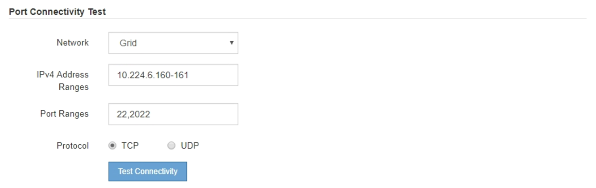

= Verifique las conexiones de red a nivel de puerto
:allow-uri-read: 
:icons: font
:imagesdir: ../media/

[role="lead"]
Para garantizar que los firewalls no obstruyan el acceso entre el instalador del dispositivo StorageGRID y otros nodos, confirme que el instalador del dispositivo StorageGRID puede conectarse a un puerto TCP o a un conjunto de puertos en la dirección IP o el rango de direcciones especificados.

.Acerca de esta tarea
Con la lista de puertos que se incluye en el instalador de dispositivos de StorageGRID, puede probar la conectividad entre el dispositivo y los demás nodos de la red de grid.

Además, puede probar la conectividad en las redes de administración y cliente y en los puertos UDP, como los que se utilizan para servidores NFS o DNS externos. Para ver una lista de estos puertos, consulte https://docs.netapp.com/us-en/storagegrid-118/network/network-port-reference.html["referencia de puerto de red"^].

NOTE: Los puertos de red de grid que aparecen en la tabla de conectividad de puertos son válidos sólo para StorageGRID versión 11,7 o posterior. Para verificar qué puertos son correctos para cada tipo de nodo, siempre debe consultar las directrices de red para su versión de StorageGRID.

.Pasos
. En el instalador del dispositivo StorageGRID, haga clic en *Configurar red* > *Prueba de conectividad de puerto (nmap)*.
+
Aparece la página Prueba de conectividad de puerto.

+
La tabla de conectividad de puertos enumera los tipos de nodos que requieren conectividad TCP en la red de cuadrícula. Para cada tipo de nodo, la tabla enumera los puertos de red de cuadrícula a los que el dispositivo debe acceder.

+
Puede probar la conectividad entre los puertos del dispositivo que aparecen en la tabla y los demás nodos de la red de grid.

. En el menú desplegable *Red*, seleccione la red que desea probar: *Grid*, *Admin* o *Cliente*.
. Especifique un rango de direcciones IPv4 para los hosts en esa red.
+
Por ejemplo, es posible que desee sondear la puerta de enlace en la red o en el nodo de administración principal.

+
Especifique un rango utilizando un guión, como se muestra en el ejemplo.

. Introduzca un número de puerto TCP, una lista de puertos separados por comas o un intervalo de puertos.
+

. Haga clic en *probar conectividad*.
+
** Si las conexiones de red a nivel de puerto seleccionadas son válidas, el mensaje "'Prueba de conectividad de puerto superada'" aparece en un banner verde. El resultado del comando nmap se muestra debajo del banner.
+
image::../media/port_connectivity_test_passed.png[Prueba de conectividad de puerto superada]

** Si se realiza una conexión de red a nivel de puerto al host remoto, pero el host no escucha en uno o más de los puertos seleccionados, el mensaje "'error de prueba de conectividad de puerto'" aparece en un banner amarillo. El resultado del comando nmap se muestra debajo del banner.
+
Cualquier puerto remoto al que no esté escuchando el host tiene un estado de "'cerrado'". Por ejemplo, puede ver este banner amarillo cuando el nodo al que intenta conectarse está en estado preinstalado y el servicio NMS de StorageGRID aún no se está ejecutando en ese nodo.

+
image::../media/nmap_test_yellow_banner.png[Banner amarillo de prueba DE NMAP]

** Si no se puede realizar una conexión de red a nivel de puerto para uno o más puertos seleccionados, el mensaje ««Error de prueba de conectividad de puerto» aparece en un banner rojo. El resultado del comando nmap se muestra debajo del banner.
+
El banner rojo indica que se ha realizado un intento de conexión TCP a un puerto en el host remoto, pero no se ha devuelto nada al remitente. Cuando no se devuelve ninguna respuesta, el puerto tiene un estado de "filtrado" y es probable que sea bloqueado por un firewall.

+

NOTE: También se enumeran los puertos con «'cerrado'».

+
image::../media/nmap_test_red_banner.png[Banner rojo de prueba DE NMAP]

