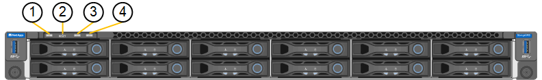
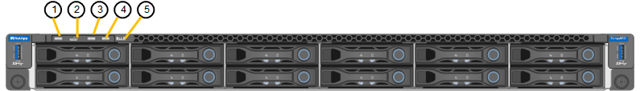

= Ver códigos e indicadores de estado
:allow-uri-read: 
:icons: font
:imagesdir: ../media/

[role="lead"]
Los aparatos y controladores incluyen indicadores que le ayudan a determinar el estado de los componentes del aparato.

[role="tabbed-block"]
====
.SG100 y SG1000
--
El dispositivo incluye indicadores que le ayudan a determinar el estado del controlador del dispositivo y los dos SSD:

* <<appliance_indicators_SG100_1000,Botones e indicadores del aparato>>
* <<general_boot_codes_SG100_1000,códigos generales de arranque>>
* <<ssd_indicators_SG100_1000,Indicadores de SSD>>

Use esta información como ayuda link:troubleshooting-hardware-installation-sg100-and-sg1000.html["Solucionar problemas de instalación de hardware de SG100 y SG1000"].

[[appliance_indicators_SG100_1000]]
Botones e indicadores del aparato::
+
--
En la siguiente figura se muestran los botones e indicadores de estado de los modelos SG100 y SG1000.

[cols="1a,2a,2a"]
|===
| Llamada | Mostrar | Estado 

 a| 
1
 a| 
Botón de encendido
 a| 
* Azul: El aparato está encendido.
* Apagado: El aparato está apagado.

 a| 
2
 a| 
Botón de reinicio
 a| 
Utilice este botón para realizar un restablecimiento completo del controlador.

 a| 
3
 a| 
Botón identificar
 a| 
Este botón se puede establecer en enlace, encendido (sólido) o Apagado.

* Azul, parpadeando: Identifica el dispositivo en el armario o rack.
* Azul, sólido: Identifica el dispositivo en el armario o rack.
* Desactivado: El aparato no se puede identificar visualmente en el armario o bastidor.

 a| 
4
 a| 
LED de alarma
 a| 
* Ámbar, sólido: Se ha producido un error.
+
*Nota:* para ver los códigos de arranque y error, link:accessing-bmc-interface.html["Acceda a la interfaz de BMC"].

* Desactivado: No hay errores.

|===
--

[[general_boot_codes_SG100_1000]]
códigos generales de arranque::
+
--
Durante el arranque o después de un reinicio duro del aparato, ocurre lo siguiente:

. El controlador de administración de la placa base (BMC) registra los códigos de la secuencia de arranque, incluidos los errores que se produzcan.
. El botón de encendido se ilumina.
. Si se produce algún error durante el arranque, el LED de alarma se enciende.
+
Para ver los códigos de error y arranque, link:accessing-bmc-interface.html["Acceda a la interfaz de BMC"].

--

[[ssd_indicators_SG100_1000]]
Indicadores de SSD::
+
--
En la siguiente figura se muestran los indicadores SSD en los sistemas SG100 y SG1000.

image::../media/ssd_indicators.png[Indicadores SSD]

[cols="1a,2a,2a"]
|===
| LED | Mostrar | Estado 

 a| 
1
 a| 
Estado/fallo de la unidad
 a| 
* Azul (sólido): La unidad está en línea
* Ámbar (sólido): Fallo de la unidad
* Ámbar (parpadeante): Luz localizadora de la unidad encendida
* Desactivado: La ranura está vacía

 a| 
2
 a| 
Unidad activa
 a| 
Azul (parpadeante): Se está accediendo a la unidad

|===
--

--
.SG110 y SG1100
--
El dispositivo incluye indicadores que le ayudan a determinar el estado del controlador del dispositivo y de los SSD:

* <<appliance_indicators,Botones e indicadores del aparato>>
* <<general_boot_codes,códigos generales de arranque>>
* <<ssd_indicators,Indicadores de SSD>>

Use esta información como ayuda link:troubleshooting-hardware-installation-sg110-and-sg1100.html["Solucionar problemas de instalación de hardware de SG110 y SG1100"].

[[appliance_indicators]]
Botones e indicadores del aparato::
+
--
En la siguiente figura se muestran los indicadores y los botones de los aparatos SG110 y SG1100.

[cols="1a,2a,3a"]
|===
| Llamada | Mostrar | Estado 

 a| 
1
 a| 
Botón de encendido
 a| 
* Azul: El aparato está encendido.
* Apagado: El aparato está apagado.

 a| 
2
 a| 
Botón de reinicio
 a| 
Utilice este botón para realizar un restablecimiento completo del controlador.

 a| 
3
 a| 
Botón identificar
 a| 
Con BMC, este botón se puede configurar en Blink, On (Sólido) o Off.

* Azul, parpadeando: Identifica el dispositivo en el armario o rack.
* Azul, sólido: Identifica el dispositivo en el armario o rack.
* Desactivado: El aparato no se puede identificar visualmente en el armario o bastidor.

 a| 
4
 a| 
LED de estado
 a| 
* Ámbar, sólido: Se ha producido un error.
+
*Nota:* para ver los códigos de arranque y error, link:accessing-bmc-interface.html["Acceda a la interfaz de BMC"].

* Desactivado: No hay errores.

 a| 
5
 a| 
PFR
 a| 
Esta luz no es utilizada por los aparatos SG110 y SG1100 y permanece apagada.

|===
--

[[general_boot_codes]]
códigos generales de arranque::
+
--
Durante el arranque o después de un reinicio duro del aparato, ocurre lo siguiente:

. El controlador de administración de la placa base (BMC) registra los códigos de la secuencia de arranque, incluidos los errores que se produzcan.
. El botón de encendido se ilumina.
. Si se produce algún error durante el arranque, el LED de alarma se enciende.
+
Para ver los códigos de error y arranque, link:accessing-bmc-interface.html["Acceda a la interfaz de BMC"].

--

[[ssd_indicators]]
Indicadores de SSD::
+
--
En la siguiente figura se muestran los indicadores SSD en los dispositivos SG110 y SG1100.

image::../media/ssd_indicators.png[Indicadores SSD]

[cols="1a,2a,2a"]
|===
| LED | Mostrar | Estado 

 a| 
1
 a| 
Estado/fallo de la unidad
 a| 
* Azul (sólido): La unidad está en línea
* Ámbar (sólido): Fallo de la unidad
* Desactivado: La ranura está vacía

 a| 
2
 a| 
Unidad activa
 a| 
Azul (parpadeante): Se está accediendo a la unidad

|===
--

--
.SG5700
--
Los controladores del aparato incluyen indicadores que le ayudan a determinar el estado del controlador del aparato:

* <<boot_codes_sg5700,Códigos de estado de arranque SG5700>>
* <<status_indicators_e5700sg_controller,Indicadores de estado del controlador E5700SG>>
* <<general_boot_codes_sg5700,códigos generales de arranque>>
* <<boot_codes_e5700sg_controller,códigos de arranque del controlador E5700SG>>
* <<error_codes_e5700sg_controller,códigos de error de la controladora E5700SG>>

Use esta información como ayuda link:troubleshooting-hardware-installation.html["Solucionar problemas de instalación de hardware de SG5700"].

[[boot_codes_sg5700]]
Códigos de estado de arranque SG5700::
+
--
Las pantallas de siete segmentos de cada controlador muestran el estado y los códigos de error a medida que el dispositivo se enciende.

La controladora E2800 y la controladora E5700SG muestran diferentes Estados y códigos de error.

Para comprender qué significan estos códigos, consulte los siguientes recursos:

[cols="1a,2a"]
|===
| Controladora | Referencia 

 a| 
Controlador E2800
 a| 
_E5700 y Guía de supervisión del sistema E2800_

*Nota:* Los códigos enumerados para el controlador E-Series E5700 no se aplican al controlador E5700SG en el dispositivo.

 a| 
Controladora E5700SG
 a| 
"Indicadores de Estados en el controlador E5700SG"

|===
--

.Pasos
. Durante el arranque, supervise el progreso visualizando los códigos que se muestran en las pantallas de siete segmentos.
+
** La pantalla de siete segmentos del controlador E2800 muestra la secuencia de repetición *OS*, *SD*, `*_blank_*` para indicar que está realizando el procesamiento de comienzo del día.
** La pantalla de siete segmentos del controlador E5700SG muestra una secuencia de códigos que termina con *AA* y *FF*.

. Una vez arrancados las controladoras, confirme las pantallas de siete segmentos que muestran lo siguiente:
+
image::../media/seven_segment_display_codes.gif[Visualización de siete segmentos después de que se han iniciado las controladoras.]

+
[cols="1a,2a"]
|===
| Controladora | Pantalla de siete segmentos 

 a| 
Controlador E2800
 a| 
Muestra 99, que es el ID predeterminado de una bandeja de controladoras E-Series.

 a| 
Controladora E5700SG
 a| 
Muestra *HO*, seguido de una secuencia repetida de dos números.

[listing]
----
HO -- IP address for Admin Network -- IP address for Grid Network HO
----
En la secuencia, el primer conjunto de números es la dirección IP asignada por DHCP para el puerto de gestión 1 de la controladora. Esta dirección se utiliza para conectar la controladora a la red del administrador para StorageGRID. El segundo conjunto de números es la dirección IP asignada por DHCP utilizada para conectar el dispositivo a la red de cuadrícula para StorageGRID.

*Nota:* Si no se puede asignar una dirección IP mediante DHCP, se muestra 0.0.0.0.

|===
. Si las pantallas de siete segmentos muestran otros valores, consulte link:troubleshooting-hardware-installation.html["Solución de problemas de instalación de hardware (SG6000 o SG5700)"] y confirme que ha completado los pasos de la instalación correctamente. Si no puede resolver el problema, póngase en contacto con el soporte técnico.

[[status_indicators_e5700sg_controller]]
Indicadores de estado del controlador E5700SG::
+
--
La pantalla de siete segmentos y los LED del controlador E5700SG muestran el estado y los códigos de error mientras el dispositivo se enciende y mientras el hardware se está inicializando. Estas pantallas se pueden utilizar para determinar el estado y la solución de errores.

Una vez iniciado el instalador de dispositivos StorageGRID, es necesario revisar periódicamente los indicadores de estado de la controladora E5700SG.

En la siguiente figura, se muestran los indicadores de estado del controlador E5700SG.

image::../media/e5700sg_leds.gif[Indicadores de estado del controlador E5700SG]

[cols="1a,2a,2a"]
|===
| Llamada | Mostrar | Descripción 

 a| 
1
 a| 
LED de atención
 a| 
Ámbar: El controlador está defectuoso y requiere atención del operador, o no se ha encontrado la secuencia de comandos de instalación.

OFF: La controladora funciona con normalidad.

 a| 
2
 a| 
Pantalla de siete segmentos
 a| 
Muestra un código de diagnóstico

Las secuencias de visualización de siete segmentos le permiten comprender los errores y el estado de funcionamiento del dispositivo.

 a| 
3
 a| 
Indicadores LED de atención del puerto de expansión
 a| 
Ámbar: Estos LED siempre son ámbar (no se ha establecido ningún enlace) porque el aparato no utiliza los puertos de expansión.

 a| 
4
 a| 
Indicadores LED de estado del enlace de puerto de host
 a| 
Verde: El enlace está activo.

Desactivado: El enlace está inactivo.

 a| 
5
 a| 
LED de estado de conexión Ethernet
 a| 
Verde: Se ha establecido un enlace.

Desactivado: No se ha establecido ningún enlace.

 a| 
6
 a| 
Indicadores LED de actividad Ethernet
 a| 
Verde: El enlace entre el puerto de gestión y el dispositivo al que está conectado (como un switch Ethernet) está activo.

Desactivado: No hay ningún enlace entre la controladora y el dispositivo conectado.

Verde parpadeante: Hay actividad Ethernet.

|===
--

[[general_boot_codes_sg5700]]
códigos generales de arranque::
+
--
Durante el arranque o después de un reinicio duro del aparato, ocurre lo siguiente:

. La visualización de siete segmentos en el controlador E5700SG muestra una secuencia general de códigos que no es específica para la controladora. La secuencia general termina con los códigos AA y FF.
. Aparecen códigos de arranque específicos del controlador E5700SG.

--

[[boot_codes_e5700sg_controller]]
códigos de arranque del controlador E5700SG::
+
--
Durante un arranque normal del dispositivo, la pantalla de siete segmentos del controlador E5700SG muestra los siguientes códigos en el orden indicado:

[cols="1a,3a"]
|===
| Codificación | Lo que indica 

 a| 
HOLA
 a| 
Se ha iniciado la secuencia de comandos de inicio maestra.

 a| 
PP
 a| 
El sistema comprueba si es necesario actualizar la FPGA.

 a| 
HP
 a| 
El sistema comprueba si el firmware de la controladora de 10/25-GbE debe actualizarse.

 a| 
RB
 a| 
El sistema se reinicia después de aplicar las actualizaciones de firmware.

 a| 
P F
 a| 
Se completaron las comprobaciones de actualización del firmware del subsistema de hardware. Se están iniciando los servicios de comunicación entre controladoras.

 a| 
ÉL
 a| 
El sistema está esperando conectividad con la controladora E2800 y sincronizando con el sistema operativo SANtricity.

*Nota:* Si este procedimiento de arranque no avanza más allá de esta fase, compruebe las conexiones entre los dos controladores.

 a| 
HC
 a| 
El sistema comprueba si hay datos de instalación de StorageGRID existentes.

 a| 
HO
 a| 
El instalador de dispositivos de StorageGRID se está ejecutando.

 a| 
HA
 a| 
StorageGRID está ejecutando.

|===
--

[[error_codes_e5700sg_controller]]
códigos de error de la controladora E5700SG::
+
--
Estos códigos representan condiciones de error que pueden mostrarse en el controlador E5700SG a medida que el dispositivo se arranca. se muestran códigos hexadecimales adicionales de dos dígitos si se producen errores específicos de hardware de bajo nivel. Si alguno de estos códigos persiste durante más de un segundo o dos, o si no puede resolver el error siguiendo uno de los procedimientos de solución de problemas prescritos, póngase en contacto con el soporte técnico.

[cols="1a,3a"]
|===
| Codificación | Lo que indica 

 a| 
22
 a| 
No se ha encontrado ningún registro de arranque maestro en ningún dispositivo de arranque.

 a| 
23
 a| 
El disco flash interno no está conectado.

 a| 
2A, 2B
 a| 
Bus atascado, no se pueden leer los datos del SPD del DIMM.

 a| 
40
 a| 
DIMM no válidos.

 a| 
41
 a| 
DIMM no válidos.

 a| 
42
 a| 
Error en la prueba de memoria.

 a| 
51
 a| 
Fallo de lectura del SPD.

 a| 
92 a 96
 a| 
Inicialización del bus PCI.

 a| 
A0 a A3
 a| 
Inicialización de la unidad SATA.

 a| 
AB
 a| 
Código de inicio alternativo.

 a| 
AE
 a| 
So de arranque.

 a| 
EA
 a| 
El entrenamiento de DDR4 falló.

 a| 
E8
 a| 
No hay memoria instalada.

 a| 
UE
 a| 
No se ha encontrado la secuencia de comandos de instalación.

 a| 
EP
 a| 
Se produjo un error en la instalación o la comunicación con la controladora E2800.

|===
--

.Información relacionada
* https://mysupport.netapp.com/site/global/dashboard["Soporte de NetApp"^]
* https://library.netapp.com/ecmdocs/ECMLP2588751/html/frameset.html["Guía de supervisión del sistema E5700 y E2800"^]

--
.SG6000
--
Los controladores de dispositivos SG6000 incluyen indicadores que le ayudan a determinar el estado del controlador de dispositivos:

* <<status_indicators_sg6000cn,Indicadores de estado y botones en el controlador SG6000-CN>>
* <<general_boot_codes_sg6000,códigos generales de arranque>>
* <<boot_codes_sg6000_storage_controller,Códigos de estado de arranque para controladoras de almacenamiento SG6000>>

Use esta información como ayuda link:troubleshooting-hardware-installation.html["Solucionar problemas de instalación de SG6000"].

[[status_indicators_sg6000cn]]
Indicadores de estado y botones en el controlador SG6000-CN::
+
--
El controlador SG6000-CN incluye indicadores que ayudan a determinar el estado del controlador, incluidos los siguientes indicadores y botones.

En la siguiente figura se muestran los indicadores y botones de estado del controlador SG6000-CN.

[cols="1a,2a,3a"]
|===
| Llamada | Mostrar | Descripción 

 a| 
1
 a| 
Botón de encendido
 a| 
* Azul: El controlador está encendido.
* Apagado: La controladora está apagada.

 a| 
2
 a| 
Botón de reinicio
 a| 
_No hay indicador_

Utilice este botón para realizar un restablecimiento completo del controlador.

 a| 
3
 a| 
Botón identificar
 a| 
* Parpadeo o azul fijo: Identifica la controladora en el armario o rack.
* Desactivado: El controlador no se puede identificar visualmente en el armario o bastidor.

Este botón se puede establecer en enlace, encendido (sólido) o Apagado.

 a| 
4
 a| 
LED de alarma
 a| 
* Ámbar: Se ha producido un error.
+
*Nota:* para ver los códigos de arranque y error, link:accessing-bmc-interface.html["Acceda a la interfaz de BMC"].

* Desactivado: No hay errores.

|===
--

[[general_boot_codes_sg6000]]
códigos generales de arranque::
+
--
Durante el arranque o tras un restablecimiento manual del controlador SG6000-CN, se produce lo siguiente:

. El controlador de administración de la placa base (BMC) registra los códigos de la secuencia de arranque, incluidos los errores que se produzcan.
. El botón de encendido se ilumina.
. Si se produce algún error durante el arranque, el LED de alarma se enciende.
+
Para ver los códigos de error y arranque, link:accessing-bmc-interface.html["Acceda a la interfaz de BMC"].

--

[[boot_codes_sg6000_storage_controller]]
Códigos de estado de arranque para controladoras de almacenamiento SG6000::
+
--
Cada controladora de almacenamiento tiene una pantalla de siete segmentos que proporciona códigos de estado cuando se enciende la controladora. Los códigos de estado son los mismos para la controladora E2800 y la controladora EF570.

Para obtener descripciones de estos códigos, consulte la información de supervisión del sistema E-Series para usted sobre el tipo de controladora de almacenamiento.

--

.Pasos
. Durante el arranque, supervise el progreso visualizando los códigos que se muestran en la pantalla de siete segmentos de cada controladora de almacenamiento.
+
La pantalla de siete segmentos de cada controlador de almacenamiento muestra la secuencia de repetición *OS*, *SD*, `*_blank_*` indica que la controladora está ejecutando el procesamiento de inicio del día.

. Una vez arrancados las controladoras, confirme que cada controladora de almacenamiento muestra 99, que es el ID predeterminado de una bandeja de controladoras E-Series.
+
Asegúrese de que este valor se muestre en ambas controladoras de almacenamiento, como se muestra en este ejemplo de controladora E2800.

+
image::../media/seven_segment_display_codes_for_e2800.gif[Códigos de visualización de siete segmentos para E2800]

. Si una o ambas controladoras muestran otros valores, consulte link:troubleshooting-hardware-installation.html["Solución de problemas de instalación de hardware (SG6000 o SG5700)"] y confirme que ha completado los pasos de la instalación correctamente. Si no puede resolver el problema, póngase en contacto con el soporte técnico.

.Información relacionada
* https://mysupport.netapp.com/site/global/dashboard["Soporte de NetApp"^]
* link:../sg6000/power-sg6000-cn-controller-off-on.html#power-on-sg6000-cn-controller-and-verify-operation["Encienda el controlador SG6000-CN y compruebe el funcionamiento"]

--
.SG6100
--
El dispositivo incluye indicadores que le ayudan a determinar el estado del controlador del dispositivo y de los SSD:

* <<appliance_indicators_SG6100,Botones e indicadores del aparato>>
* <<general_boot_codes_SG6100,códigos generales de arranque>>
* <<ssd_indicators_SG6100,Indicadores de SSD>>

Use esta información como ayuda link:troubleshooting-hardware-installation-sg6100.html["Solucionar problemas de instalación de hardware de SG6100"].

[[appliance_indicators_SG6100]]
Botones e indicadores del aparato::
+
--
En la siguiente figura se muestran los indicadores y los botones del aparato SGF6112.

[cols="1a,2a,3a"]
|===
| Llamada | Mostrar | Estado 

 a| 
1
 a| 
Botón de encendido
 a| 
* Azul: El aparato está encendido.
* Apagado: El aparato está apagado.

 a| 
2
 a| 
Botón de reinicio
 a| 
Utilice este botón para realizar un restablecimiento completo del controlador.

 a| 
3
 a| 
Botón identificar
 a| 
Con BMC, este botón se puede configurar en Blink, On (Sólido) o Off.

* Azul, parpadeando: Identifica el dispositivo en el armario o rack.
* Azul, sólido: Identifica el dispositivo en el armario o rack.
* Desactivado: El aparato no se puede identificar visualmente en el armario o bastidor.

 a| 
4
 a| 
LED de estado
 a| 
* Ámbar, sólido: Se ha producido un error.
+
*Nota:* para ver los códigos de arranque y error, link:accessing-bmc-interface.html["Acceda a la interfaz de BMC"].

* Desactivado: No hay errores.

 a| 
5
 a| 
PFR
 a| 
El aparato SGF6112 no utiliza esta luz y permanece apagada.

|===
--

[[general_boot_codes_SG6100]]
códigos generales de arranque::
+
--
Durante el arranque o después de un reinicio duro del aparato, ocurre lo siguiente:

. El controlador de administración de la placa base (BMC) registra los códigos de la secuencia de arranque, incluidos los errores que se produzcan.
. El botón de encendido se ilumina.
. Si se produce algún error durante el arranque, el LED de alarma se enciende.
+
Para ver los códigos de error y arranque, link:accessing-bmc-interface.html["Acceda a la interfaz de BMC"].

--

[[ssd_indicators_SG6100]]
Indicadores de SSD::
+
--
En la siguiente figura se muestran los indicadores de SSD en el dispositivo SGF6112.

image::../media/ssd_indicators.png[Indicadores SSD]

[cols="1a,2a,2a"]
|===
| LED | Mostrar | Estado 

 a| 
1
 a| 
Estado/fallo de la unidad
 a| 
* Azul (sólido): La unidad está en línea
* Ámbar (sólido): Fallo de la unidad
* Desactivado: La ranura está vacía

* Nota: * Si se inserta una nueva SSD en funcionamiento en un nodo StorageGRID SGF6112 en funcionamiento, los led en la SSD deben parpadear inicialmente, pero dejar de parpadear tan pronto como el sistema determine que la unidad tiene suficiente capacidad y es funcional.

 a| 
2
 a| 
Unidad activa
 a| 
Azul (parpadeante): Se está accediendo a la unidad

|===
--

--
====