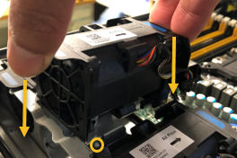

= Reemplace el ventilador en SG100 o SG1000
:allow-uri-read: 
:icons: font
:imagesdir: ../media/

[role="lead"]
El aparato de servicios tiene ocho ventiladores de refrigeración. Si uno de los ventiladores falla, debe reemplazarla por Lo antes posible. para que el dispositivo tenga la refrigeración adecuada.

.Antes de empezar
* Ha desembalado el ventilador de repuesto.
* Ya tienes link:locating-controller-in-data-center.html["ubicación física del aparato"].
* Ha confirmado que los otros ventiladores están instalados y en ejecución.

.Acerca de esta tarea
No se podrá acceder al nodo del dispositivo mientras sustituye el ventilador.

La fotografía muestra un ventilador para el aparato de servicios. Se puede acceder a los ventiladores de refrigeración después de retirar la cubierta superior del aparato.

NOTE: Cada una de las dos unidades de suministro de alimentación también contiene un ventilador. Esos ventiladores no están incluidos en este procedimiento.

image::../media/fan_fru.png[FRU de ventilador]

.Pasos
. Apague el aparato.
+
.. Inicie sesión en el nodo de grid:
+
... Introduzca el siguiente comando: `ssh admin@_grid_node_IP_`
... Introduzca la contraseña que aparece en `Passwords.txt` archivo.
... Introduzca el siguiente comando para cambiar a la raíz: `su -`
... Introduzca la contraseña que aparece en `Passwords.txt` archivo.
+
Cuando ha iniciado sesión como root, el símbolo del sistema cambia de `$` para `#`.

.. Apague el aparato de servicios: +
`*shutdown -h now*`

. Utilice uno de estos dos métodos para comprobar que la alimentación del dispositivo de servicios está desactivada:
+
** El LED del indicador de alimentación de la parte frontal del aparato está apagado.
** La página Power Control de la interfaz del BMC indica que el aparato está apagado.

. Tire del aparato para extraerlo del rack.
. Levante el pestillo de la cubierta superior y retire la cubierta del aparato.
. Localice el ventilador que falló.
+
image::../media/fan_location.png[Ubicación de ventiladores]

. Levante el ventilador fallido para sacarlo del chasis.
+
image::../media/fan_removal.png[Extracción del ventilador]

. Deslice el ventilador de repuesto en la ranura abierta del chasis.
+
Alinee el borde del ventilador con el pasador guía. El pasador está en un círculo en la fotografía.

+

. Presione firmemente el conector del ventilador en la placa de circuitos.
+
image::../media/fan_connector_check.png[Revisión del conector del ventilador]

. Vuelva a colocar la cubierta superior en el aparato y presione el pestillo hacia abajo para fijar la cubierta en su lugar.
. Encienda el dispositivo y supervise los LED del controlador y los códigos de arranque.
+
Utilice la interfaz de BMC para supervisar el estado de inicio.

. Confirme que el nodo del dispositivo aparece en Grid Manager y que no aparece ninguna alerta.

Tras sustituir la pieza, devuelva la pieza que ha fallado a NetApp, tal y como se describe en las instrucciones de RMA incluidas con el kit. Consulte https://mysupport.netapp.com/site/info/rma["Repuestos de  de devolución de piezas"^] para obtener más información.
