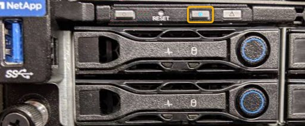

= Encienda y apague el LED de identificación SG100 o SG1000
:allow-uri-read: 
:icons: font
:imagesdir: ../media/

[role="lead"]
El LED de identificación azul de la parte frontal y trasera de la controladora se puede encender para ayudar a localizar el dispositivo en un centro de datos.

.Antes de empezar
Tiene la dirección IP de BMC de la controladora que desea identificar.

.Pasos
. Acceda a la interfaz de BMC del dispositivo.
. Seleccione *Server Identify*.
+
Se selecciona el estado actual del LED Identify.

. Seleccione *ON* o *OFF* y luego seleccione *Realizar acción*.
+
Al seleccionar *ON*, los LED azules de identificación se iluminan en la parte frontal y trasera del aparato.

+

+

NOTE: Si hay un panel frontal instalado en la controladora, es posible que le resulte difícil ver el LED de identificación frontal.

. Encienda y apague el LED según sea necesario.

.Información relacionada
link:locating-controller-in-data-center.html["Ubique la controladora en el centro de datos"]

link:../installconfig/accessing-bmc-interface.html["Acceda a la interfaz de BMC"]
