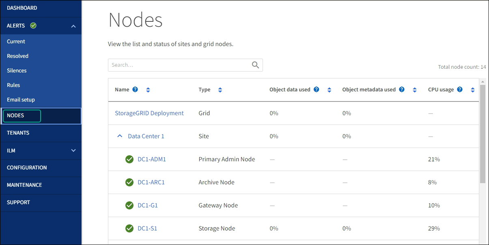

= Actualice el firmware de la unidad SG5700 mediante SANtricity System Manager mediante un método sin conexión
:allow-uri-read: 
:icons: font
:imagesdir: ../media/

[role="lead"]
Use el método en línea de SANtricity System Manager para actualizar el firmware en las unidades del dispositivo con el fin de asegurarse de contar con todas las funciones y correcciones de errores más recientes.

.Antes de empezar
* El dispositivo de almacenamiento tiene el estado Optimal.
* Todas las unidades tienen el estado Optimal.
* Ya tienes link:../commonhardware/placing-appliance-into-maintenance-mode.html["Puso el dispositivo StorageGRID en modo de mantenimiento"].
+

NOTE: Mientras el dispositivo está en modo de mantenimiento, se detiene la actividad de I/O (entrada/salida) en la controladora de almacenamiento para que las operaciones de almacenamiento disruptivas sean seguras.

CAUTION: No actualice el firmware de la unidad en más de un dispositivo StorageGRID a la vez. De este modo, se puede provocar la falta de disponibilidad de los datos, dependiendo del modelo de puesta en marcha y la política del ciclo de vida de la información.

.Acerca de esta tarea
Las unidades se actualizan en paralelo mientras el dispositivo está en modo de mantenimiento. Si el pool o el grupo de volúmenes no es compatible con la redundancia o se degrada, se debe utilizar el método sin conexión para actualizar el firmware de la unidad. También debe usar el método sin conexión para cualquier unidad asociada con una caché de lectura flash o cualquier pool o grupo de volúmenes que esté actualmente degradado. El método sin conexión actualiza el firmware solo cuando se detiene toda la actividad de I/O en las unidades para actualizarse. Para detener la actividad de I/O, coloque el nodo en modo de mantenimiento.

El método sin conexión es más rápido que el método en línea y será significativamente más rápido cuando muchas unidades de un mismo dispositivo necesiten actualizaciones. Sin embargo, requiere que los nodos se retiren de servicio, lo que puede requerir programar una ventana de mantenimiento y supervisar el progreso. Elija el método que mejor se adapte a sus procedimientos operativos y la cantidad de unidades que deben actualizarse.

.Pasos
. Confirme que el aparato está en link:../commonhardware/placing-appliance-into-maintenance-mode.html["modo de mantenimiento"].
. Acceda a System Manager de SANtricity mediante uno de estos métodos:
+
** Utilice el instalador del dispositivo StorageGRID y seleccione *Avanzado* > *Administrador del sistema SANtricity*
** Utilice Grid Manager y seleccione *NODOS* > *_Nodo de almacenamiento_* > *Administrador del sistema de SANtricity*
** Use SANtricity System Manager. Para ello, vaya a la IP de la controladora de almacenamiento:
+
`*https://_Storage_Controller_IP_*`

. Si es necesario, introduzca el nombre de usuario y la contraseña del administrador del sistema SANtricity.
. Compruebe la versión de firmware de la unidad instalada actualmente en el dispositivo de almacenamiento:
+
.. En el Administrador del sistema de SANtricity, seleccione *SOPORTE* > *Centro de actualización*.
.. En actualización del firmware de la unidad, seleccione *Iniciar actualización*.
+
En la página Actualizar firmware de la unidad, se muestran los archivos de firmware de la unidad actualmente instalados.

.. Tenga en cuenta las revisiones de firmware de la unidad actuales y los identificadores de unidades en la columna firmware de la unidad actual.
+
image::../media/storagegrid_update_drive_firmware.png[Actualizar el firmware de la unidad]

+
En este ejemplo:

+
*** La revisión del firmware de la unidad es *MS02*.
*** El identificador de la unidad es *KPM51VUG800G*.

.. Seleccione *Ver unidades* en la columna unidades asociadas para mostrar dónde están instaladas estas unidades en el dispositivo de almacenamiento.
.. Cierre la ventana Actualizar firmware de la unidad.

. Descargue y prepare la actualización del firmware de la unidad disponible:
+
.. En actualización del firmware de la unidad, seleccione *Soporte de NetApp*.
.. En el sitio de soporte de NetApp, seleccione la pestaña *Descargas* y, a continuación, seleccione *Firmware de unidad de disco E-Series*.
+
Se muestra la página firmware del disco E-Series.

.. Busque cada *Identificador de unidad* instalado en el dispositivo de almacenamiento y compruebe que cada identificador de unidad tiene la última revisión de firmware.
+
*** Si la revisión del firmware no es un enlace, este identificador de unidad tiene la revisión de firmware más reciente.
*** Si se enumeran uno o varios números de pieza de unidad para un identificador de unidad, estas unidades tienen disponible una actualización de firmware. Puede seleccionar cualquier enlace para descargar el archivo de firmware.
+
image::../media/storagegrid_drive_firmware_download.png[Página firmware del disco E-Series]

.. Si aparece una revisión posterior del firmware, seleccione el enlace en la revisión del firmware (Descargar) para descargar una `.zip` archivo que contiene el archivo de firmware.
.. Extraiga (descomprima) los archivos de almacenamiento del firmware de la unidad que descargó del sitio de soporte.

. Instale la actualización del firmware de la unidad:
+
.. En el Administrador del sistema de SANtricity, en actualización del firmware de la unidad, seleccione *comenzar actualización*.
.. Seleccione *examinar* y seleccione los nuevos archivos de firmware de la unidad que descargó del sitio de soporte.
+
Los archivos de firmware de la unidad tienen un nombre de archivo similar a `D_HUC101212CSS600_30602291_MS01_2800_0002.dlp`.

+
Es posible seleccionar hasta cuatro archivos de firmware de la unidad, uno por vez. Si más de un archivo de firmware de la unidad es compatible con la misma unidad, se muestra un error de conflicto de archivo. Decida qué archivo de firmware de la unidad desea usar para la actualización y elimine el otro.

.. Seleccione *Siguiente*.
+
*Select Drives* enumera las unidades que se pueden actualizar con los archivos de firmware seleccionados.

+
Solo se muestran las unidades que son compatibles.

+
El firmware seleccionado para la unidad aparece en la columna *Propuesto Firmware*. Si debe cambiar este firmware, seleccione *Atrás*.

.. Seleccione *Actualizar todas las unidades sin conexión (paralelo)* — Actualiza las unidades que pueden admitir una descarga de firmware solo cuando se detiene toda la actividad de E/S en cualquier volumen que utilice las unidades.
+

CAUTION: Antes de utilizar este método, debe poner el aparato en modo de mantenimiento. Debe utilizar el método *Offline* para actualizar el firmware de la unidad.

+

CAUTION: Si desea utilizar la actualización sin conexión (paralelo), no continúe a menos que esté seguro de que el dispositivo está en modo de mantenimiento. Si no se coloca el dispositivo en modo de mantenimiento antes de iniciar una actualización de firmware de la unidad sin conexión, se podría perder datos.

.. En la primera columna de la tabla, seleccione la o las unidades que desea actualizar.
+
La práctica recomendada es actualizar todas las unidades del mismo modelo a la misma revisión de firmware.

.. Seleccione *Inicio* y confirme que desea realizar la actualización.
+
Si necesita detener la actualización, seleccione *Detener*. Se completa cualquier descarga de firmware actualmente en curso. Se cancela cualquier descarga de firmware que no haya comenzado.

+

CAUTION: Si se detiene la actualización del firmware de la unidad, podrían producirse la pérdida de datos o la falta de disponibilidad de las unidades.

.. (Opcional) para ver una lista de los elementos actualizados, seleccione *Guardar registro*.
+
El archivo de registro se guarda en la carpeta de descargas del explorador con el nombre `latest-upgrade-log-timestamp.txt`.

+
link:troubleshoot-upgrading-drive-firmware-using-santricity-system-manager.html["Si es necesario, solucione los errores de actualización de firmware del controlador"].

. Cuando el procedimiento se realice correctamente, realice cualquier procedimiento de mantenimiento adicional mientras el nodo esté en modo de mantenimiento. Cuando haya terminado, o si ha experimentado algún fallo y desea volver a empezar, vaya al instalador de dispositivos StorageGRID y seleccione * Avanzado * > * Controlador de reinicio *. A continuación, seleccione una de estas opciones:
+
** *Reiniciar en StorageGRID*.
** *Reiniciar en el modo de mantenimiento*. Reinicie la controladora y mantenga el nodo en modo de mantenimiento. Seleccione esta opción si se ha producido algún fallo durante el procedimiento y desea volver a empezar. Cuando el nodo termine de reiniciarse en el modo de mantenimiento, reinicie desde el paso adecuado del procedimiento en que falló.
+
El dispositivo puede tardar hasta 20 minutos en reiniciarse y volver a unirse a la cuadrícula. Para confirmar que el reinicio ha finalizado y que el nodo ha vuelto a unirse a la cuadrícula, vuelva a Grid Manager. La página Nodos debe mostrar el estado normal (icono de marca de verificación verde image:../media/icon_alert_green_checkmark.png["marca de verificación verde"] a la izquierda del nombre del nodo) del nodo del dispositivo, lo que indica que no hay ninguna alerta activa y que el nodo está conectado a la cuadrícula.

+

