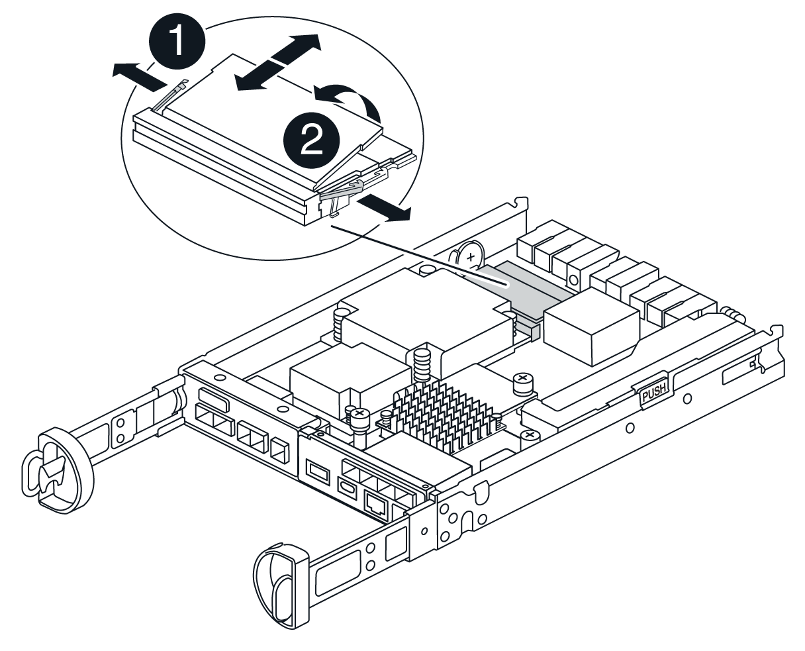

= Sustituir la controladora de almacenamiento E4000 (SG6160)
:allow-uri-read: 
:icons: font
:imagesdir: ../media/

[role="lead"]
Es posible que deba sustituir una controladora E4000 si no funciona de forma óptima o si falló.

.Antes de empezar
* Tiene una controladora de sustitución con el mismo número de pieza que la controladora que desea sustituir.
* Tiene etiquetas para identificar cada cable conectado a la controladora.
* Tiene una muñequera ESD o ha tomado otras precauciones antiestáticas.
* Tiene un destornillador Phillips del número 1.
* Localizó físicamente el dispositivo de almacenamiento en el que va a reemplazar la controladora en el centro de datos.

NOTE: No confíe en las instrucciones E-Series para sustituir una controladora con el dispositivo StorageGRID, ya que los procedimientos no son los mismos.

.Acerca de esta tarea
Puede determinar si tiene una controladora con errores de dos maneras:

* Una alerta de Grid Manager indica una condición de fallo de la controladora de almacenamiento, y Grid Manager o Recovery Guru en SANtricity System Manager le permiten sustituir la controladora.
* El LED de alerta ámbar del controlador está encendido, lo que indica que el controlador tiene un fallo.
+

NOTE: Si ambas controladoras de la bandeja tienen encendidos los LED de atención de ambas controladoras, póngase en contacto con el soporte técnico para obtener ayuda.

Si su dispositivo contiene dos controladoras de almacenamiento, es posible sustituir una de las controladoras mientras el dispositivo está encendido y realizar operaciones de lectura/escritura, siempre que se cumplan las siguientes condiciones:

* La segunda controladora de la bandeja tiene el estado óptimo.
* El campo *Aceptar para eliminar* del área Detalles de Recovery Guru en el Administrador del sistema de SANtricity muestra *Sí*, lo que indica que es seguro quitar este componente.

NOTE: Cuando sea posible, coloque el aparato en modo de mantenimiento para este procedimiento de sustitución con el fin de minimizar el posible impacto de errores o fallos imprevistos.

NOTE: Si la segunda controladora de la bandeja no tiene el estado óptimo o si Recovery Guru indica que no es correcto quitar la controladora, póngase en contacto con el soporte técnico.

== Paso 1: Prepare el controlador de reemplazo

Prepare el controlador E4000 de reemplazo.

.Pasos
. Desembale el nuevo controlador y configúrelo en una superficie plana y sin estática.
+
Guarde los materiales de embalaje que se van a utilizar durante el envío del controlador que ha fallado.

. Localice las etiquetas de dirección MAC y número de pieza de FRU en la parte posterior de la controladora de reemplazo.

== Paso 2: Desconecte la controladora

Prepare para extraer la controladora que ha fallado y desconectarla. Puede usar SANtricity System Manager para realizar estos pasos.

.Pasos
. Confirmar que el número de pieza de repuesto de la controladora con errores es el mismo que el número de pieza de FRU de la controladora de reemplazo.
+
Cuando una controladora tiene un error y se debe sustituir, el número de pieza de repuesto se muestra en el área Detalles de Recovery Guru. Si necesita encontrar este número manualmente, puede buscar en la ficha *base* del controlador.

+

CAUTION: *Posible pérdida de acceso a los datos &#8212;* Si los dos números de pieza no son los mismos, no intente este procedimiento.

. Realice un backup de la base de datos de configuración.
+
Si se produce un problema al quitar una controladora, puede usar el archivo guardado para restaurar la configuración. El sistema guardará el estado actual de la base de datos de configuración RAID, que incluye todos los datos de los grupos de volúmenes y pools de discos en la controladora.

+
.. Seleccione *Soporte › Centro de soporte › Diagnóstico*.
.. Seleccione *recopilar datos de configuración*.
.. Haga clic en *recoger*.
+
El archivo se guarda en la carpeta de descargas del explorador con el nombre *configurationData-<arrayName>-<dateTime>.7z*.

. Recopile datos de soporte del dispositivo.
+

NOTE: La recogida de datos de soporte antes y después de sustituir un componente, garantiza que pueda enviar un conjunto de registros completo al soporte técnico si el reemplazo no resuelve el problema.

+
Si se produce un problema al quitar una controladora, es posible utilizar el archivo guardado para solucionar el problema. El sistema guardará los datos de inventario, Estados y rendimiento acerca de la cabina de almacenamiento en un único archivo.

+
.. *Seleccione Soporte › Centro de Soporte › Diagnóstico*.
.. Seleccione *recopilar datos de soporte*.
.. Haga clic en *recoger*.

. Cambie la controladora que desea sustituir sin conexión.

== Paso 3: Quite el contenedor de controladora

Quite un contenedor de controladora.

.Pasos
. Coloque una muñequera ESD o tome otras precauciones antiestáticas.
. Etiquete cada cable conectado al compartimento de controladoras.
. Desconecte todos los cables del compartimento de controladoras.
+

CAUTION: Para evitar un rendimiento degradado, no gire, pliegue, pellizque ni pellizque los cables.

. Apriete el pestillo de la manija de leva hasta que se suelte, abra por completo la manija de leva para liberar el compartimento de controladoras del plano medio y luego, con dos manos, saque el compartimento de controladoras del chasis.
. Coloque el controlador sobre una superficie plana y sin estática con la cubierta extraíble hacia arriba.
. Abra la cubierta presionando los botones azules en los lados del contenedor del controlador para liberar la cubierta y luego gire la cubierta hacia arriba y hacia afuera del contenedor del controlador.

== Paso 4: Determine las piezas que se deben transferir al controlador de reemplazo

El controlador de repuesto puede venir con las piezas preinstaladas. Determine qué piezas deben transferirse al compartimento de la controladora de reemplazo.

. Coloque el controlador de repuesto en una superficie plana y libre de estática con la cubierta extraíble hacia arriba.
. Abra la cubierta presionando los botones azules en los lados del contenedor del controlador para liberar la cubierta y luego gire la cubierta hacia arriba y hacia afuera del contenedor del controlador.
. Determine si la controladora de reemplazo contiene una batería y/o DIMM. Si es así, vuelva a instalar la cubierta del controlador y vaya a. <<step8_replace_controller,Paso 8: Reemplace el controlador>>. De lo contrario:
+
** Si la controladora de reemplazo no incluye una batería o DIMM, vaya a. <<step5_remove_battery,Paso 5: Retire la batería>>.
** Si la controladora de reemplazo incluye una batería, pero no un DIMM, vaya a. <<step6_remove_dimm,Paso 6: Mueva los DIMM>>.

== Paso 5: Retire la batería

Retire la batería del controlador averiado e instálela en el controlador de sustitución si es necesario.

.Pasos
. Quite la batería del compartimento de controladoras:
+
.. Pulse el botón azul del lateral del compartimento de la controladora.
.. Deslice la batería hacia arriba hasta que se despeje de los soportes de sujeción y, a continuación, levante la batería para sacarla del compartimento de controladoras.
.. Desenchufe el enchufe de la batería apretando el clip de la cara del enchufe de la batería para liberarlo de la toma y, a continuación, desenchufe el cable de la batería de la toma.
+
image::../media/drw_E4000_replace_nvbattery_IEOPS-862.png[Quite la batería de NVMEM.]

+
|===

 a| 
image::../media/legend_icon_01.png[Referencia de llamada 1]
| Pestaña de liberación de la batería 

 a| 
image::../media/legend_icon_02.png[Referencia de llamada 2]
| Conector de alimentación de la batería 
|===

. Mueva la batería al compartimento de controladora de reemplazo e instálela:
+
.. Alinee la batería con los soportes de sujeción de la pared lateral de chapa metálica, pero no la conecte. Lo conectará una vez que el resto de los componentes se muevan al compartimento de controladoras de reemplazo.

. Si la controladora de reemplazo tiene DIMM preinstalados, vaya a. <<step7_install_battery,Paso 7: Instale la batería>>. De lo contrario, continúe con el siguiente paso.

== Paso 6: Mueva los DIMM

Quite los DIMM del compartimento de controladora deficiente e instálelos en el compartimento de controladora de reemplazo.

.Pasos
. Localice los DIMM en el compartimento de controladoras.
+

NOTE: Anote la ubicación del DIMM en los sockets para poder insertar el DIMM en la misma ubicación en el compartimento de la controladora de reemplazo y con la orientación adecuada.
Quite los DIMM del compartimento de la controladora deficiente:

+
.. Extraiga el módulo DIMM de su ranura empujando lentamente las dos lengüetas del expulsor DIMM situadas a cada lado del módulo DIMM.
+
El módulo DIMM girará un poco hacia arriba.

.. Gire el módulo DIMM hasta el tope y, a continuación, deslice el módulo DIMM para extraerlo del socket.
+

NOTE: Sujete con cuidado el módulo DIMM por los bordes para evitar la presión sobre los componentes de la placa de circuitos DIMM.

+

+
|===

 a| 
image::../media/legend_icon_01.png[Referencia de llamada 1]
| Lengüetas del expulsor de DIMM 

 a| 
image::../media/legend_icon_02.png[Referencia de llamada 2]
| DIMM 
|===

. Compruebe que la batería no esté enchufada en el compartimento de la controladora de reemplazo.
. Instale los DIMM en la controladora de reemplazo en el mismo lugar donde se encontraban en la controladora afectada:
+
.. Empuje con cuidado, pero firmemente, en el borde superior del DIMM hasta que las lengüetas expulsoras encajen en su lugar sobre las muescas de los extremos del DIMM.
+
El módulo DIMM encaja firmemente en la ranura, pero debe entrar fácilmente. Si no es así, realinee el DIMM con la ranura y vuelva a insertarlo.

+

NOTE: Inspeccione visualmente el módulo DIMM para comprobar que está alineado de forma uniforme y completamente insertado en la ranura.

. Repita estos pasos para el otro DIMM.
. Si el controlador de reemplazo tiene una batería preinstalada, vaya a. <<step8_replace_controller,Paso 8: Reemplace el controlador>>. De lo contrario, continúe con el siguiente paso.

== Paso 7: Instale la batería

Instale la batería en el compartimento de controladoras de reemplazo.

.Pasos
. Vuelva a conectar el enchufe de la batería en el socket del compartimento de controladoras.
+
Asegúrese de que el enchufe se bloquea en la toma de la batería de la placa base.

. Alinee la batería con los soportes de sujeción de la pared lateral de chapa metálica.
. Deslice la batería hacia abajo hasta que el pestillo de la batería se acople y haga clic en la abertura de la pared lateral.
. Vuelva a instalar la cubierta del compartimento de controladoras y bloquéela en su lugar.

== Paso 8: Reemplace el controlador

Instale la controladora de reemplazo y compruebe que el nodo ha vuelto a unirse al grid.

.Pasos
. Instale el controlador de repuesto en el aparato.
+
.. Dé la vuelta al controlador de modo que la cubierta extraíble quede orientada hacia abajo.
.. Con el mango de la leva en la posición abierta, deslice el controlador completamente en el aparato.
.. Mueva la palanca de leva hacia la izquierda para bloquear el controlador en su sitio.
.. Sustituya los cables.
.. Si la controladora original utilizó DHCP para la dirección IP, busque la dirección MAC en la etiqueta ubicada en la parte posterior de la controladora de reemplazo. Solicite al administrador de red que asocie la red DNS y la dirección IP de la controladora que quitó con la dirección MAC de la controladora de reemplazo.
+

NOTE: Si la controladora original no utilizó DHCP para la dirección IP, la nueva controladora adoptará la dirección IP de la controladora que quitó.

. Coloque la controladora en línea mediante System Manager de SANtricity:
+
.. Seleccione *hardware*.
.. Si el gráfico muestra las unidades, seleccione *Controladores y componentes*.
.. Seleccione la controladora que desea colocar en línea.
.. Seleccione *colocar en línea* en el menú contextual y confirme que desea realizar la operación.

. Cuando se arranque la controladora, compruebe los LED de la controladora.
+
** El LED de atención ámbar del controlador se enciende y se apaga, a menos que se produzca un error.
** Es posible que los LED del enlace de host estén encendidos, parpadeantes o apagados, según la interfaz del host.

. Cuando la controladora vuelva a estar en línea, confirme que su estado es óptimo y compruebe los LED de atención de la bandeja de controladoras.
+
Si el estado no es óptimo o si alguno de los LED de atención está encendido, confirme que todos los cables están correctamente asentados y que el compartimento de controladoras esté instalado correctamente. Si es necesario, quite y vuelva a instalar el compartimento de controladoras.

+

NOTE: Si no puede resolver el problema, póngase en contacto con el soporte técnico.

. Si es necesario, redistribuya los volúmenes de vuelta a su propietario preferido mediante System Manager de SANtricity.
+
.. Selecciona *Almacenamiento › Volúmenes*.
.. Selecciona *Más › Redistribuir volúmenes*.

. Recoja datos de soporte para la cabina de almacenamiento mediante SANtricity System Manager.
+
.. Seleccione *Soporte › Centro de soporte › Diagnóstico*.
.. Seleccione *recopilar datos de soporte*.
.. Haga clic en *recoger*.
+
El archivo se guarda en la carpeta de descargas del explorador con el nombre *support-data.7z*.

. Si colocó el dispositivo en modo de mantenimiento durante este procedimiento, salga del modo de mantenimiento y espere a que el nodo se reinicie y vuelva a unirse a la cuadrícula. Este proceso puede tardar hasta 20 minutos. A continuación, en Grid Manager, compruebe que la página Nodos muestra un estado normal (icono de marca de verificación verde image:../media/icon_alert_green_checkmark.png["marca de verificación verde"] a la izquierda del nombre del nodo) del nodo del dispositivo, lo que indica que no hay ninguna alerta activa y que el nodo está conectado a la cuadrícula.
+
image::../media/nodes_menu.png[El nodo del dispositivo se ha vuelto a unir a la cuadrícula]

.El futuro
Se completó el reemplazo de una controladora. Es posible reanudar las operaciones normales.

Tras sustituir la pieza, devuelva la pieza que ha fallado a NetApp, tal y como se describe en las instrucciones de RMA incluidas con el kit. Consulte https://mysupport.netapp.com/site/info/rma["Repuestos de  de devolución de piezas"^] para obtener más información.
