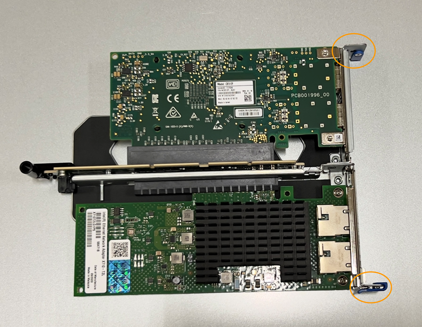
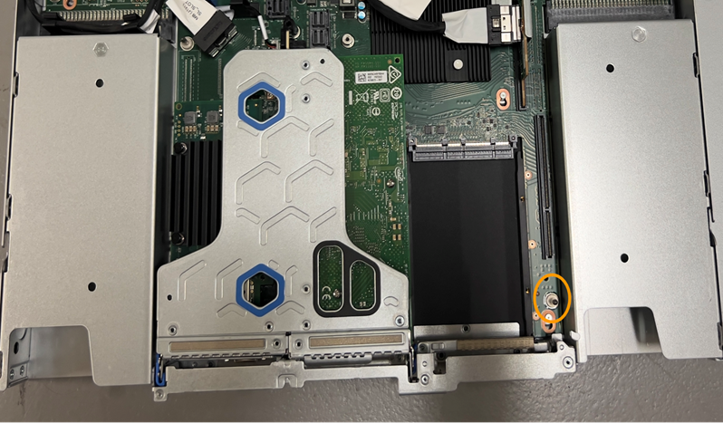

= Sustituya NIC en el SGF6112
:allow-uri-read: 
:icons: font
:imagesdir: ../media/

[role="lead"]
Es posible que deba reemplazar una tarjeta de interfaz de red (NIC) en el SGF6112 si no funciona de manera óptima o si ha fallado.

Utilice estos procedimientos para:

* Retire la NIC
* Vuelva a instalar la NIC

== Retire la NIC

.Antes de empezar
* Tiene la NIC de sustitución correcta.
* Usted ha determinado el link:verify-component-to-replace.html["Ubicación de la NIC que se va a sustituir"].
* Ya tienes link:locating-sgf6112-in-data-center.html["El aparato SGF6112 se encuentra físicamente"] Donde va a sustituir la NIC en el centro de datos.
+

NOTE: A. link:power-sgf6112-off-on.html#shut-down-the-sgf6112-appliance["apagado controlado del aparato"] es necesario antes de retirar el dispositivo del rack.

* Ha desconectado todos los cables y. link:reinstalling-sgf6112-cover.html["ha quitado la cubierta del aparato"].

.Acerca de esta tarea
Para evitar interrupciones del servicio, confirme que todos los demás nodos de almacenamiento están conectados a la cuadrícula antes de iniciar la sustitución de la tarjeta de interfaz de red (NIC) o sustituya la NIC durante una ventana de mantenimiento programada cuando se acepten períodos de interrupción del servicio. Consulte la información acerca de https://docs.netapp.com/us-en/storagegrid-118/monitor/monitoring-system-health.html#monitor-node-connection-states["supervisar los estados de conexión de los nodos"^].

CAUTION: Si alguna vez ha utilizado una regla de ILM que crea solo una copia de un objeto, debe sustituir la NIC durante una ventana de mantenimiento programada. De lo contrario, es posible que pierda temporalmente el acceso a esos objetos durante este procedimiento. Consulte la información acerca de https://docs.netapp.com/us-en/storagegrid-118/ilm/why-you-should-not-use-single-copy-replication.html["por qué no debe utilizar replicación de copia única"^].

.Pasos
. Envuelva el extremo de la correa de la muñequera ESD alrededor de su muñeca y fije el extremo de la pinza a una masa metálica para evitar descargas estáticas.
. Localice el conjunto elevador que contiene la NIC en la parte posterior del aparato.
+
Las tres NIC del dispositivo se encuentran en dos conjuntos elevadores en las posiciones del chasis que se muestran en la fotografía (se muestra la parte posterior del dispositivo con la cubierta superior quitada):

+
image::../media/sgf6112-nic-positions.jpg[Ubicaciones de NIC]

+
[cols="1a,2a,4a"]
|===
|  | Nombre del dispositivo o de la pieza | Descripción 

 a| 
1
 a| 
hic1 pb/hic2
 a| 
Puertos de red Ethernet 10/25 GbE en el conjunto de elevador de dos puertos

 a| 
2
 a| 
mtc1 pb/mtc2
 a| 
Puertos de gestión de 1/10GBase-T en el conjunto de elevador de dos puertos

 a| 
3
 a| 
hic3 pb/hic4
 a| 
Puertos de red Ethernet 10/25 GbE en el conjunto de elevador de un puerto

 a| 
4
 a| 
Conjunto de elevador de dos ranuras
 a| 
Es compatible con uno de los NIC 10/25 GbE y la NIC 1/10GBase-T

 a| 
5
 a| 
Conjunto de elevador de una ranura
 a| 
Compatible con uno de los NIC 10/25 GbE

|===
. Sujete el conjunto del elevador con la NIC averiada a través de los orificios marcados en azul y levántelo con cuidado hacia arriba. Mueva el conjunto de elevador hacia la parte delantera del chasis mientras lo levanta para permitir que los conectores externos de sus NIC instaladas despejen el chasis.
. Coloque el elevador sobre una superficie antiestática plana con el marco metálico hacia abajo para acceder a los NIC.
+
** * Conjunto de riser de dos ranuras con dos NIC*
+

** * Conjunto elevador de una ranura con un NIC *
+
image::../media/one-slot-assembly-sgf6112.png[NIC en el conjunto de elevador de una ranura]

. Abra el pestillo azul (con un círculo) del NIC que se va a sustituir y retire con cuidado el NIC del conjunto del elevador. Balancee ligeramente la NIC para ayudar a quitar la NIC de su conector. No use fuerza excesiva.
. Coloque el NIC en una superficie antiestática plana.

== Vuelva a instalar la NIC

Instale la NIC de reemplazo en la misma ubicación que la que se quitó.

.Antes de empezar
* Tiene la NIC de sustitución correcta.
* Ha eliminado la NIC fallida existente.

.Pasos
. Envuelva el extremo de la correa de la muñequera ESD alrededor de su muñeca y fije el extremo de la pinza a una masa metálica para evitar descargas estáticas.
. Retire la NIC de repuesto de su embalaje.
. Si va a sustituir una de las NIC en el conjunto de elevador de dos ranuras, realice lo siguiente:
+
.. Asegúrese de que el pestillo azul está en la posición abierta.
.. Alinee la NIC con su conector en el conjunto elevador. Presione con cuidado el NIC en el conector hasta que quede completamente asentado, como se muestra en la fotografía, y luego cierre el pestillo azul.
+

.. Localice el orificio de alineación en el conjunto del elevador de dos ranuras (con un círculo) que se alinea con un pasador guía en la placa del sistema para garantizar la colocación correcta del conjunto del elevador.
+
image::../media/sgf6112_two-slot-riser_alignment_hole.png[Orificio de alineación del conjunto de elevador grande]

.. Localice el pasador guía en la placa del sistema
+
image::../media/sgf6112_two-slot-riser_guide-pin.png[Pasador guía para el conjunto de elevador de dos ranuras]

.. Coloque el conjunto de elevador en el chasis, asegurándose de que esté alineado con el conector de la placa del sistema y el pasador guía.
.. Presione con cuidado el conjunto del elevador de dos ranuras en su sitio a lo largo de su línea central, junto a los orificios marcados en azul, hasta que quede completamente asentado.

. Si va a sustituir la NIC en el conjunto elevador de una ranura, realice lo siguiente:
+
.. Asegúrese de que el pestillo azul está en la posición abierta.
.. Alinee la NIC con su conector en el conjunto elevador. Presione con cuidado el NIC en el conector hasta que quede completamente asentado como se muestra en la fotografía y cierre el pestillo azul.
+
image::../media/one-slot-assembly-sgf6112.png[NIC en el conjunto de elevador de una ranura]

.. Localice el orificio de alineación en el conjunto del elevador de una ranura (con un círculo) que se alinea con un pasador guía en la placa del sistema para garantizar la colocación correcta del conjunto del elevador.
+
image::../media/sgf6112_one-slot-riser_alignment_hole.png[Orificio de alineación en el conjunto del elevador de una ranura]

.. Localice el pasador guía en la placa del sistema
+

.. Coloque el conjunto de elevador de una ranura en el chasis, asegurándose de que esté alineado con el conector de la placa del sistema y el pasador guía.
.. Presione con cuidado el conjunto del elevador de una ranura en su sitio a lo largo de su línea central, junto a los orificios marcados en azul, hasta que quede completamente asentado.

. Retire las tapas protectoras de los puertos NIC en los que va a volver a instalar los cables.

.Después de terminar
Si no tiene que realizar ningún otro procedimiento de mantenimiento en el aparato, vuelva a instalar la cubierta del aparato, vuelva a colocar el aparato en el bastidor, conecte los cables y conecte la alimentación.

Tras sustituir la pieza, devuelva la pieza que ha fallado a NetApp, tal y como se describe en las instrucciones de RMA incluidas con el kit. Consulte https://mysupport.netapp.com/site/info/rma["Repuestos de  de devolución de piezas"^] para obtener más información.
