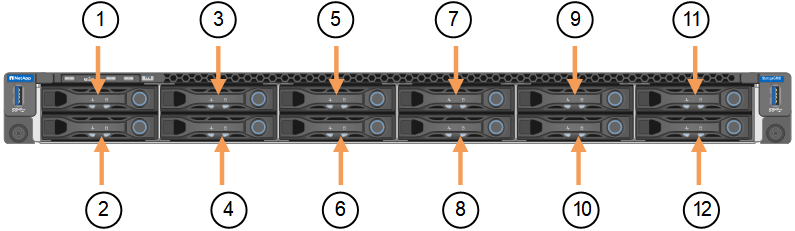

= Sustituya las unidades en SGF6112
:allow-uri-read: 
:icons: font
:imagesdir: ../media/

[role="lead"]
El dispositivo de almacenamiento SGF6112 contiene 12 unidades SSD. Los datos en las unidades se protegen por un esquema de RAID que permite que el dispositivo se recupere de cualquier fallo de unidad sin tener que copiar datos de otro nodo.

El fallo de una segunda unidad antes de corregir un fallo inicial de unidad puede requerir que se copien datos de otros nodos para restaurar la redundancia. Esta restauración de redundancia puede llevar más tiempo y puede ser imposible si las reglas de ILM de una copia única están en uso o se usaron en el pasado, o si la redundancia de datos se ha visto afectada por fallos en otros nodos. Por lo tanto, si se produce un fallo en una de las unidades SGF6112, debe sustituirla lo antes posible para garantizar la redundancia.

.Antes de empezar
* Ya tienes link:locating-sgf6112-in-data-center.html["ubicación física del aparato"].
* Ha verificado qué unidad ha fallado al señalar que el LED izquierdo de la unidad es ámbar fijo o utilizar Grid Manager a. link:verify-component-to-replace.html["vea la alerta causada por la unidad con error"].
+

NOTE: Consulte la información sobre la visualización de los indicadores de estado para verificar el fallo.

* Ha obtenido la unidad de reemplazo.
* Ha obtenido la protección ESD adecuada.

.Pasos
. Compruebe que el LED de fallo izquierdo de la unidad esté en color ámbar o utilice el ID de ranura de unidad de la alerta para localizar la unidad.
+
Las doce unidades se encuentran en las siguientes posiciones del chasis (se muestra la parte frontal del chasis con el panel frontal quitado):

+

+
|===
| Posición | Unidad 

 a| 
1
 a| 
HDD00

 a| 
2
 a| 
HDD01

 a| 
3
 a| 
HDD02

 a| 
4
 a| 
HDD03

 a| 
5
 a| 
HDD04

 a| 
6
 a| 
HDD05

 a| 
7
 a| 
HDD06

 a| 
8
 a| 
HDD07

 a| 
9
 a| 
HDD08

 a| 
10
 a| 
HDD09

 a| 
11
 a| 
HDD10

 a| 
12
 a| 
HDD11

|===
+
También puede utilizar Grid Manager para supervisar el estado de las unidades SSD. Selecciona *NODOS*. A continuación, seleccione `*Storage Node*` > *Hardware*. Si se produce un error en una unidad, el campo Storage RAID Mode contiene un mensaje acerca de qué unidad ha fallado.

. Envuelva el extremo de la correa de la muñequera ESD alrededor de su muñeca y fije el extremo de la pinza a una masa metálica para evitar descargas estáticas.
. Desembale la unidad de repuesto y configúrela en una superficie nivelada y sin estática cerca del aparato.
+
Guarde todos los materiales de embalaje.

. Pulse el botón de liberación de la unidad con error.
+
image::../media/h600s_driveremoval.gif[Extracción de la unidad]

+
La palanca de los muelles de accionamiento se abre parcialmente y la unidad se libera de la ranura.

. Abra el asa, deslice la unidad hacia fuera y colóquela en una superficie nivelada y sin estática.
. Presione el botón de liberación de la unidad de reemplazo antes de insertarla en la ranura de la unidad.
+
Los muelles de pestillo se abren.

+
image::../media/h600s_driveinstall.gif[Instalación de la unidad]

. Inserte la unidad de reemplazo en la ranura y, a continuación, cierre el asa de la unidad.
+

NOTE: No ejerza demasiada fuerza al cerrar el mango.

+
Cuando la unidad se inserta por completo, se oye un clic.

+
La unidad sustituida se reconstruye automáticamente con datos reflejados de las unidades de trabajo. El LED de la unidad debe parpadear inicialmente, pero luego dejar de parpadear tan pronto como el sistema determine que la unidad tiene suficiente capacidad y es funcional.

+
Puede comprobar el estado de la reconstrucción mediante Grid Manager.

. Si se produjo un error en más de una unidad y se reemplazó, es posible que haya alertas que indican que algunos volúmenes deben restaurarse datos en ellos. Si recibe una alerta, antes de intentar recuperar el volumen, seleccione *NODOS* > `*appliance Storage Node*` > *Hardware*. En la sección StorageGRID Appliance de la página, compruebe que el modo RAID de almacenamiento esté en buen estado o recompilándose. Si el estado enumera una o varias unidades con errores, corrija esta condición antes de intentar restaurar volúmenes.
. En Grid Manager, vaya a *NODES* > `*appliance Storage Node*` > *Hardware*. En la sección StorageGRID Appliance de la página, compruebe que el modo RAID de almacenamiento esté en buen estado.

Tras sustituir la pieza, devuelva la pieza que ha fallado a NetApp, tal y como se describe en las instrucciones de RMA incluidas con el kit. Consulte https://mysupport.netapp.com/site/info/rma["Repuestos de  de devolución de piezas"^] para obtener más información.
