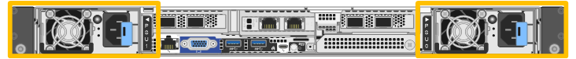

= Sustituya una o ambas fuentes de alimentación en SGF6112 o SG6100-CN
:allow-uri-read: 
:icons: font
:imagesdir: ../media/

[role="lead"]
El dispositivo SGF6112 y el nodo de computación SG6100-CN tienen dos fuentes de alimentación para redundancia. Si una de las fuentes de alimentación falla, debe reemplazarla por Lo antes posible. para garantizar que el dispositivo tenga alimentación redundante. Ambas fuentes de alimentación que funcionan en el aparato deben ser del mismo modelo y potencia.

.Antes de empezar
* Ya tienes link:locating-sgf6112-in-data-center.html["ubicación física del aparato"] con la fuente de alimentación que se debe sustituir.
* Ya tienes link:verify-component-to-replace.html["se determina la ubicación de la fuente de alimentación que se va a sustituir"].
* Si solo va a sustituir un suministro de alimentación:
+
** Ha desembalado la unidad de suministro de alimentación de repuesto y se ha asegurado de que es el mismo modelo y vataje que la unidad de suministro de alimentación que desea sustituir.
** Ha confirmado que la otra fuente de alimentación está instalada y en funcionamiento.

* Si va a sustituir ambos suministros de alimentación al mismo tiempo:
+
** Ha desembalado las unidades de suministro de alimentación de repuesto y se ha asegurado de que sean del mismo modelo y vataje.

.Acerca de esta tarea
En la figura, se muestran las dos unidades de suministro de alimentación para el dispositivo SGF6112 o el nodo de computación SG6100-CN. Se puede acceder a las fuentes de alimentación desde la parte posterior del aparato.

.Pasos
. Si sólo va a sustituir una fuente de alimentación, no es necesario apagar el aparato. Vaya a la <<Unplug_the_power_cord,Desenchufe el cable de alimentación>> paso. Si va a sustituir ambas fuentes de alimentación al mismo tiempo, haga lo siguiente antes de desconectar los cables de alimentación:
+
.. link:power-sgf6112-off-on.html#shut-down-the-sgf6112-appliance["Apague el aparato"].
+

CAUTION: Si alguna vez utilizó una regla de ILM que crea solo una copia de un objeto y va a sustituir ambas fuentes de alimentación al mismo tiempo, debe sustituir los suministros de alimentación durante una ventana de mantenimiento programada porque podría perder temporalmente el acceso a esos objetos durante este procedimiento. Consulte la información acerca de https://docs.netapp.com/us-en/storagegrid-118/ilm/why-you-should-not-use-single-copy-replication.html["por qué no debe utilizar replicación de copia única"^].

. [[Unplug_the_power_cord, start=2]]desenchufe el cable de alimentación de cada fuente de alimentación que vaya a sustituirse.
+
Cuando se ve desde la parte posterior del aparato, la fuente de alimentación A (PSU0) está a la derecha y la fuente de alimentación B (PSU1) a la izquierda.

. Levante el asa del primer suministro que se va a sustituir.
+
image::../media/sg6000_cn_lift_cam_handle_psu.gif[Levantar el asa para extraer la fuente de alimentación]

. Presione el pestillo azul y saque la fuente de alimentación.
+
image::../media/sg6000_cn_remove_power_supply.gif[Quitar una fuente de alimentación]

. Con el pestillo azul a la derecha, deslice la fuente de alimentación de repuesto hacia el chasis.
+

NOTE: Las dos fuentes de alimentación instaladas deben ser del mismo modelo y potencia.

+
Asegúrese de que el pestillo azul está en el lado derecho cuando deslice la unidad de sustitución en.

+
Notará un clic cuando la fuente de alimentación esté bloqueada en su lugar.

+
image::../media/sg6000_cn_insert_power_supply.gif[Alimentación deslizante hacia adentro]

. Empuje el asa hacia abajo contra el cuerpo de la PSU.
. Si va a sustituir ambas fuentes de alimentación, repita los pasos 2 a 6 para sustituir la segunda fuente de alimentación.
. link:../installconfig/connecting-power-cords-and-applying-power.html["Conecte los cables de alimentación a las unidades sustituidas y aplique alimentación"].

Tras sustituir la pieza, devuelva la pieza que ha fallado a NetApp, tal y como se describe en las instrucciones de RMA incluidas con el kit. Consulte https://mysupport.netapp.com/site/info/rma["Repuestos de  de devolución de piezas"^] para obtener más información.
