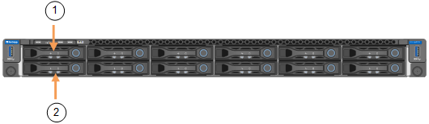

= Sustituya el controlador SG6100-CN
:allow-uri-read: 
:icons: font
:imagesdir: ../media/

[role="lead"]
Es posible que deba reemplazar la controladora SG6100-CN si no funciona de forma óptima o si falló.

.Antes de empezar
* Tiene una controladora de sustitución con el mismo número de pieza que la controladora que desea sustituir. Compruebe las etiquetas adjuntas a la parte frontal de las controladoras para confirmar que los números de pieza coinciden.
* Tiene etiquetas para identificar cada cable conectado a la controladora.
* Localizó físicamente la controladora para reemplazar en el centro de datos.
+
link:locating-sgf6112-in-data-center.html["Ubique la controladora en el centro de datos"]

.Acerca de esta tarea
No se podrá acceder al nodo de almacenamiento del dispositivo cuando sustituya la controladora SG6100-CN. Si el controlador SG6100-CN funciona lo suficiente, puede realizar un apagado controlado al inicio de este procedimiento.

NOTE: Si va a sustituir la controladora antes de instalar el software StorageGRID, es posible que no pueda acceder al instalador de dispositivos de StorageGRID inmediatamente después de completar este procedimiento. Aunque puede acceder al instalador de dispositivos de StorageGRID desde otros hosts en la misma subred que el dispositivo, no puede acceder a él desde hosts en otras subredes. Esta condición debe resolverse dentro de los 15 minutos (cuando se agota cualquier entrada de caché ARP para el tiempo de espera original de la controladora); asimismo, puede borrar la condición de inmediato mediante la purga manual de todas las entradas antiguas de la caché ARP desde el enrutador o la puerta de enlace local.

.Pasos
. Muestre las configuraciones actuales del aparato y regístrelas.
+
.. Inicie sesión en el dispositivo que se va a sustituir:
+
... Introduzca el siguiente comando: `ssh admin@_grid_node_IP_`
... Introduzca la contraseña que aparece en `Passwords.txt` archivo.
... Introduzca el siguiente comando para cambiar a la raíz: `su -`
... Introduzca la contraseña que aparece en `Passwords.txt` archivo.
+
Cuando ha iniciado sesión como root, el símbolo del sistema cambia de `$` para `#`.

.. Introduzca: `*run-host-command ipmitool lan print*` Para mostrar las configuraciones actuales de BMC del dispositivo.

. Si el controlador SG6100-CN funciona lo suficiente como para permitir un apagado controlado, link:power-sgf6112-off-on.html["Apague el controlador SG6100-CN"].
. Si alguna de las interfaces de red de este dispositivo StorageGRID está configurada para DHCP, es posible que deba actualizar las asignaciones de permisos DHCP permanentes en los servidores DHCP para hacer referencia a las direcciones MAC del dispositivo de reemplazo. La actualización garantiza que el dispositivo tenga asignadas las direcciones IP esperadas.
. Retire y sustituya el controlador SG6100-CN:
+
.. Etiquete y desconecte los cables.
+

CAUTION: Para evitar un rendimiento degradado, no tuerza, pliegue, pellizque ni pise los cables.

.. link:reinstalling-sgf6112-into-cabinet-or-rack.html["Retire el controlador averiado del gabinete o rack"] .
.. Tenga en cuenta la posición de los componentes reemplazables (dos fuentes de alimentación, tres NIC y dos SSD) en el controlador fallido.
+
Las dos unidades se encuentran en las siguientes posiciones del chasis (se muestra la parte delantera del chasis con el panel frontal quitado):

+

+
|===
|  | Unidad 

 a| 
1
 a| 
HDD00

 a| 
2
 a| 
HDD01

|===
.. Transfiera los componentes reemplazables al controlador de reemplazo.
+
Siga las instrucciones de mantenimiento suministradas para volver a instalar los componentes reemplazables.

+

CAUTION: Si desea conservar los datos en las unidades, inserte las unidades SSD en las mismas ranuras que ocupaban en el dispositivo fallido.  Si no lo hace, el instalador del dispositivo mostrará una advertencia y tendrá que colocar las unidades en las ranuras correctas y reiniciar el controlador antes de que este pueda volver a unirse a la red.

.. link:reinstalling-sgf6112-into-cabinet-or-rack.html["Instale el controlador de reemplazo en el gabinete o rack"] .
.. Reemplace los cables y cualquier transceptor óptico.
.. Encienda la controladora y supervise los LED de la controladora.

. Si el dispositivo que sustituyó tenía activado el cifrado de unidades de hardware para las unidades SED, debe hacerlo https://docs.netapp.com/us-en/storagegrid-appliances/installconfig/optional-enabling-node-encryption.html#access-an-encrypted-drive["introduzca la clave de acceso de cifrado de la unidad"] para acceder a las unidades cifradas cuando se inicia el dispositivo de sustitución por primera vez.
. Si el dispositivo donde sustituyó la controladora usaba un servidor de gestión de claves (KMS) para cifrar los datos, es posible que se necesite una configuración adicional para que el nodo pueda unirse al grid. Si el nodo no se une automáticamente a la cuadrícula, asegúrese de que estas opciones de configuración se hayan transferido a la nueva controladora y configure manualmente todos los ajustes que no tengan la configuración esperada:
+
** link:../installconfig/configuring-network-links.html["Configure los enlaces de red"]
** link:../installconfig/setting-ip-configuration.html["Configure las direcciones IP de StorageGRID"]
** https://docs.netapp.com/us-en/storagegrid/admin/kms-overview-of-kms-and-appliance-configuration.html#set-up-the-appliance["Configure el cifrado de nodo para el dispositivo"^]

. Inicie sesión en el dispositivo con la controladora reemplazada:
+
.. Introduzca el siguiente comando: `ssh admin@_grid_node_IP_`
.. Introduzca la contraseña que aparece en `Passwords.txt` archivo.
.. Introduzca el siguiente comando para cambiar a la raíz: `su -`
.. Introduzca la contraseña que aparece en `Passwords.txt` archivo.

. Restaure la conectividad de red de BMC para el dispositivo. Existen dos opciones:
+
** Utilice IP estáticas, máscara de red y puerta de enlace
** Utilice DHCP para obtener una IP, una máscara de red y una puerta de enlace
+
... Para restaurar la configuración de BMC para utilizar una IP estática, una máscara de red y una puerta de enlace, escriba los siguientes comandos:
+
`*run-host-command ipmitool lan set 1 ipaddr _Appliance_IP_*`

+
`*run-host-command ipmitool lan set 1 netmask _Netmask_IP_*`

+
`*run-host-command ipmitool lan set 1 defgw ipaddr _Default_gateway_*`

... Para restaurar la configuración de BMC a fin de utilizar DHCP a fin de obtener una IP, una máscara de red y una puerta de enlace, introduzca el siguiente comando:
+
`*run-host-command ipmitool lan set 1 ipsrc dhcp*`

. Después de restaurar la conectividad de red de BMC, conéctese a la interfaz de BMC para auditar y restaurar cualquier configuración de BMC personalizada adicional que pueda haber aplicado. Por ejemplo, se debe confirmar la configuración de los destinos de capturas SNMP y las notificaciones por correo electrónico. Consulte link:../installconfig/configuring-bmc-interface.html["Configurar la interfaz de BMC"].
. Confirme que el nodo del dispositivo aparece en Grid Manager y que no aparece ninguna alerta.

Tras sustituir la pieza, devuelva la pieza que ha fallado a NetApp, tal y como se describe en las instrucciones de RMA incluidas con el kit. Consulte https://mysupport.netapp.com/site/info/rma["Repuestos de  de devolución de piezas"^] para obtener más información.
